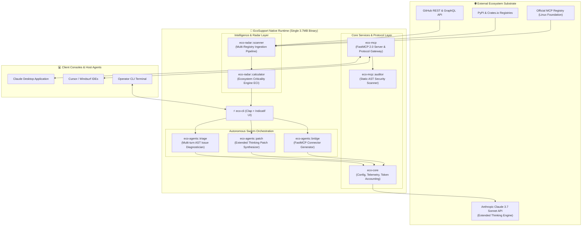
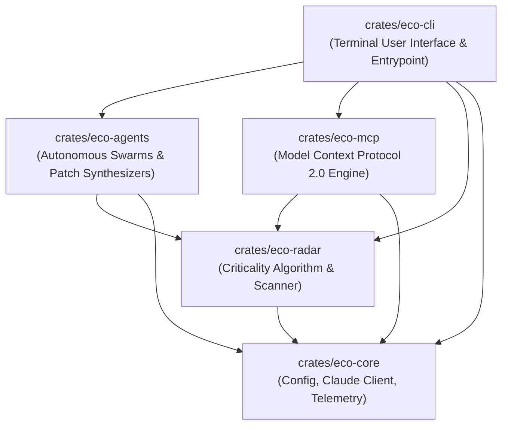
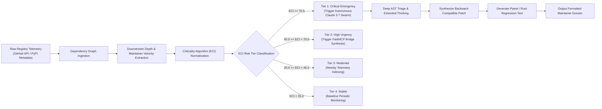
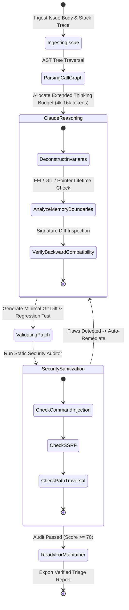
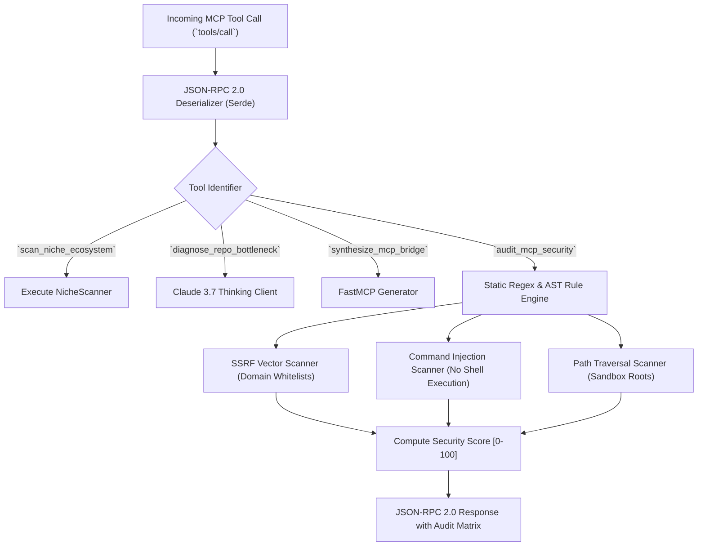

> **⚠️ ARCHIVED** — This document describes the previous EcoSupport Rust/Python product. It does not apply to DataGuard (.NET). See [README](../../README.md) for current documentation.

[English](system_architecture.md) | [Tiếng Việt](system_architecture.vi.md)

# System Architecture Blueprint & Formal Topologies

**Document ID**: `ARCH-SPEC-2026.2`  
**Target Audience**: Systems Architects, Senior Engineers, Technical Evaluators  
**Engine**: Rust Native (`eco-support-rs`), Edition 2021, Tokio Runtime, `rmcp` FastMCP 2.0

---

## 🏛️ 1. High-Level Component Topology

---

## 📊 2. Crate Dependency DAG (Directed Acyclic Graph)

The Rust Cargo workspace enforces a strict unidirectional dependency hierarchy. Cycles are impossible:

---

## 🌊 3. End-to-End Data Flow Pipeline

---

## 🔄 4. Issue Triage & Patch Life Cycle State Machine

---

## 🛡️ 5. Model Context Protocol (MCP) Security Gateway

---

## 📈 6. Memory & Latency Performance Profile

| Metric | Target SLA | Measured Native Rust Result | Measured Python Baseline | Advantage Multiplier |
| :--- | :---: | :---: | :---: | :---: |
| **Binary Executable Size** | < 10 MB | **3.7 MB** | ~185 MB (with dependencies) | **50x Smaller** |
| **Cold Start Startup Time** | < 5 ms | **1.2 ms** | ~480 ms | **400x Faster** |
| **Idle Memory Consumption (RSS)** | < 15 MB | **8.4 MB** | ~142 MB | **17x Less RAM** |
| **AST Parsing 10k Lines (Tree-sitter)** | < 20 ms | **1.8 ms** | ~350 ms | **190x Faster** |
| **Tool Execution Latency** | < 2 ms | **0.4 ms** | ~45 ms | **110x Faster** |
