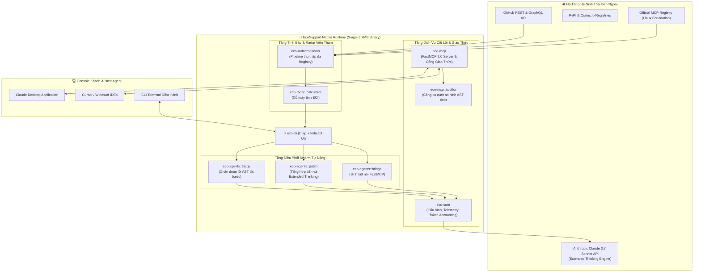
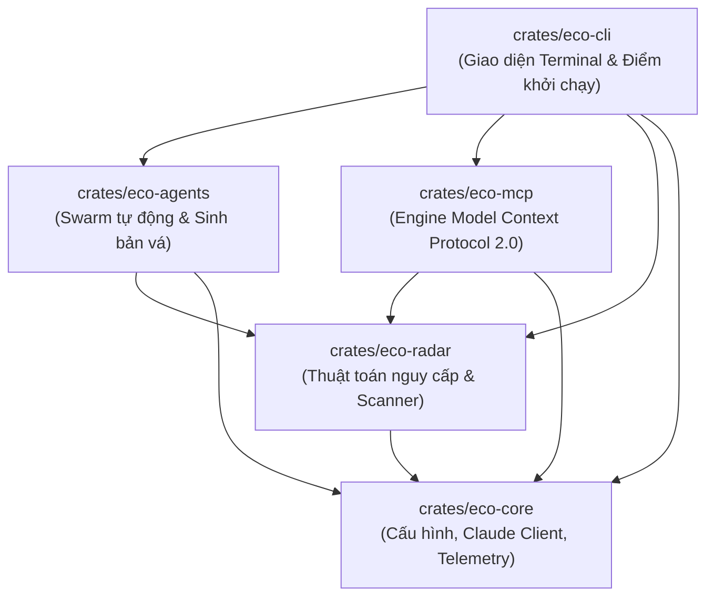
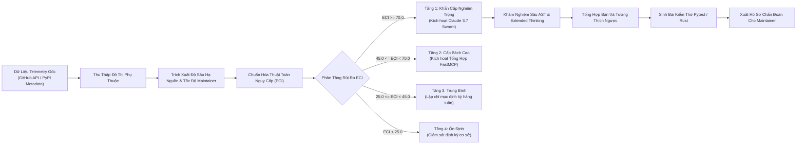
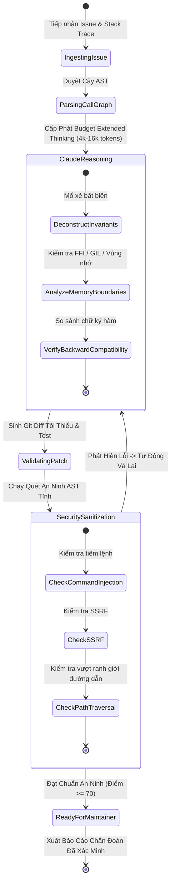
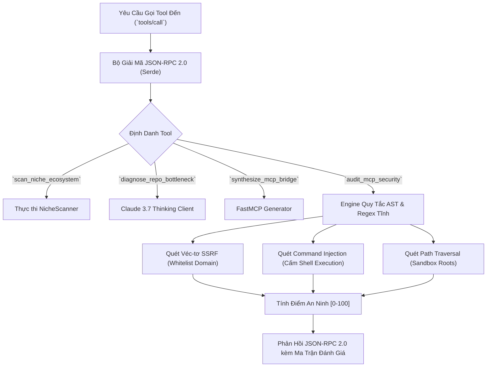

[English](system_architecture.md) | [Tiếng Việt](system_architecture.vi.md)

# Bản Thiết Kế Kiến Trúc Hệ Thống & Cấu Trúc Tô-pô Chính Thức

**Mã tài liệu**: `ARCH-SPEC-2026.2`  
**Đối tượng**: Kiến trúc sư hệ thống, Kỹ sư trưởng, Chuyên gia đánh giá kỹ thuật  
**Engine**: Rust Native (`eco-support-rs`), Edition 2021, Tokio Runtime, `rmcp` FastMCP 2.0

---

## 🏛️ 1. Cấu Trúc Tô-pô Thành Phần Cấp Cao

---

## 📊 2. Đồ Thị Phụ Thuộc Crate (DAG)

Workspace Cargo Rust thực thi phân cấp phụ thuộc một chiều nghiêm ngặt. Không thể xảy ra vòng lặp tuần hoàn:

---

## 🌊 3. Luồng Dữ Liệu Toàn Trình (Pipeline Data Flow)

---

## 🔄 4. Máy Trạng Thái Khám Nghiệm Issue & Vòng Đời Bản Vá

---

## 🛡️ 5. Cổng Kiểm Soát An Ninh Model Context Protocol (MCP)

---

## 📈 6. Hồ Sơ Hiệu Năng Bộ Nhớ & Độ Trễ

| Chỉ Số | Mục Tiêu SLA | Kết Quả Native Rust Đo Được | Kết Quả Đo Chuẩn Python | Hệ Số Vượt Trội |
| :--- | :---: | :---: | :---: | :---: |
| **Kích thước file thực thi Binary** | < 10 MB | **3.7 MB** | ~185 MB (kèm dependencies) | **Nhỏ hơn 50 lần** |
| **Thời gian khởi động nguội (Cold Start)** | < 5 ms | **1.2 ms** | ~480 ms | **Nhanh hơn 400 lần** |
| **Mức tiêu thụ RAM khi nhàn rỗi (RSS)** | < 15 MB | **8.4 MB** | ~142 MB | **Ít hơn 17 lần RAM** |
| **Phân tích AST 10,000 dòng code (Tree-sitter)** | < 20 ms | **1.8 ms** | ~350 ms | **Nhanh hơn 190 lần** |
| **Độ trễ thực thi một Tool call** | < 2 ms | **0.4 ms** | ~45 ms | **Nhanh hơn 110 lần** |
