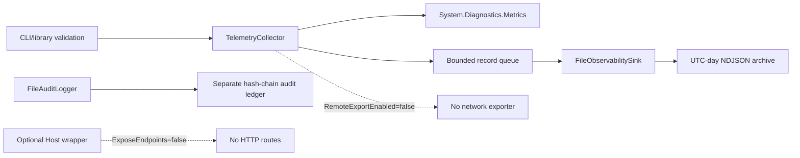
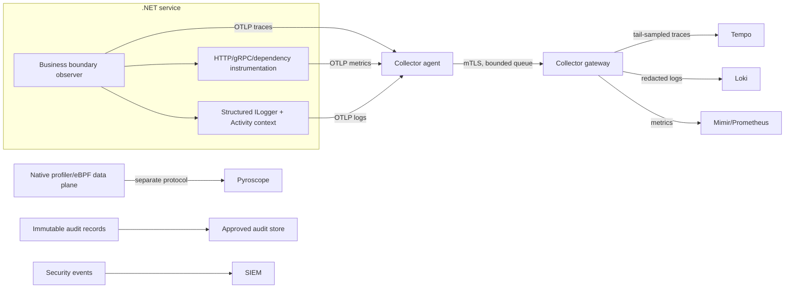
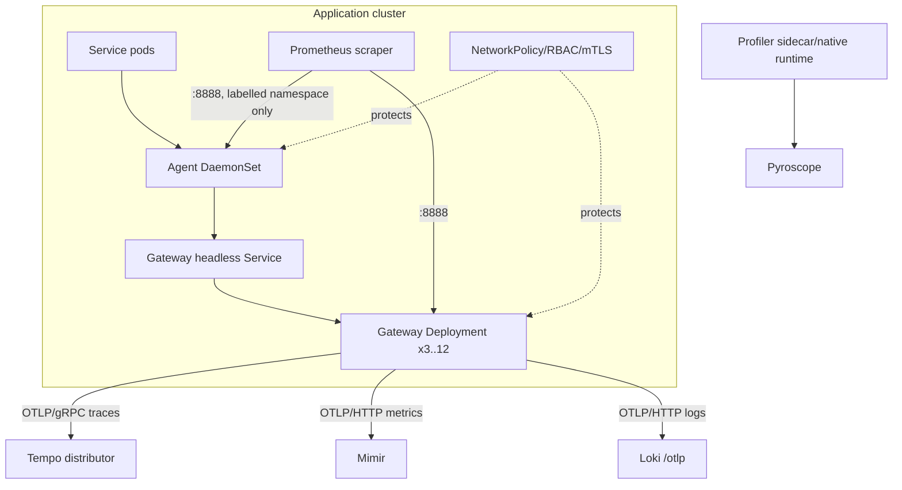
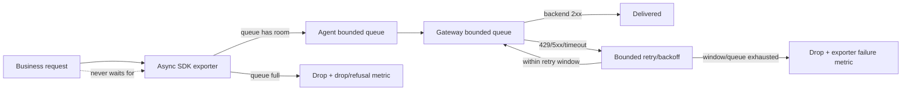
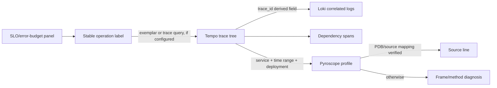
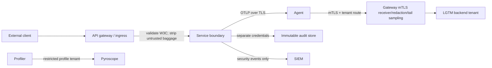

# Architecture specification

This is a compatibility-first reference slice for the discovered DataGuard `net9.0`
repository. DataGuard is a CLI/library and is not a Docker workload, so the product runtime uses
`DataGuard.Core.Telemetry.FileObservabilitySink` as its primary sink: bounded automatic records,
UTF-8 NDJSON and UTC-day archives. It is fail-open: bounded queues, asynchronous local writes and
measured drops. The OTel SDK/Collector/LGTM/Kubernetes diagrams below describe an optional host
adapter only; they are not started by the DataGuard CLI/library.

## Product runtime override



Business code can still depend on the small `IBusinessOperationObserver` abstraction in the
optional package. Vendor-specific configuration stays in a separately hosted adapter. Payloads,
arguments, SQL parameters, credentials and dynamic identifiers are prohibited by default.

## Quality attributes

| Attribute | Design target | Evidence / gate |
|---|---|---|
| Business-path isolation | Export never synchronously gates a transaction | Async batch exporters, bounded queues and fail-open test |
| Privacy | No payload, credential, raw identifier or exception message by default | Application allowlist, gateway redaction and canary tests |
| Compatibility | Preserve existing `net9.0`, custom metrics/NDJSON and audit paths | Discovery baseline and additive projects |
| Diagnosability | Stable operation names, W3C context and cross-signal links | 37 contract tests; backend links remain integration gates |
| Cost control | Finite labels/names, sampled traces, queue and profile budgets | Cardinality test, tail-sampling policy and benchmark |
| Operability | Self-health, self-metrics, rollback and per-signal flags | Collector `validate`, Kustomize render, rollout/runbooks |
| Security | TLS/mTLS, workload identity, least privilege and tenant isolation | Secret refs, RBAC/NetworkPolicy artifacts; cluster gate pending |

## Assumption register

| Area | Current value | Source/status | Gate before rollout |
|---|---|---|---|
| Number of services | UNKNOWN | Not present in discovery | Inventory each service and owner |
| Request rate / peak RPS | UNKNOWN | No production telemetry supplied | 7/30-day traffic profile |
| Message throughput | UNKNOWN | No Kafka/RabbitMQ client detected | Broker/client inventory and peak rate |
| Clusters / regions | UNKNOWN | No Kubernetes manifests or cluster context | Region/failure-domain map |
| Hosting model | UNKNOWN (cloud/on-prem/hybrid) | No deployment owner data | Network/identity/residency decision |
| Tenant model | UNKNOWN | No tenant contract | Isolation and routing policy |
| Data residency | UNKNOWN | No compliance policy in repository | Region-local backend approval |
| Log volume / trace volume | UNKNOWN | No samples | Bytes/s, sampling and retention model |
| Metric series | UNKNOWN | Existing custom metrics only | Per-service series budget and sample |
| Profile volume | UNKNOWN | No profiler selected | Profiler canary and storage budget |
| Retention | UNKNOWN per signal | No backend config | Legal/compliance retention matrix |
| RTO / RPO | UNKNOWN | No platform SLO contract | Queue persistence and recovery design |
| Trust boundaries | Gateway/agent split proposed | No gateway/mesh config | Threat-model and NetworkPolicy review |
| API gateway | UNKNOWN | No gateway manifest detected | W3C ingress and baggage policy |
| Service mesh | UNKNOWN | No mesh config detected | Avoid duplicate propagation/instrumentation |
| SIEM | UNKNOWN | No integration detected | Route security events separately |
| Audit platform | Existing audit code, destination UNKNOWN | Discovery found hash-chain code | Immutable store and regulatory approval |
| SLO owners | UNKNOWN | No owner registry | Approve journey SLIs/SLOs and runbooks |

Unknowns are assumptions, not defaults. The local artifacts intentionally use bounded sample
values only for syntax and benchmark gates; they must not be used as capacity commitments.

## Logical signal flow



Profiles, diagnostic logs and immutable audit/security records are separate products; a
profile is not an OTLP trace and a Loki log is not an audit ledger.

## Kubernetes deployment topology



The agent and gateway use different failure domains and queues. Kubernetes API egress for
metadata/resolver is intentionally a cluster-specific owner gate.

## HTTP → messaging → database propagation

```mermaid
sequenceDiagram
  participant C as Client/API gateway
  participant A as HTTP service
  participant P as Producer
  participant Q as Kafka/RabbitMQ
  participant W as Consumer/worker
  participant DB as PostgreSQL/Redis
  C->>A: W3C traceparent + trusted tracestate
  A->>A: banking.transfer.initiate (child Activity)
  A->>P: outbound context
  P->>Q: traceparent/tracestate + allowlisted baggage
  Q->>W: delivery attempt N
  W->>W: consumer Activity; span link for retry/batch
  W->>DB: dependency Activity (no parameters/values)
  DB-->>W: persisted outcome
  W-->>Q: ack, retry or DLQ classification
```

Malformed context becomes a new root; duplicate/replay attempts link to the original and are
classified as idempotent outcomes. Context never lives in a singleton or crosses an
untrusted boundary without baggage stripping.

## Failure, buffering and retry path



Memory and retry limits are explicit. A full queue causes measured telemetry loss, not a
business exception and not a zero-loss claim. Persistent queues require an approved RPO,
encrypted disk class and restart-recovery test.

## Cross-signal correlation



Exemplars, Tempo derived fields and trace-to-profile links are conditional backend features;
the repository provides the identifiers and catalog contract but does not claim they work
until a live integration test proves them.

## Security trust boundaries



RBAC, NetworkPolicy and backend tenant permissions must be evaluated independently. A
diagnostic signal may never be promoted to an immutable compliance record by dashboard
configuration alone.

## Sampling and naming policy

- SDK uses parent-based head sampling with a 10% default ratio. Gateway tail sampling can
  retain errors, slow traces and critical-operation candidates only from the traces that
  reach the gateway; it cannot recover head-sampled-out traces. When complete candidate
  coverage is required, set `UseAlwaysOnHeadSamplingForTailSampling=true` together with
  `TraceSamplingRatio=1.0`, and approve the resulting ingress/queue/storage budget. Low-volume
  critical operations use a synthetic heartbeat and minimum-event gate.
- Trace completeness requires trace-ID-aware agent/gateway routing. Tail sampling consumes
  gateway memory proportional to `decision_wait × expected_new_traces_per_sec`; size it from
  real traffic and monitor queue/refusal metrics.
- Operation names are stable, bounded and allowlisted (`banking.transfer.initiate`), never
  raw URLs, GUIDs, account/customer IDs, message IDs or trace IDs.
- Metrics use only finite dimensions (`operation`, `result`, normalized `error.type`,
  dependency/protocol and SLO class). Trace/span IDs are correlation fields, never labels.
