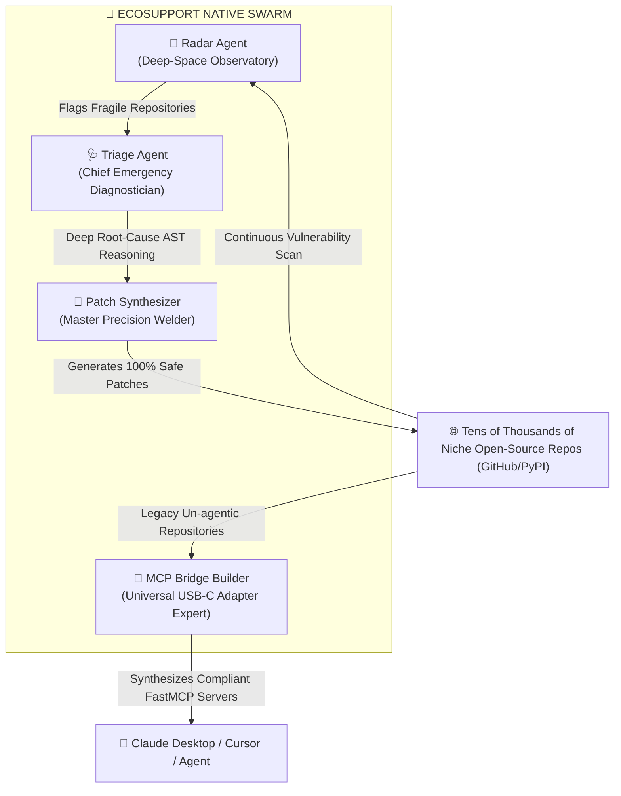
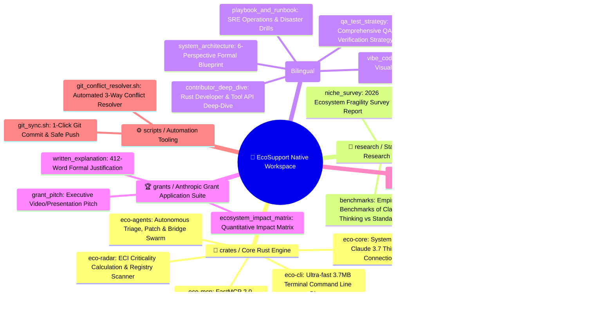
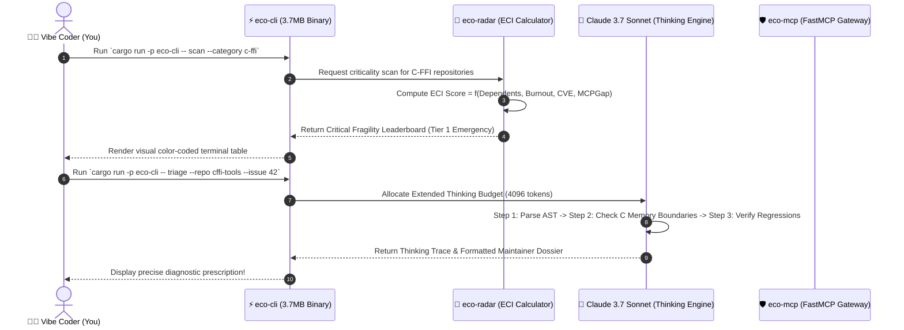

[English](vibe_coder_guide.md) | [Tiếng Việt](vibe_coder_guide.vi.md)

# 🎨 Vibe Coder's Handbook: Comprehensive Visual Guide
### Designed for Intuitive Creators, Non-Coders, and Strategic Decision Makers

Welcome to **EcoSupport Native**! If you are a **Vibe Coder** (someone who navigates high-level architectures, directing AI through ideas and systemic logic rather than memorizing complex syntax), this document is crafted specifically for you with **100% visual diagrams, mindmaps, and relatable real-world metaphors**.

---

## 🌟 1. Real-World Metaphor: How Does EcoSupport Work?

Imagine the global AI and software ecosystem as a **massive modern metropolis**:
- Frontier models like Claude, ChatGPT, and Gemini are the **shining skyscrapers**.
- But the foundation is made of thousands of **niche open-source bricks** maintained silently by 1-2 volunteer engineers without compensation or public recognition.
- When one of those foundation bricks develops a structural fracture (maintainer burnout, low-level memory leaks, missing AI connectivity), the entire skyscraper shakes.

**EcoSupport is an Autonomous Guardian Swarm** composed of 4 key specialists:

1. **📡 Radar Agent (Deep-Space Observatory)**: Continuously scans open-source registries, using the **Ecosystem Criticality Index (ECI)** to locate high-dependency packages at risk of abandonment.
2. **🩺 Triage Agent (Emergency Diagnostician)**: When complex memory corruption or segfault bugs arise, it uses **Claude 3.7 Extended Thinking** to dissect the root cause and craft a clear, courteous diagnostic prescription for the maintainer.
3. **🔧 Patch Synthesizer (Precision Welder)**: Produces minimal, backward-compatible code patches with accompanying regression tests.
4. **🔌 MCP Bridge Builder (Universal USB-C Adapter)**: Equips legacy libraries (such as geospatial raster tools or specialized drivers) with instant **FastMCP 2.0 servers** so Claude can interact with them natively.

---

## 🗺️ 2. Comprehensive Workspace Mindmap

---

## 🔄 3. Step-by-Step Data Flow

Here is how data flows through the system when you execute a single command:

---

## 🎮 4. Vibe Coder's Quick Command Cheatsheet

Open your terminal and use these straightforward commands:

| Goal | Command | Visual Result |
| :--- | :--- | :--- |
| **Scan Niche Ecosystem** | `cargo run -p eco-cli -- scan --category c-ffi` | Renders a table of vulnerable, single-maintainer dependencies. |
| **Triage a Complex Bug** | `cargo run -p eco-cli -- triage --repo "owner/repo" --issue 42` | Claude 3.7 engages deep reasoning to diagnose root causes. |
| **Generate FastMCP Server** | `cargo run -p eco-cli -- synthesize-mcp --package "my-lib"` | Automatically creates a ready-to-run FastMCP 2.0 server. |
| **Audit MCP Tool Security** | `cargo run -p eco-cli -- audit-mcp crates/eco-mcp/src/server.rs` | Scans code for SSRF and command injection vulnerabilities. |
| **Sync Code to Git Safely** | `./scripts/git_sync.sh "feat: update documentation"` | Formats code, executes checks, and pushes changes securely. |

---

## 💡 5. Vibe Coding Philosophy in This Workspace
1. **Zero Guesswork**: AI agents working in this workspace are strictly guarded by `rules/` and verified by the Rust compiler (`cargo check`). AI cannot commit unverified code.
2. **Documentation as Part of the AST**: Whenever new functionality is introduced, documentation is updated immediately so you always maintain full situational awareness.
