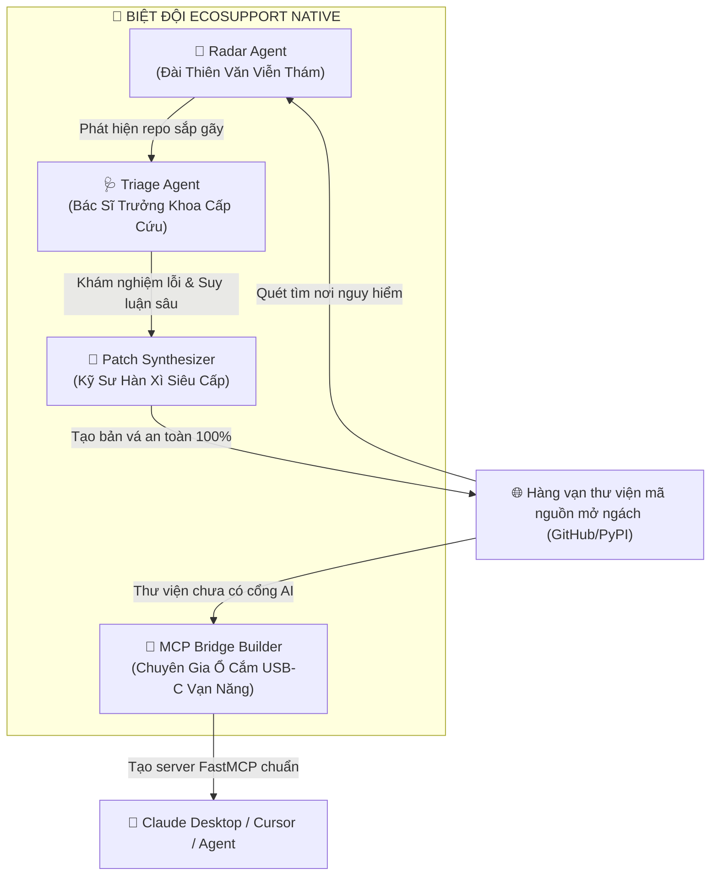
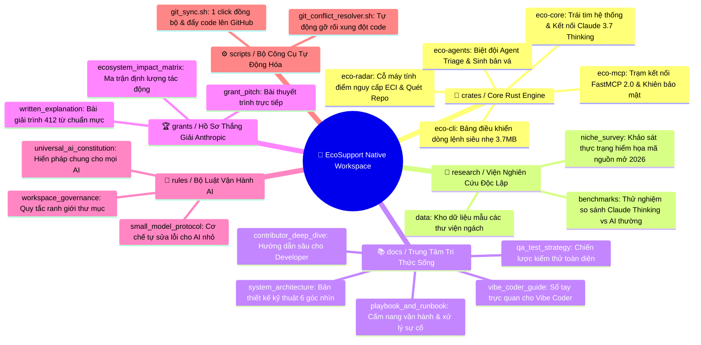
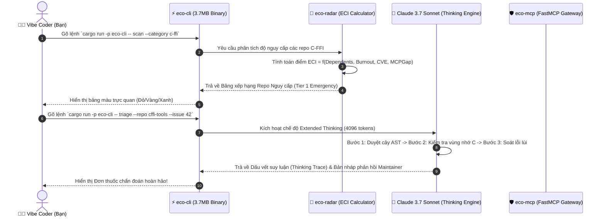

[English](vibe_coder_guide.md) | [Tiếng Việt](vibe_coder_guide.vi.md)

# 🎨 Sổ Tay Vibe Coder: Hướng Dẫn Trực Quan & Toàn Diện
### Dành cho người sáng tạo trực giác, người không rành code, và người điều hành chiến lược

Chào mừng bạn đến với **EcoSupport Native**! Nếu bạn là một **Vibe Coder** (người thích nhìn bức tranh tổng thể, điều khiển AI bằng ý tưởng và logic thay vì nhớ cú pháp lập trình phức tạp), tài liệu này được thiết kế dành riêng cho bạn với **100% hình ảnh, sơ đồ tư duy (mindmap), và các phép ẩn dụ thực tế dễ hiểu nhất**.

---

## 🌟 1. Ẩn Dụ Thực Tế: EcoSupport Hoạt Động Như Thế Nào?

Hãy tưởng tượng hệ sinh thái AI toàn cầu giống như một **thành phố công nghệ khổng lồ**:
- Các mô hình lớn như Claude, ChatGPT, Gemini là các **tòa nhà chọc trời**.
- Nhưng móng nhà lại được xây bởi hàng ngàn **viên gạch ngách (niche open-source libraries)** do 1-2 kỹ sư duy trì âm thầm (không lương, không ai biết đến).
- Khi một viên gạch bị nứt (maintainer kiệt sức, lỗi bộ nhớ C/Rust, thiếu cổng kết nối AI), cả tòa nhà có nguy cơ rung chuyển.

**EcoSupport là một Biệt đội Cứu hộ Tự động (Autonomous Guardian Swarm)** với 4 nhân vật chính:

1. **📡 Radar Agent (Đài thiên văn viễn thám)**: Ngày đêm quét toàn bộ bầu trời mã nguồn mở, dùng thuật toán **ECI (Ecosystem Criticality Index)** để tìm ra repo nào đang gánh hàng ngàn ứng dụng nhưng chỉ có 1 người duy trì sắp bỏ cuộc.
2. **🩺 Triage Agent (Bác sĩ cấp cứu)**: Khi có lỗi hiểm hóc (cháy bộ nhớ, segfault), bác sĩ dùng năng lực **Claude 3.7 Extended Thinking** để mổ xẻ tận gốc nguyên nhân và viết đơn thuốc (hướng dẫn sửa) rõ ràng, lịch sự cho tác giả.
3. **🔧 Patch Synthesizer (Kỹ sư hàn xì)**: Tạo ra bản vá mã nguồn nhỏ gọn, kèm bài test kiểm tra, cam kết không làm hỏng bất kỳ tính năng cũ nào.
4. **🔌 MCP Bridge Builder (Ổ cắm USB-C vạn năng)**: Giúp các thư viện cổ xưa hoặc ngách (như đọc ảnh vệ tinh, bản đồ địa lý) có ngay cổng cắm **FastMCP 2.0** để Claude có thể điều khiển trực tiếp.

---

## 🗺️ 2. Bản Đồ Tư Duy Toàn Bộ Workspace (Mindmap)

---

## 🔄 3. Luồng Dữ Liệu Từng Bước (Step-by-Step Data Flow)

Dưới đây là cách dòng chảy thông tin di chuyển qua các bánh răng của hệ thống khi bạn gõ 1 lệnh duy nhất:

---

## 🎮 4. Bảng Lệnh Nhanh Cho Vibe Coder (Cheatsheet)

Bạn chỉ cần mở Terminal và copy các lệnh này:

| Mục Đích | Lệnh Thực Thi | Kết Quả Trực Quan |
| :--- | :--- | :--- |
| **Quét thị trường ngách** | `cargo run -p eco-cli -- scan --category c-ffi` | Hiện bảng xếp hạng các repo đang có nguy cơ gãy đổ. |
| **Khám bệnh 1 Bug phức tạp** | `cargo run -p eco-cli -- triage --repo "owner/repo" --issue 42` | Claude 3.7 mở não suy luận sâu và đưa ra chẩn đoán gốc rễ. |
| **Tự chế cổng kết nối AI cho thư viện** | `cargo run -p eco-cli -- synthesize-mcp --package "my-lib"` | Tự động sinh ra file server FastMCP 2.0 hoàn chỉnh. |
| **Kiểm tra an toàn cổng MCP** | `cargo run -p eco-cli -- audit-mcp crates/eco-mcp/src/server.rs` | Quét xem có nguy cơ bị hacker chèn lệnh hoặc đọc lén file không. |
| **Đồng bộ code lên Git an toàn** | `./scripts/git_sync.sh "lời nhắn cập nhật"` | Tự động format, kiểm tra lỗi, lưu commit và đẩy lên Git an toàn 100%. |

---

## 💡 5. Triết Lý Vibe Coding Trong Dự Án Này
1. **Không đoán mò cú pháp**: Mọi AI khi làm việc trong workspace này đều bị kiểm soát bởi `rules/` và trình biên dịch Rust (`cargo check`). AI không thể sinh mã rác.
2. **Tài liệu là một phần của code**: Mỗi khi một tính năng mới ra đời, AI buộc phải cập nhật tài liệu này để bạn luôn nắm được bức tranh tổng thể mà không cần đọc từng dòng code Rust.
