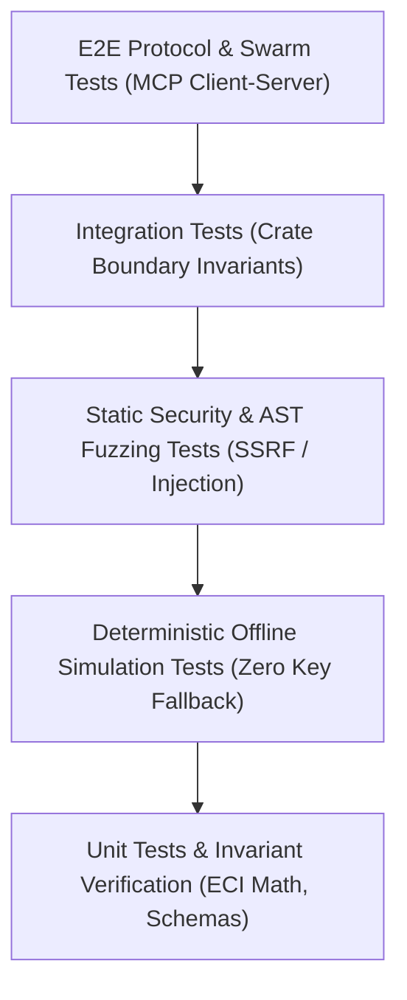

> **⚠️ ARCHIVED** — This document describes the previous EcoSupport Rust/Python product. It does not apply to DataGuard (.NET). See [README](../../README.md) for current documentation.

[English](qa_test_strategy.md) | [Tiếng Việt](qa_test_strategy.vi.md)

# QA & Verification Test Strategy

**Document ID**: `TEST-STRATEGY-2026.1`  
**Target Audience**: QA Engineers, Security Auditors, Anthropic Grant Evaluators


---

## 🧪 1. Testing Philosophy & Test Pyramid

EcoSupport enforces a multi-tier test pyramid ensuring that both the native Rust engine and the underlying AI reasoning harness are formally verified before release.



---

## 📋 2. Test Suite Inventory

### Rust Native Test Suite (`crates/eco-cli/tests/`):
1. **`test_rust_core.rs`**:
   - `test_claude_client_simulation_mode`: Verifies that unkeyed environments gracefully execute deterministic simulations with accurate token telemetry.
2. **`test_rust_radar.rs`**:
   - `test_eci_critical_fragility_calculation`: Proves that a single-maintainer library with 5,000+ dependents is flagged as `TIER_1_CRITICAL_EMERGENCY`.
   - `test_eci_stable_repo_calculation`: Proves that a well-maintained library with 10+ maintainers is classified as `STABLE`.
3. **`test_rust_mcp.rs`**:
   - `test_mcp_server_initialization_tools`: Verifies registration of all 4 FastMCP tools.
   - `test_mcp_security_auditor_detects_flaws`: Confirms static detection of `shell=True` and unvetted `eval()`.
   - `test_mcp_security_auditor_approves_safe`: Confirms that safe tool definitions pass audit with 100/100 score.
4. **`test_rust_agents.rs`**:
   - `test_rust_triage_agent`: Verifies structured root cause and maintainer reply generation.
   - `test_rust_patch_synthesizer`: Verifies git diff and regression test synthesis.
   - `test_rust_doc_bridge_agent`: Verifies FastMCP server generation.

---

## ⚡ 3. Automated Test Execution Commands

```bash
# 1. Run all Rust unit and integration tests
cargo test --workspace

# 2. Run with visible stdout logs
cargo test --workspace -- --nocapture

# 3. Check memory safety and strict lints
cargo clippy --workspace --all-targets -- -D warnings

# 4. Format validation
cargo fmt --check
```
