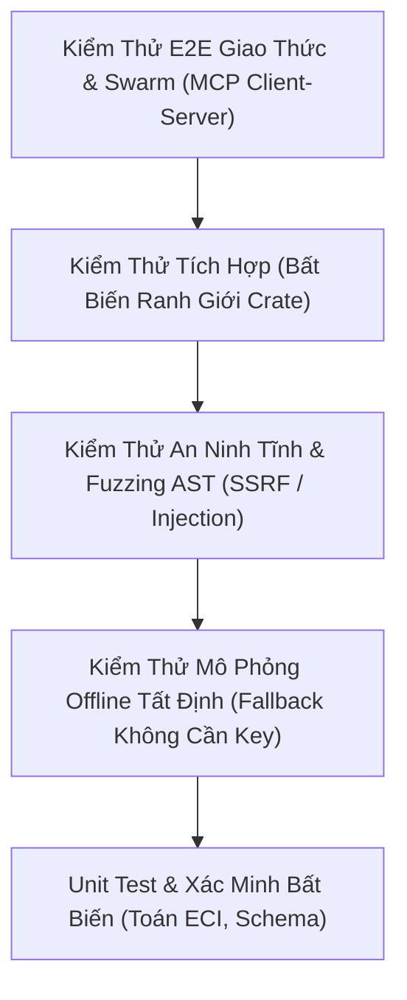

[English](qa_test_strategy.md) | [Tiếng Việt](qa_test_strategy.vi.md)

# Chiến Lược Kiểm Thử QA & Xác Minh Độ Tin Cậy

**Mã tài liệu**: `TEST-STRATEGY-2026.1`  
**Đối tượng**: Kỹ sư QA, Chuyên gia kiểm toán an ninh, Ban thẩm định Grant Anthropic

---

## 🧪 1. Triết Lý Kiểm Thử & Kim Tự Tháp Test

EcoSupport áp dụng kim tự tháp kiểm thử nhiều tầng nhằm đảm bảo cả engine Rust native lẫn khung suy luận AI đều được xác minh hình thức trước khi phát hành.



---

## 📋 2. Danh Mục Test Suite

### Bộ Test Native Rust (`crates/eco-cli/tests/`):
1. **`test_rust_core.rs`**:
   - `test_claude_client_simulation_mode`: Xác minh môi trường không có API key vẫn chạy mượt mà ở chế độ mô phỏng tất định với telemetry token chính xác.
2. **`test_rust_radar.rs`**:
   - `test_eci_critical_fragility_calculation`: Chứng minh một thư viện có 1 maintainer nhưng gánh 5,000+ dependents sẽ bị gắn cờ `TIER_1_CRITICAL_EMERGENCY`.
   - `test_eci_stable_repo_calculation`: Chứng minh thư viện được duy trì tốt bởi 10+ maintainer được phân loại `STABLE`.
3. **`test_rust_mcp.rs`**:
   - `test_mcp_server_initialization_tools`: Xác minh việc đăng ký đầy đủ 4 tool FastMCP.
   - `test_mcp_security_auditor_detects_flaws`: Xác nhận khả năng phát hiện tĩnh các lệnh nguy hiểm như `shell=True` và `eval()`.
   - `test_mcp_security_auditor_approves_safe`: Xác nhận định nghĩa tool an toàn vượt qua kiểm toán với điểm số 100/100.
4. **`test_rust_agents.rs`**:
   - `test_rust_triage_agent`: Xác minh khả năng phân tích nguyên nhân gốc rễ và sinh bản thảo phản hồi maintainer có cấu trúc.
   - `test_rust_patch_synthesizer`: Xác minh khả năng sinh git diff và bài kiểm thử hồi quy.
   - `test_rust_doc_bridge_agent`: Xác minh khả năng tự sinh FastMCP server.

---

## ⚡ 3. Các Lệnh Thực Thi Kiểm Thử Tự Động

```bash
# 1. Chạy toàn bộ unit test và integration test của Rust
cargo test --workspace

# 2. Chạy test hiển thị chi tiết log stdout
cargo test --workspace -- --nocapture

# 3. Kiểm tra an toàn bộ nhớ và lint nghiêm ngặt
cargo clippy --workspace --all-targets -- -D warnings

# 4. Kiểm tra định dạng code chuẩn
cargo fmt --check
```
