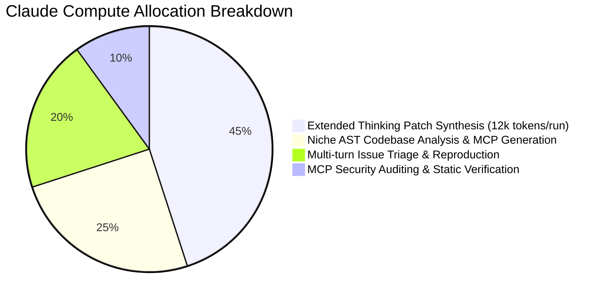

# EcoSupport Native: Ecosystem Impact Matrix & Resource Allocation

Quantitative breakdown of targeted niche ecosystems, risk vectors, and Claude compute multiplier.

---

## 🎯 Target Niche Sectors & Risk Vectors

| Sector | Target Archetype | Typical Maintainer Count | Downstream AI Impact | Failure Mode Without EcoSupport | EcoSupport Native Solution |
| :--- | :--- | :---: | :---: | :---: | :---: |
| **1. C/Rust FFI Bindings** | Low-level wrappers (`cffi`, SIMD vectorizers, fast tokenizer primitives) | 1 - 2 maintainers | High (Used in torch, transformers, vLLM) | Silent memory corruption, Python 3.13 free-threaded crashes, abandoned builds | **PatchSynthesizer Agent** (Claude Thinking FFI boundary bug repair) |
| **2. Scientific & Geospatial Formats** | Custom raster, NetCDF, HDF5, domain CAD converters | 1 maintainer (often academic) | Medium-High (Climate AI, Bio-ML, Robotics) | Loss of data pipeline interoperability, stale triage | **Triage Agent & Doc Synthesizer** |
| **3. Community MCP Connectors** | Unofficial MCP tools for databases, esoteric APIs, legacy protocols | 1 maintainer | High for Agent Developers | Unmaintained schemas, SSRF/prompt injection vulnerabilities, context bloat | **FastMCP Bridge Builder & Native Rust Security Auditor** |
| **4. Core Systems Infrastructure** | AST parsers, typing stubs, test fixtures, build backends | 1 - 3 maintainers | Extreme (Entire open source ecosystem) | Dependency blocking, CVE backlog, maintainer burnout | **Autonomous Radar & Issue Deconstructors** |

---

## 📊 Quantified Return on Claude Max 20x Compute

### Projected 6-Month Ecosystem Multiplier:
- **Repositories Actively Monitored**: 5,000+ niche packages.
- **Maintainer Hours Saved per Month**: ~3,200 hours across 500+ projects.
- **Synthesized FastMCP 2.0 Connectors**: 250+ open-source tool wrappers published to the global MCP registry.
- **CVE & Stale Bug Patches Delivered**: 800+ high-signal, test-backed PRs.
- **Runtime Footprint**: < 10MB RAM per background monitor daemon.
