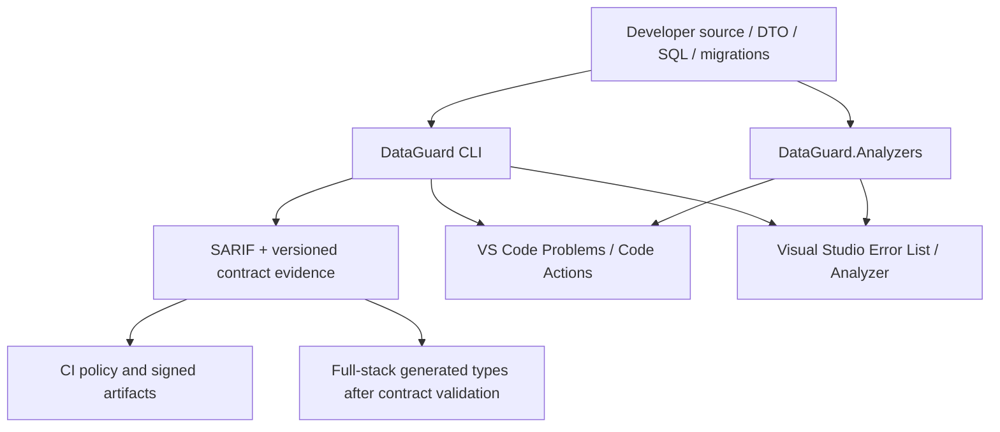

# Plan: DataGuard Marketplace product

## Outcome

Phát hành hai extension độc lập: **DataGuard for VS Code** và **DataGuard for Visual Studio 2022**. Cả hai biến DataGuard từ CLI/analyzer thành workflow developer cho database/API contract lifecycle: phát hiện drift, procedure/DTO mismatch, raw SQL risk, migration compatibility, policy gate và evidence cho CI. Không biến product thành IDE generic hoặc chạy engine/database client trong IDE host.

Research: [Marketplace publishing](research/marketplace-publishing.md), [market positioning](research/market-positioning.md). Red-team: [CAUTION](reports/marketplace-redteam.md); P1 gates are incorporated below.

## Product boundary

| Persona | Pain point có thể giải quyết | Deliverable |
|---|---|---|
| Backend | EF/Dapper/SP result & parameter mismatch, unsafe raw SQL, schema drift đến muộn | diagnostics/SARIF, command validate/snapshot/diff, Problems/Output, quick path tới contract evidence |
| Full-stack | Backend schema/DTO thay đổi âm thầm làm vỡ API client | versioned machine-readable contract report, breaking-change classification, TypeScript DTO generation chỉ từ validated contract (phase sau khi schema ổn định) |
| Frontend | Không biết contract backend thay đổi gì, không cần database credential | đọc published contract/evidence artifact; chỉ nhận compatibility signal/types — không query database |
| Enterprise/banking | credential leakage, production query load, unverifiable release, supply-chain risk, audit gaps | least-privilege/offline mode, no secret storage, policy-as-code, SARIF/SBOM/provenance, signed packages, deterministic evidence |

## Market position and prioritization

DataGuard thắng ở **code ↔ stored procedure/schema contract drift có evidence**, không ở SQL editor, formatter, database GUI hay deployment engine. Xem [market research](research/market-positioning.md) cho competitor map và backlog P0/P1/P2.

- **P0**: output/SARIF/evidence contract, policy/redaction, trusted-host UX, deterministic two-VSIX supply chain.
- **P1**: breaking-change classification, TypeScript export từ validated contract, provider-specific drift/migration evidence.
- **P2**: team dashboard/portal chỉ sau validation với 5–10 target teams; không build trước.

### Licensing and enterprise claims gate

Canonical `LICENSE` is MIT, so commercial use is permitted. Before Marketplace release, reconcile all extension/package/docs metadata that still names another license; declare MIT accurately and never claim certified PCI DSS/SOC 2/GDPR compliance without an independent assessment. Enterprise controls are product capabilities, not a compliance certificate.
## Non-negotiable constraints

1. `DataGuard.Cli` là authority duy nhất; extensions không duplicate SQL parsing, DB adapters, credential store, policy engine hay telemetry.
2. Process execution: fixed executable setting, `shell=false`/`UseShellExecute=false`, argument list, path allow/normalization, timeout/cancellation, one run per workspace/solution, bounded output và kill process tree thuộc extension.
3. VS Code chỉ execute CLI trong **trusted workspace**. Mọi SARIF/evidence host đọc phải được CLI ghi vào temporary file private (`--output`); extension không parse stdout và luôn xóa file sau parse/cancel.
4. Default is offline/snapshot when no explicit CLI config; never auto-connect to a database or persist a connection string.
5. No telemetry or network egress from extensions. Marketplace publishing secrets only in protected CI environment.
6. VS Code and Visual Studio outputs/commands must remain behaviorally consistent; only host UX differs.

## Architecture

## Phases

### Phase 1 — Discovery, contract and risk gates

- Complete Marketplace/host research and explicit publisher ownership proof.
- Red-team two-host architecture, enterprise resource boundaries and supply-chain workflow.
- Define versioned Contract Evidence JSON schema: provider, contract digest, schema version, violations, breaking-change classification; redact all connection/vault data.
- Define bank profile policy: offline CI allowed, approved provider set, max execution time/output, fail-on-drift, no plaintext connection setting, signed evidence required.

**Success**: documented threat model, per-persona acceptance scenarios, no unbounded or secret-bearing IDE path.

### Phase 2 — Core enterprise contract workflows

- Make `--format` and `--output` real CLI contract, then add versioned Contract Evidence JSON output; test redaction, determinism and breaking-change classification.
- Add policy profile/config validation and structured exit semantics so CI and both IDEs render the same result.
- Add backend workflow commands: validate, snapshot refresh/show/diff, migration compatibility/evidence; no production DB default.
- Add full-stack workflow only at validation boundary: export contracts/typed DTO source from validated schema; never infer from unvalidated live result.

**Success**: deterministic offline contract/evidence test corpus; policy failures are SARIF + nonzero exit; compatibility result can be consumed without DB credential.

### Phase 3 — VS Code product

- Upgrade `src/DataGuard.VSCode`: Workspace Trust gate, workspace selection, configured executable path, cancellation/timeout/single-flight process runner, tree termination, output truncation, private temporary SARIF output to DiagnosticCollection, Problems navigation and actionable missing-CLI/error state.
- Add commands for validate, snapshot diff, export evidence/types; no automatic expensive validation.
- Add icon PNG, CHANGELOG, license/repo/bugs metadata, tests and `npm ci` reproducibility; package with `vsce`.

**Success**: VS Code Extension Development Host smoke test proves trust gate, commands, diagnostics, cancellation, no-shell process execution and `.vsix` install/package.

### Phase 4 — Visual Studio 2022 product

- Add `src/DataGuard.VisualStudio` VSSDK AsyncPackage, VSIX manifest and Tools menu commands mirroring VS Code.
- Use Visual Studio Output Window and Error List/SARIF integration; marshal UI only on UI thread, run CLI off-thread, make cancellation visible and kill the owned child process tree on disposal.
- Add VSIX publish metadata, overview and icon; provision VSSDK and `VsixPublisher.exe` explicitly in Windows CI.

**Success**: Release VSIX builds on `windows-latest`, manifest validates, command is installed and invoked in a VS 2022 Experimental Instance smoke path, no DB client loads into devenv.

### Phase 5 — Packaging, supply chain and Marketplace release

- Add CI jobs for Node extension test/package and Windows Visual Studio VSIX build; upload immutable artifacts, checksums, SBOM and provenance for **both** VSIX outputs.
- Add protected publish workflow: tag-only plus explicit dispatch, derive both manifests/package versions from the signed tag, verify publisher IDs, smoke package before publish, use environment secrets `VSCE_PAT` and `VS_MARKETPLACE_PAT` only.
- Prefer Microsoft Entra workload identity for VS Code Marketplace before 2026-12-01 PAT retirement; document owner-operated fallback.
- Publish only after artifacts and credentials are verified. Do not move existing tags; next release uses a new tag.

**Success**: two Marketplace entries install from their intended host, package checksums/provenance available, no token in source/log/artifact.

## Verification matrix

| Scenario | Expected result |
|---|---|
| Missing CLI | actionable host error; no shell fallback; no crash |
| Disabled/no workspace | no spawned process |
| Concurrent click | existing run selected/cancelled; never two DB scans |
| Untrusted VS Code workspace | command refuses execution; no process starts |
| SARIF violation | CLI writes private `--output` file; Problems/Error List location and severity match; temp file is deleted |
| Invalid/malicious config path | path is normalized; fixed argument vector; no injected command |
| Offline enterprise policy | validation uses snapshot/manual assembly and emits deterministic evidence |
| Contract breaking change | export marks breaking, CI fails per policy, frontend receives no stale type update |
| Package install | VS Code VSIX installs in Extension Development Host; Visual Studio VSIX command invokes in VS 2022 Experimental Instance |
| Publish secret absent | publish job fails loud; package build remains available |

## External prerequisites

- Marketplace publisher ID(s) created and verified by owner.
- Protected GitHub environment and valid `VSCE_PAT`/`VS_MARKETPLACE_PAT`, or Microsoft Entra workload identity for VS Code publishing.
- Marketplace metadata/docs must match the canonical MIT license; no unsupported compliance claim.
- Windows Visual Studio 2022 Build Tools/VSSDK availability on CI.

## Current verified implementation

- Run `32371572507` packaged and attested both VSIX artifacts; it uploads SHA-256 checksums and GitHub build provenance.
- No VSIX SBOM is generated yet. Do not claim the VSIX supply-chain gate complete until the workflow uploads a dependency SBOM for each artifact.
- Run `32371572762` passed all five core CI jobs; code scanning open alerts were zero at that check.
- Public Marketplace publish remains blocked by missing publisher credentials and the unperformed Visual Studio 2022 Experimental Instance install/invoke smoke.

## Completion criteria

- Both VSIX artifacts build and install/validate reproducibly.
- All role scenarios have automated contract tests; host-specific tests cover process/cancellation/SARIF mapping.
- CI CodeQL, dependency scan, SBOM and package provenance are green.
- Marketplace links are public only after owner credential prerequisite is met; otherwise the artifact and workflow are delivered with exact blocked secret names.
