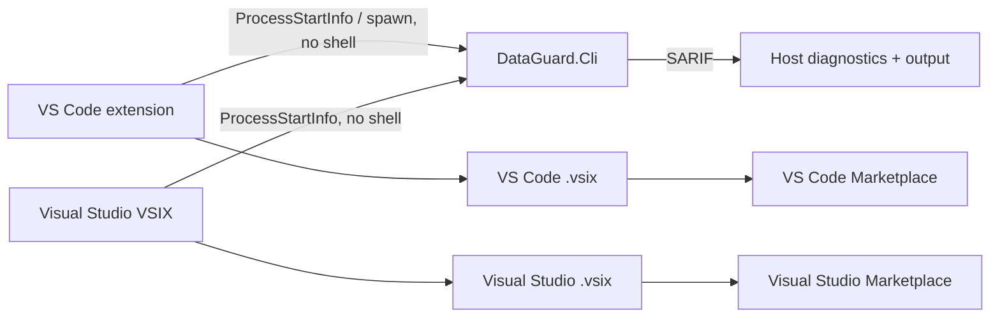

# Research: DataGuard Marketplace publishing

## Kết luận

Hai Marketplace entry không dùng chung artifact. DataGuard cần phát hành một VS Code extension TypeScript bằng `vsce` và một Visual Studio 2022 VSIX bằng VSSDK. Cả hai giữ `DataGuard.Cli` là validation authority; extension chỉ điều phối CLI, hiển thị output/SARIF và không nhận hoặc lưu credential database.

## Bằng chứng và yêu cầu

| Host | Artifact/build | Metadata bắt buộc | Publish | Quyết định |
|---|---|---|---|---|
| VS Code Marketplace (`/vscode`) | `@vscode/vsce package` tạo `.vsix` | `package.json`: name, publisher, version, icon PNG, license, repository, categories, engines; README/CHANGELOG image phải HTTPS, không SVG không tin cậy | `vsce publish`; publisher được tạo tại Marketplace manage page | Mở rộng `src/DataGuard.VSCode` thành thin runner có diagnostics; package từ Linux CI |
| Visual Studio Marketplace | VSSDK VSIX project build Release trên Windows, `.vsix` + VSIX manifest | `source.extension.vsixmanifest`, icon PNG, overview, `vs-publish.json` (categories, internalName, publisher, repo) | `VsixPublisher.exe publish -payload ... -publishManifest ...` | Tạo `src/DataGuard.VisualStudio`; Windows-only CI package |

## Publisher và credential

- Publisher ID là identity Marketplace, không tự đồng nhất với GitHub/NuGet. `thanhnt-sm` chỉ được dùng khi owner tạo và verify publisher ID đó.
- VS Code docs yêu cầu Marketplace **Manage** PAT cho PAT flow; PAT global Azure DevOps bị retire 2026-12-01. Không hardcode PAT: GitHub environment secret `VSCE_PAT`, manual protected release gate; roadmap thay bằng Microsoft Entra workload identity khi publisher/tenant có cấu hình đó.
- Visual Studio `VsixPublisher.exe` dùng PAT và publish manifest. Secret riêng `VS_MARKETPLACE_PAT`; không chia sẻ secret với NuGet.
- Package CI luôn chạy; publish chỉ chạy khi tag release, publisher ID xác thực, và secret có mặt. Thiếu credential phải fail loud ở publish job, không làm giả successful deployment.

## Kiến trúc được chọn

- VS Code: one concurrent validation per workspace; shell disabled; bounded timeout; collect stdout to parse SARIF; user-facing OutputChannel/DiagnosticCollection; no automatic run on every keystroke.
- Visual Studio: `AsyncPackage`, Tools command, OutputWindow pane, cancellation/disposal; no in-process database client or secret persistence.
- Roslyn analyzer NuGet package vẫn là fast IDE diagnostics. Marketplace extensions không duplicate engine/analyzer logic.

## Acceptance gates

1. `npm ci`, TypeScript compile, extension unit tests, `vsce package`, và VSIX content inspection pass.
2. Windows job restore/build/package Visual Studio VSIX; manifest validation pass.
3. CI upload cả hai `.vsix` artifacts, metadata không dùng placeholder, package không chứa source/dependency dev không cần thiết.
4. VS Code artifact cài được vào Extension Development Host; Visual Studio artifact cài/test được trên VS 2022 experimental instance hoặc Windows CI manifest/package smoke check.
5. Publisher creation/verification và secrets là prerequisite bên ngoài; chỉ khi có chúng mới publish public được.

## Nguồn chính thức

1. [VS Code: Publishing Extensions](https://code.visualstudio.com/api/working-with-extensions/publishing-extension) — `vsce`, VSIX package, publisher creation, security limits và PAT/Entra transition.
2. [Visual Studio: Publish extension via command line](https://learn.microsoft.com/en-us/visualstudio/extensibility/walkthrough-publishing-a-visual-studio-extension-via-command-line?view=visualstudio) — `VsixPublisher.exe`, publish manifest, VSIX testing và Marketplace flow.
3. [VSIX schema 2.0](https://learn.microsoft.com/en-us/visualstudio/extensibility/vsix-extension-schema-2-0-reference?view=visualstudio) — VSIX identity, installation target và asset schema.

## Câu hỏi còn lại

- Owner phải xác nhận publisher ID Marketplace thực tế và cấp publish permission cho account/identity sử dụng trong CI.
- Bất kỳ public publish nào cần `VSCE_PAT`/`VS_MARKETPLACE_PAT` hoặc Microsoft Entra workload identity; không có secret khả dụng trong source repository.
