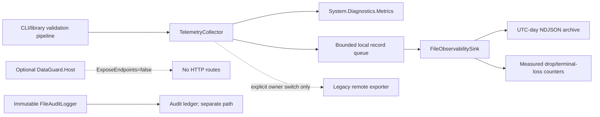

# Phase 6: Local file observability and endpoint lockdown

## Overview

Discovery and the product owner clarification establish that DataGuard is a CLI/library, not a
backend or frontend, and it is not deployed in Docker. Phase 6 therefore makes the product-native
path the primary implementation: bounded automatic records are written as text NDJSON and
partitioned into UTC-day archives. Collector/LGTM/Kubernetes/profiling artifacts remain optional
reference adapters and are not part of the product runtime.

The phase deliberately preserves, but disables by default, the previously drafted network
exporter and HTTP host routes. They can only be re-enabled through an explicit owner-controlled
switch and a separate compatibility review.

## Requirements

- Functional: existing `TelemetryCollector` calls automatically emit standard, bounded local
  observability records for events, counters, histograms and validation summaries.
- Functional: records are UTF-8 NDJSON text, contain stable resource/signal fields and UTC-day
  archive paths (`yyyy/MM/dd/observability-yyyy-MM-dd.ndjson`).
- Security: event bodies are omitted by default; if enabled, redaction and length limits apply;
  arbitrary properties, payloads, credentials and dynamic identifiers are not written.
- Reliability: the queue and record size are bounded; file writes are asynchronous/best effort;
  archive failures never fail the validation/business path and losses are measurable.
- Compatibility: preserve the existing `TelemetryConfig` constructor, Meter instruments, injected
  export delegate and audit ledger. Do not turn diagnostic observability files into audit records.
- Endpoint policy: no product endpoint is opened by default. `DataGuard.Host` health routes and
  OTel OTLP exporters are explicit opt-in compatibility surfaces. `DataGuard.Host` also keeps both
  listener and route mapping disabled unless a wrapper opts in.

## Architecture

The local envelope maps `signal`, `event_name`, `service_name`, `operation_name`, `status`,
`severity_text`, `value`, `trace_id`, `span_id`, `attributes` and `resource` to familiar
OpenTelemetry concepts without pretending that a text file is an OTLP wire payload. An active
W3C `Activity` contributes correlation IDs; the collector never invents a trace ID solely to make
the file look complete.

## Related Code Files

- Create: `src/DataGuard.Core/Telemetry/ObservabilityFileSink.cs`
- Create: `tests/DataGuard.Core.Tests/ObservabilityFileSinkTests.cs`
- Modify: `src/DataGuard.Core/Telemetry/TelemetryCollector.cs`
- Modify: `src/DataGuard.Core/Models/Configuration.cs`
- Modify: `src/DataGuard.Core/PublicApi/PublicApiSurface.cs`
- Modify: `src/DataGuard.Cli/Program.cs`
- Modify: `src/DataGuard.Host/HealthHostOptions.cs`, `src/DataGuard.Host/Program.cs`
- Modify: `src/DataGuard.Observability/CoreObservability.cs`
- Modify: `docs/observability/README.md`, `docs/observability/architecture.md`,
  `docs/observability/configuration.md`, `docs/03-components/core/telemetry*.md`

## Implementation Steps

1. Keep the existing Meter instruments and route automatic event/metric calls into a second
   bounded local record queue when no injected exporter is present.
2. Serialize only the local allowlisted envelope. Omit event bodies by default and redact/cap any
   explicitly enabled body. Reject unsafe archive roots/files that are reparse points.
3. Rotate by record UTC date and append to deterministic archive paths. Return write/drop counts
   and expose `LastObservabilityFilePath`, `DroppedObservabilityRecordCount` and existing loss
   counters for diagnostics.
4. Make remote export opt-in (`RemoteExportEnabled=false`) and make the host listener/health route
   mapping opt-in (`EnableHost=false`, `ExposeEndpoints=false`); retain compatibility tests by
   passing the switches explicitly.
5. Add CLI/YAML configuration for archive directory and service metadata without changing the
   positional configuration constructor.
6. Run affected tests, full Release build/test, formatting, docs synchronization and a direct
   local archive smoke. Do not start Docker, Collector, Kubernetes, LGTM or profiler processes for
   this product phase.

## Success Criteria

- [x] Existing DataGuard telemetry APIs still compile and legacy injected-export tests pass.
- [x] Events, counters and histograms are automatically represented in bounded local NDJSON.
- [x] Archive files are partitioned by UTC day and contain stable resource/signal fields.
- [x] Allowlist/redaction tests prove PAN, bearer token, email and dynamic IDs do not leak.
- [x] Queue and record-size limits expose drops without throwing into validation code.
- [x] Remote export is disabled unless explicitly enabled; no implicit network call occurs.
- [x] DataGuard.Host routes are disabled by default and only integration tests opt in.
- [x] Full solution/build/test/docs gates are rerun after the final documentation patch.
- [x] Production retention/rotation and any remote Collector/backend canary are explicitly
  owner-blocked operational gates, not requirements for the accepted local CLI/library path.

## Risk Assessment

| Risk | Severity | Mitigation |
|---|---|---|
| Local disk fills or becomes unwritable | High | Bounded queue, fail-open writes, measured drops, runbook and owner-managed retention |
| Partial append followed by retry duplicates a record | Medium | Each record has a stable `record_id`; document at-least-once local write semantics |
| Diagnostic file is mistaken for an immutable audit ledger | High | Separate directory/type/API and explicit documentation; keep `FileAuditLogger` hash-chain path |
| Event details contain new sensitive formats | High | Details omitted by default, allowlist attributes, redaction canary tests and bounded body |
| Remote endpoint is re-enabled accidentally | High | `RemoteExportEnabled=false`, no endpoint registration without explicit switch, config review |
| Archive retention is unspecified | Medium | No automatic deletion; require owner retention/RPO policy before operational rollout |

## Re-plan Trigger

If local archive writes fail repeatedly, disable the smallest affected signal, preserve the drop
counter and inspect permissions/disk before changing queue limits. If an owner later requests
Collector/LGTM export, create a new owner-gated phase with exact protocol, TLS, residency,
retention, traffic and rollback evidence; do not broaden this CLI/library phase implicitly.
