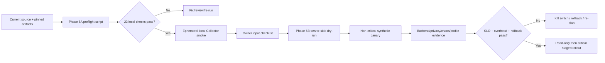

# Phase 6 (historical): Preflight, owner-gated integration and canary

> Superseded by `phase-06-local-file-observability.md` after the product owner clarified that
> DataGuard is a CLI/library and is not deployed in Docker. The preflight evidence remains useful
> as an optional backend/cluster reference, but it is not the active product runtime plan.

## Overview

Phase 6 is split deliberately. **Phase 6A** is a deterministic, non-mutating repository and
artifact preflight that can run with the current source and exact pinned images. **Phase 6B** is
the owner-gated runtime integration/canary and remains blocked until the real cluster, backend,
client, traffic, residency and profiler contracts are supplied. This split produces useful
evidence without pretending that local validation proves Kubernetes admission or LGTM behavior.

The split follows the Kubernetes contract that server-side dry-run is the owner/API-server gate
and the OpenTelemetry Collector contract that `validate` is a configuration gate. References:
[kubectl apply](https://kubernetes.io/docs/reference/kubectl/generated/kubectl_apply/) and
[Collector configuration validation](https://opentelemetry.io/docs/collector/configuration/).

## Requirements

- Functional: validate the checked-in Collector/Kubernetes/SLO artifacts with the exact pinned
  distribution; restore, build, test and audit the current solution; expose a machine-readable
  Phase 6A result.
- Non-functional: do not call `kubectl apply`, read a Secret, contact a backend, start a profiler,
  or write generated evidence into the repository; fail closed on missing tools or contract drift.
- Runtime: only an approved owner context may execute server-side dry-run, deploy a non-critical
  canary, inject failures, query backends or enable profiling.
- Evidence: every runtime result must retain the exact command, immutable image/package digest,
  redacted endpoint/tenant identity, timestamp, owner and rollback decision.

## Architecture



Phase 6A is intentionally read-only and local. Phase 6B owns the external failure domains:
Kubernetes admission, TLS/tenant routing, LGTM protocol behavior, persistent queue/data-loss
semantics, real client instrumentation and profiler overhead.

## Related Code Files

- Create: `scripts/verify_observability_phase6_preflight.sh`
- Create: `scripts/verify_observability_phase6_local_smoke.sh` and the local-only debug config
  `docs/observability/collector/local-smoke.yaml`
- Create: `scripts/verify_observability_phase6_owner_inputs.py`,
  `docs/observability/phase6-owner-inputs.schema.json`, the redacted template
  `docs/observability/phase6-owner-inputs.example.json` and its operator guide
  `docs/observability/phase6-owner-inputs.md`
- Modify: `docs/observability/validation.md`, `docs/observability/README.md`,
  `docs/observability/rollout.md`
- Modify: this phase file and `reports/phase-06-preflight-review.md`
- No production telemetry path, TargetFramework or existing logging provider is changed by this
  phase.

## Phase 6A — deterministic local preflight

Run from the repository root:

```sh
./scripts/verify_observability_phase6_preflight.sh
```

The gate performs all of the following without a cluster mutation:

1. Require the local toolchain and a ready Docker daemon.
2. Check the solution, lock files, Collector configs, Kustomize copies, SLO rules and JSON
   schema are present.
3. Reject floating project package versions, non-immutable Kubernetes Collector references,
   `insecure: true` and inline endpoint credentials.
4. Compare Collector source/config-map copies byte-for-byte and render Kustomize locally.
5. Parse Collector/Kubernetes/SLO YAML and the observability JSON schema.
6. Inspect the exact Collector image component inventory and validate agent/gateway configs.
7. Validate Prometheus rule syntax and deterministic rule tests with the exact pinned image.
8. Run locked restore, Release build, full solution tests and the NuGet vulnerability report.

Evidence on 2026-09-14:

```text
PHASE6A_STATUS=PASS checks=23
PHASE6B_STATUS=OWNER_GATED
MUTATIONS_PERFORMED=0
```

The component inventory check uses the image's canonical names (`k8s_attributes` and
`otlp_http`); the configuration aliases (`k8sattributes` and `otlphttp`) remain validated by
the Collector itself. The script uses a temporary directory under `/tmp` and removes it on exit.
The owner-input template is structurally validated but deliberately has `approved=false`; it
cannot authorize a runtime action.

The separate local process smoke starts the exact pinned Collector in an ephemeral Docker
container, probes its health endpoint and sends one synthetic OTLP/JSON trace to the debug
exporter. It is not included in the non-mutating preflight because it creates a local container,
and it does not exercise LGTM, TLS, tenant routing or Kubernetes:

```sh
./scripts/verify_observability_phase6_local_smoke.sh
```

Evidence on 2026-09-14:

```text
PHASE6_LOCAL_SMOKE_STATUS=PASS
HEALTH=READY OTLP_HTTP_STATUS=200 DEBUG_EXPORT=SEEN
EXTERNAL_MUTATIONS=0 LOCAL_CONTAINER=EPHEMERAL
LGTM_BACKEND=NOT_CONFIGURED KUBERNETES_API=NOT_CONTACTED PROFILER=NOT_STARTED
```

## Phase 6B — owner-gated runtime integration and canary

### Entry condition

Phase 6A must pass. The platform/service owner must then attach the following to the phase report.
First validate the redacted packet locally (the checked-in example is template-only and must not
be used as approval):

```sh
python3 scripts/verify_observability_phase6_owner_inputs.py --file /path/to/owner-inputs.json
```

The command must print `PACKET_STATUS=PASS` and `RUNTIME_AUTHORIZATION=APPROVED`. It rejects raw
endpoint/credential/payload fields, placeholders, missing client contracts and non-boolean approval.

- Approved cluster context, Kubernetes API/CNI version, namespace labels and workload identity.
- Actual gRPC/Kafka/RabbitMQ/Npgsql/Redis client package versions and retry, DLQ, streaming,
  duplicate and idempotency contracts.
- Loki/Tempo/Mimir/Pyroscope endpoints, protocol, tenant/RBAC, TLS/mTLS, residency and
  retention policy.
- Seven/30-day traffic, peak/average payload sizes, queue outage tolerance, RTO/RPO and SLO
  owners.
- Profiler choice, OS/architecture/runtime compatibility, symbol/source policy and overhead
  budget.

No placeholder endpoint or local Docker success can satisfy these inputs.

### Execution sequence

1. Re-run Phase 6A and record the exact package/image digests.
2. Run server-side schema dry-run against the approved context; do not apply if this fails.
3. Apply only to a non-critical namespace with synthetic traffic and telemetry signals initially
   disabled except the minimum synthetic trace path.
4. Verify OTLP protocol, certificate chain, tenant routing, residency/retention, redaction,
   metric names/buckets, trace continuity, log correlation, exemplars and conditional
   trace-to-profile links.
5. Exercise Collector/backend 429/5xx, DNS/TLS failure, queue-full, restart, disk-full and
   network-partition cases. Record bounded drops and prove the business path remains independent.
6. Run PAN/account/customer/token canaries through logs, traces, metrics and profile metadata;
   preserve only redacted query evidence.
7. Benchmark baseline, SDK/no-exporter, head sampling, tail sampling and profiler canary against
   the owner-approved service budget.
8. Roll out one signal at a time: non-critical, read-only, critical transaction. Exercise the
   per-signal kill switch and rollback at every stage.

### Exact owner commands

Run only after the owner has selected and recorded the target context. These commands are not
executed by Phase 6A:

```sh
kubectl config current-context
kubectl apply --dry-run=server --validate=strict -k docs/observability/kubernetes
kubectl apply -k docs/observability/kubernetes
kubectl rollout status daemonset/otel-agent -n observability --timeout=5m
kubectl rollout status deployment/otel-gateway -n observability --timeout=5m
```

Backend, profiler and chaos commands must be written with the exact approved tool/version and
redacted target details in the owner evidence report. The owner must not substitute a client
`--dry-run=client` for the server-side admission gate.

## Success criteria and status

- [x] Phase 6A preflight script passes with 23 checks and performs zero external mutations.
- [x] Ephemeral local Collector smoke reaches health, accepts a synthetic OTLP trace and shows
  it in the debug exporter; this is local signal-path evidence only.
- [ ] Concrete gRPC/Kafka/RabbitMQ/Redis adapters and duplicate-native-span behavior verified.
- [ ] Backend protocol, TLS, tenant, residency, retention and metric samples verified.
- [ ] Privacy/cardinality canary searches are clean in logs, traces, metrics and profile metadata.
- [ ] Fail-open chaos and queue/data-loss model are observed, not inferred.
- [ ] Profiling overhead and source mapping are bounded and documented.
- [ ] Canary rollback and per-signal kill switches are exercised.
- [ ] Phase review records evidence, residual risks, owner and the next re-plan.

Phase 6 remains `in-progress` until every Phase 6B criterion has evidence. It must not be called
production-ready while any owner-gated item is unchecked.

## Risk assessment

| Risk | Severity | Mitigation/owner gate |
|---|---|---|
| Local validator passes while the target API server rejects a manifest | High | Run `--dry-run=server --validate=strict` in the approved cluster; platform owner |
| Collector/backend protocol or tenant contract differs from placeholders | High | Capture exact endpoint/protocol/tenant sample and revalidate; observability owner |
| Queue exhaustion drops telemetry during an outage | High | Size queue from measured traffic, expose drop metrics, run outage test; SRE owner |
| Client-native spans duplicate generic adapters | Medium | Discover actual packages and assert span counts in integration tests; service owner |
| Profiling overhead or symbol leakage exceeds policy | High | Canary with kill switch, symbols/source controls and measured budget; performance/security owner |
| Secret, residency or retention policy is absent | Critical | Block Phase 6B apply until owner supplies approved contract; compliance owner |

## Re-plan trigger

After each Phase 6B gate, create a dated phase report. A failed gate returns to the smallest safe
scope (usually feature flag off and rollback), records the observed failure and updates the owner
input checklist before another attempt. A passing runtime canary may open a separate rollout phase;
it does not retroactively convert local or generic evidence into a production-readiness claim.
