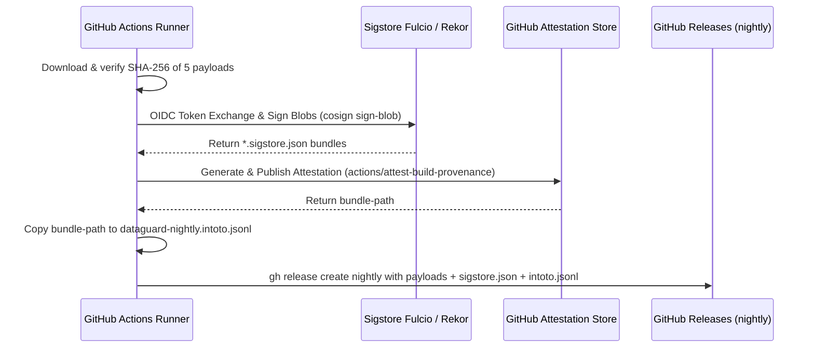

# Phase 2: Nightly Installer Sigstore Signing and Provenance

## Overview
Remediate the OpenSSF Scorecard finding `Warn: release artifact nightly not signed` and `Warn: release artifact nightly does not have provenance`. Modernize `.github/workflows/installers.yml` so that every rolling `nightly` pre-release cryptographically signs its CLI binaries and IDE extensions with keyless Sigstore cosign and attaches an in-toto SLSA provenance bundle (`.intoto.jsonl`).

## Requirements
- **Functional Requirements**:
  - The `publish` job in `.github/workflows/installers.yml` MUST request permissions `id-token: write` (for OIDC Fulcio certificate issuance) and `attestations: write` (for GitHub Artifact Attestations).
  - Install `sigstore/cosign-installer` pinned by immutable commit SHA.
  - Sign all 5 installer artifacts:
    - `dataguard-<v>-linux-x64.zip`
    - `dataguard-<v>-win-x64.zip`
    - `dataguard-<v>-osx-arm64.zip`
    - `dataguard-vscode-<v>.vsix`
    - `DataGuard.VisualStudio-<v>.vsix`
    producing `<file>.sigstore.json` containing signature, OIDC cert, and Rekor transparency log proof.
  - Invoke `actions/attest-build-provenance` to record cryptographic build provenance.
  - Export the generated attestation bundle output (`${{ steps.attest.outputs.bundle-path }}`) to `./artifacts/dataguard-nightly.intoto.jsonl`.
  - Attach all `*.sigstore.json` files and `dataguard-nightly.intoto.jsonl` to the `gh release create nightly` command.
  - Update `body.md` in the release creation step: replace "Automated, **unsigned** pre-release" with "Automated, **cryptographically signed** pre-release with Sigstore keyless signatures and SLSA provenance".
- **Non-functional Requirements**:
  - Concurrency safety: preserve existing `concurrency: installers-${{ github.ref }}`.
  - Keep workflow execution overhead minimal (~30-45s addition for keyless signing).

## Architecture


## Related Code Files
- Modify: `.github/workflows/installers.yml` (publish job: permissions, cosign installer, sign step, attest step, release file glob)
- Modify: `scripts/tests/test_check_workflow_policy.py` (add TDD enforcement for installers signing & provenance)
- Modify: `docs/USAGE.md` (update documentation: nightly is signed)

## Implementation Steps (TDD: Red -> Green -> Verify)

### 1. Step 1 (RED): Expand Policy Gate `scripts/tests/test_check_workflow_policy.py`
Add unit tests asserting:
1. `installers.yml` `publish` job defines `id-token: write` and `attestations: write`.
2. `installers.yml` includes `uses: sigstore/cosign-installer`.
3. `installers.yml` signs all artifacts with `cosign sign-blob --yes --bundle`.
4. `installers.yml` includes `actions/attest-build-provenance` and copies `bundle-path` to `dataguard-nightly.intoto.jsonl`.
Run test:
```bash
python3 -m unittest scripts/tests/test_check_workflow_policy.py
```
**Expected Outcome**: **FAIL (RED)** — missing signing & attestation assertions on `installers.yml`.

### 2. Step 2 (GREEN): Update `.github/workflows/installers.yml`
1. Update job permissions:
   ```yaml
   publish:
     name: Publish nightly pre-release
     runs-on: ubuntu-latest
     needs: [resolve-version, cli, vscode, visualstudio]
     if: github.event_name == 'push' || inputs.publish_prerelease
     permissions:
       contents: write
       id-token: write
       attestations: write
   ```
2. Add Cosign setup and signing steps before `gh release create`:
   ```yaml
   - name: Install sigstore (cosign)
     uses: sigstore/cosign-installer@6f9f17788090df1f26f669e9d70d6ae9567deba6 # v4.1.2
     with:
       cosign-release: "v3.1.3"

   - name: Sign nightly artifacts with Sigstore (keyless)
     run: |
       set -euo pipefail
       for file in ./artifacts/dataguard-*.zip ./artifacts/*.vsix; do
         echo "Signing $file..."
         cosign sign-blob --yes --bundle "$file.sigstore.json" "$file"
       done

   - name: Generate build provenance attestation
     id: attest
     uses: actions/attest-build-provenance@1e69f48acb82d1966a394da916b4c1698aa569d6 # v2
     with:
       subject-path: |
         ./artifacts/dataguard-*.zip
         ./artifacts/*.vsix

   - name: Stage provenance file for release assets
     run: |
       cp "${{ steps.attest.outputs.bundle-path }}" ./artifacts/dataguard-nightly.intoto.jsonl
   ```
3. Update `gh release create` file list:
   ```bash
   gh release create "$TAG" \
     ./artifacts/*.zip \
     ./artifacts/*.zip.sha256 \
     ./artifacts/*.vsix \
     ./artifacts/*.vsix.sha256 \
     ./artifacts/*.sigstore.json \
     ./artifacts/dataguard-nightly.intoto.jsonl \
     --title "Nightly build $VERSION" \
     --notes-file body.md \
     --prerelease
   ```
Re-run policy tests:
```bash
python3 -m unittest scripts/tests/test_check_workflow_policy.py
```
**Expected Outcome**: **PASS (GREEN)**.

### 3. Step 3 (VERIFY): Policy Audit Verification
Run the workflow policy validator to verify zero policy violations:
```bash
python3 scripts/check-workflow-policy.py
```
**Expected Outcome**: `OK: all workflows conform to security policies.`

## Success Criteria
- [x] `scripts/tests/test_check_workflow_policy.py` passes all test cases.
- [x] `installers.yml` has `id-token: write` and `attestations: write`.
- [x] Nightly release includes `*.sigstore.json` for all payloads.
- [x] Nightly release includes `dataguard-nightly.intoto.jsonl`.
- [x] Scorecard `Signed-Releases` warning on `nightly` is remediated.

## Risk Assessment
- **Risk**: Cosign OIDC token request failure during high GitHub Actions load.
- **Mitigation**: Use pinned Cosign v3.1.3 installer with built-in retry logic; release job can be rerun via `workflow_dispatch`.
