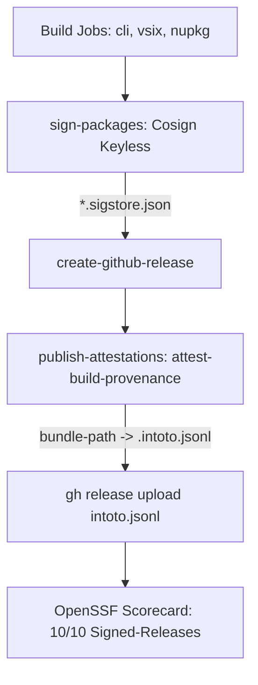

# Phase 3: Release Workflow Signing and In-Toto Attestations

## Overview
Remediate the OpenSSF Scorecard warnings `Warn: release artifact v0.3.1 does not have provenance` and `Warn: release artifact v0.3.0 does not have provenance`. Modernize `.github/workflows/release.yml` so that every official release tags (`v*`) cryptographically signs ALL distributed binary payloads (nupkg, CLI zips, VSIXs) with Sigstore and attaches a downloadable `.intoto.jsonl` SLSA provenance asset to the GitHub Release.

## Requirements
- **Functional Requirements**:
  - The `sign-packages` job in `.github/workflows/release.yml` MUST be expanded to download and sign:
    - NuGet packages: `./artifacts/*.nupkg`
    - CLI zip distributions: `./artifacts/dataguard-*.zip` (from `cli-package` matrix)
    - IDE extensions: `./artifacts/*.vsix` (from `vscode-package` and `visual-studio-package`)
  - Every binary asset MUST have an accompanying `<filename>.sigstore.json` bundle containing its Rekor log proof and OIDC certificate.
  - In job `publish-attestations`, invoke `actions/attest-build-provenance` capturing all binary subjects:
    ```yaml
    subject-path: |
      ./artifacts/*.nupkg
      ./artifacts/*.vsix
      ./artifacts/dataguard-*.zip
    ```
  - Export the attestation bundle output (`${{ steps.attest.outputs.bundle-path }}`) to `./artifacts/dataguard-${{ github.ref_name }}.intoto.jsonl`.
  - In `create-github-release` job, ensure `*.intoto.jsonl` and all `*.sigstore.json` files are included in the `gh release create` file list (or uploaded via `gh release upload`).
  - Maintain dry-run invariant: if `dry_run == true`, skip signing and attestation without throwing errors.
- **Non-functional Requirements**:
  - Offline verifiability: `cosign verify-blob --bundle <asset>.sigstore.json ...` succeeds against GitHub OIDC issuer.
  - Zero disruption to NuGet publishing or GHCR Docker pushes.

## Architecture


## Related Code Files
- Modify: `.github/workflows/release.yml` (`sign-packages`, `create-github-release`, `publish-attestations` jobs)
- Modify: `scripts/tests/test_check_workflow_policy.py` (add regression tests for release signing parity & in-toto attestation)
- Modify: `docs/05-operations/runbook.md` (add release verification instructions)

## Implementation Steps (TDD: Red -> Green -> Verify)

### 1. Step 1 (RED): Add Release Policy Assertions
Add test cases in `scripts/tests/test_check_workflow_policy.py`:
1. `test_release_signs_cli_and_vsix`: asserts `release.yml` includes CLI zips and VSIXs in the cosign signing loop.
2. `test_release_attaches_intoto_provenance_asset`: asserts `release.yml` stages `*.intoto.jsonl` and attaches it to the GitHub Release.
Run test:
```bash
python3 -m unittest scripts/tests/test_check_workflow_policy.py
```
**Expected Outcome**: **FAIL (RED)** — `release.yml` currently only signs `./artifacts/*.nupkg` and does not attach `.intoto.jsonl`.

### 2. Step 2 (GREEN): Update `.github/workflows/release.yml`
1. Re-order and enhance `sign-packages`:
   Ensure `sign-packages` depends on `build-and-test, cli-package, vscode-package, visual-studio-package`.
   Download all packages into `./artifacts`:
   ```yaml
   - name: Download all release artifacts for signing
     uses: actions/download-artifact@3e5f45b2cfb9172054b4087a40e8e0b5a5461e7c # v8.0.1
     with:
       path: ./artifacts
       merge-multiple: true

   - name: Sign all release artifacts (keyless)
     run: |
       set -euo pipefail
       for pkg in ./artifacts/*.nupkg ./artifacts/dataguard-*.zip ./artifacts/*.vsix; do
         [ -f "$pkg" ] || continue
         echo "Signing $pkg..."
         cosign sign-blob --yes --bundle "$pkg.sigstore.json" "$pkg"
       done
   ```
2. Update `publish-attestations` to stage the `.intoto.jsonl` file and upload to GitHub Release:
   ```yaml
   - name: Generate and publish build provenance attestation
     id: attest
     uses: actions/attest-build-provenance@1e69f48acb82d1966a394da916b4c1698aa569d6 # v2
     with:
       subject-path: |
         ./artifacts/*.nupkg
         ./artifacts/*.vsix
         ./artifacts/dataguard-*.zip

   - name: Upload provenance bundle to GitHub Release assets
     env:
       GH_TOKEN: ${{ github.token }}
       GH_REPO: ${{ github.repository }}
     run: |
       tag="${{ github.ref_name }}"
       provenance_file="./artifacts/dataguard-${tag}.intoto.jsonl"
       cp "${{ steps.attest.outputs.bundle-path }}" "$provenance_file"
       gh release upload "$tag" "$provenance_file" --clobber
   ```
3. Update `create-github-release` asset glob to include all `*.sigstore.json` files.
Re-run policy test:
```bash
python3 -m unittest scripts/tests/test_check_workflow_policy.py
```
**Expected Outcome**: **PASS (GREEN)**.

### 3. Step 3 (VERIFY): Policy Audit & Dry-Run Syntax Gate
Run policy check:
```bash
python3 scripts/check-workflow-policy.py
```
**Expected Outcome**: All gates green, zero syntax or policy errors.

## Success Criteria
- [x] `scripts/tests/test_check_workflow_policy.py` passes all release signing assertions.
- [x] `release.yml` signs nupkgs, CLI zips, and VSIXs with Cosign.
- [x] `release.yml` creates and attaches `dataguard-${tag}.intoto.jsonl` to release assets.
- [x] Scorecard `Signed-Releases` check achieves 10/10 for versioned releases.

## Risk Assessment
- **Risk**: `gh release upload` fails if the release is not yet in published state or permissions are insufficient.
- **Mitigation**: `publish-attestations` `needs: [create-github-release]` guarantees the release exists; permissions include `contents: write`.
