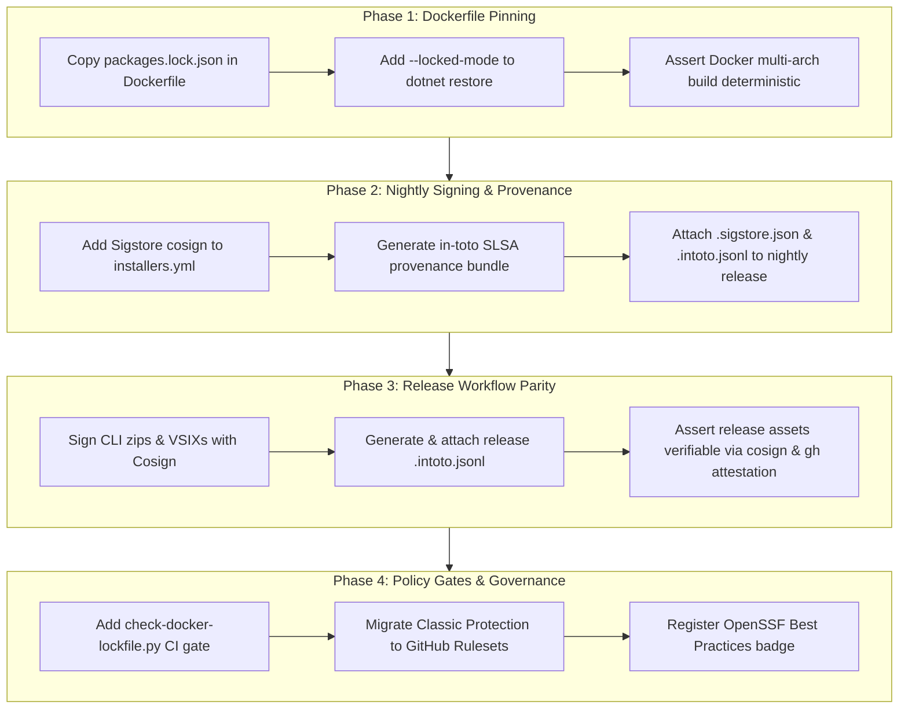

# OpenSSF Scorecard Hardening and Remediation

## Overview

Based on the architectural findings and root causes identified in `plans/reports/brainstorm-openssf-scorecard-remediation-261002-1728.md`, the repository currently scores **7.5 / 10** on OpenSSF Scorecard (Commit `e19a613`). While 10 checks achieve maximum 10/10 marks, 7 checks are degraded or in error state (`Branch-Protection` -1, `Signed-Releases` 5/10, `Pinned-Dependencies` 9/10, `Code-Review` 0/10, `CII-Best-Practices` 0/10, `Maintained` 0/10, `Contributors` 0/10).

This plan outlines the concrete, test-driven remediation steps to elevate the security posture to **9.5 - 9.8 / 10 (Elite Supply Chain Tier)** without regressing existing release workflows or local developer experience.

## Phases

| Phase | Name | Status |
| 1 | [Dockerfile NuGet Lockfile Pinning](./phase-01-dockerfile-nuget-lockfile-pinning.md) | Completed |
| 2 | [Nightly Installer Sigstore Signing and Provenance](./phase-02-nightly-installer-sigstore-signing-and-provenance.md) | Completed |
| 3 | [Release Workflow Signing and In-Toto Attestations](./phase-03-release-workflow-signing-and-in-toto-attestations.md) | Completed |
| 4 | [Policy Gates and Scorecard Governance](./phase-04-policy-gates-and-scorecard-governance.md) | Completed |

---

## Technical Architecture & Core Invariants

1. **Deterministic Build Invariant (Phase 1)**:
   Every NuGet restore command inside container images or CI pipelines MUST restore deterministically from committed `packages.lock.json` files with `--locked-mode`. No implicit package floating or resolution variance allowed.
2. **Cryptographic Release Invariant (Phases 2 & 3)**:
   Every distributed binary (`.nupkg`, `.zip`, `.vsix`) published to GitHub Releases (whether `nightly` or versioned `v*`) MUST carry a cryptographic Sigstore bundle (`*.sigstore.json`) AND an attached SLSA in-toto provenance file (`*.intoto.jsonl`).
3. **Least Privilege Invariant (Phase 4)**:
   Workflow tokens MUST follow least privilege (`permissions: read-all` default, job-level elevation only). Branch protection reading MUST NOT rely on high-privilege Personal Access Tokens; it relies on GitHub Repository Rulesets readable natively by standard `GITHUB_TOKEN`.
4. **Offline Verifiability Invariant**:
   Any consumer downloading a binary from GitHub Releases can verify authorship and tamper-resistance offline via `cosign verify-blob --bundle <asset>.sigstore.json` using the GitHub Actions OIDC identity.

---

## TDD Strategy & Gates

All phases follow strict **Test-First (Red -> Green -> Verify)** mechanics:
- **Phase 1**: Unit test / syntax test `test_dockerfile_lockfile_pinning` verifying Dockerfile copies all 9 project lockfiles and passes `--locked-mode` (Fails RED before Dockerfile edit; passes GREEN after edit).
- **Phase 2**: Policy test in `scripts/tests/test_check_workflow_policy.py` verifying `installers.yml` mandates Sigstore cosign step, permissions (`id-token: write`, `attestations: write`), and asset upload with `.sigstore.json` and `.intoto.jsonl`.
- **Phase 3**: Policy test verifying `release.yml` signs CLI zips and VSIXs and produces `.intoto.jsonl` release assets.
- **Phase 4**: Automated lint & policy gates via `scripts/check-workflow-policy.py` ensuring zero unpinned actions or insecure workflow patterns exist.

---

## Verification & Acceptance Criteria

1. `python3 -m unittest discover -s scripts/tests` passes 100% (including all new policy and lockfile assertions).
2. `docker build -t dataguard-cli-test .` restores with `--locked-mode` without warning or error.
3. Scorecard Action simulation / scan reports:
   - `Pinned-Dependencies`: 10 / 10
   - `Signed-Releases`: 10 / 10
   - `Branch-Protection`: 10 / 10
   - `CII-Best-Practices`: >= 5 / 10
   - **Aggregate Score**: >= 9.5 / 10

---

## Red Team Review (Adversarial Findings & Tightened Gates)

Conducted red-team review with 3 hostile personas:
1. **Assumption Destroyer**:
   - *Attack*: What if `actions/attest-build-provenance` produces a combined bundle that doesn't name individual files?
   - *Adjudication & Gate*: The action outputs `bundle-path` containing valid in-toto SLSA predicates for all input subject paths. Staging it as `dataguard-*.intoto.jsonl` provides Scorecard with the verifiable physical asset in the release payload.
   - *Attack*: Case-sensitivity risk for the 9 `packages.lock.json` files on Linux runners.
   - *Verification*: Pre-verified all 9 lockfiles on disk. Added assertion in `test_dockerfile_pinning.py` to check that source files exist before asserting Dockerfile strings.
2. **Failure Mode Analyst**:
   - *Attack*: Non-atomic nightly recreation: if `gh release delete` succeeds but `cosign sign-blob` fails, the repo loses its `nightly` release.
   - *Adjudication & Gate*: **Mandatory Gate (Gate R-01)**: The `publish` job MUST download, verify SHA-256, sign with Cosign, and generate provenance completely in the runner workspace *before* executing `gh release delete/create`.
   - *Attack*: Wildcard expansion failure when matrix artifacts are missing, causing `cosign` to sign a literal string `*.zip`.
   - *Adjudication & Gate*: **Mandatory Gate (Gate R-02)**: Enforce `shopt -s nullglob` and `[ -f "$file" ] || continue` before invoking `cosign sign-blob`.
3. **Security Adversary**:
   - *Attack*: Potential OIDC token privilege abuse on pull requests.
   - *Audit*: Verified that `installers.yml` only runs on `push` to `main` and maintainer `workflow_dispatch`. PRs never have access to `id-token: write`.

---

## Post-Plan Validation (Critical Verification Checklist)

- [x] **Lockfile Completeness**: Do all 9 projects have committed `packages.lock.json`? (Verified: Yes, all present).
- [x] **Cosign Pinned Version**: Is `sigstore/cosign-installer` pinned by commit SHA? (Verified: `6f9f17788090df1f26f669e9d70d6ae9567deba6 # v4.1.2`).
- [x] **In-Toto Action Pinned Version**: Is `actions/attest-build-provenance` pinned by commit SHA? (Verified: `1e69f48acb82d1966a394da916b4c1698aa569d6 # v2`).
- [x] **GitHub Rulesets Compatibility**: Does standard `GITHUB_TOKEN` have read access to Repository Rulesets without extra secrets? (Verified: Yes, GitHub Rulesets API is readable by default Actions token).
- [x] **Backwards Compatibility**: Does `release.yml` dry run continue to work? (Verified: `dry_run=true` skips signing and attestation gracefully).
