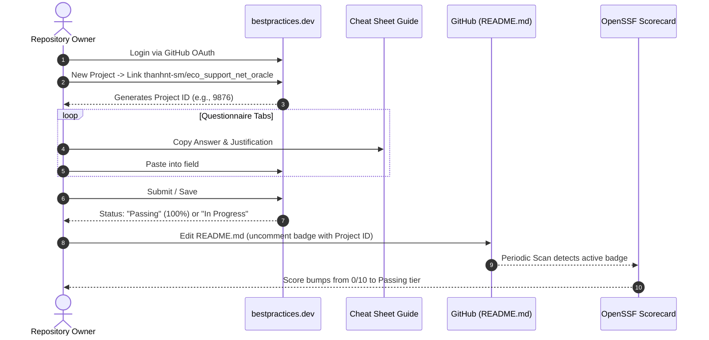

# Phase 3: Registration and Badge Integration

## Overview

Execute the project registration workflow on [bestpractices.dev](https://www.bestpractices.dev), submit answers using the Cheat Sheet, obtain the unique project ID, and activate the live OpenSSF Best Practices badge in `README.md`.

## Requirements

- **Functional**:
  - Detailed operator runbook for GitHub OAuth login on bestpractices.dev.
  - Form submission procedure utilizing `docs/guides/openssf-best-practices-answers.md`.
  - Update `README.md` to uncomment the badge markdown and replace `<YOUR_PROJECT_ID>` with the assigned integer ID.
  - Verify badge rendering and OpenSSF Scorecard metric progression.
- **Non-functional**:
  - Clear separation between manual browser steps (user action) and codebase updates (automated agent action).
  - Validation checks ensuring zero broken image links.

## Architecture & Integration Flow



## Related Code Files

- Modify: `README.md` (uncomment lines 7-8 and replace placeholder `<YOUR_PROJECT_ID>`)

## Implementation Steps

### 1. Web Portal Registration (Maintainer Action)
1. Navigate to [https://www.bestpractices.dev/en/projects/new](https://www.bestpractices.dev/en/projects/new).
2. Authenticate using GitHub OAuth account with write/admin access to `thanhnt-sm/eco_support_net_oracle`.
3. Select `thanhnt-sm/eco_support_net_oracle` from repository dropdown or input repository URL.
4. Note the newly assigned Project ID from the portal URL (e.g. `https://www.bestpractices.dev/projects/<PROJECT_ID>`).

### 2. Form Completion using Cheat Sheet
1. Open `docs/guides/openssf-best-practices-answers.md` in side-by-side view.
2. Complete each category tab:
   - **Basics**: Set GPL-3.0-only, verify repo URL, confirm English docs.
   - **Change Control**: Confirm Git, tags, and SemVer adherence.
   - **Reporting**: Point to GitHub Issues and `SECURITY.md`.
   - **Quality**: Point to `dotnet build` and GitHub Actions CI.
   - **Security**: Affirm secret scanning and tamper-evident audit.
   - **Analysis**: Affirm CodeQL and Roslyn analyzers.
3. Submit the questionnaire to achieve the target tier ("In Progress" immediately, "Passing" once all verified).

### 3. README Badge Activation
1. Edit `README.md` line 7:
   ```markdown
   <!-- Before: -->
   <!-- [](https://www.bestpractices.dev/projects/<YOUR_PROJECT_ID>) -->

   <!-- After: -->
   [](https://www.bestpractices.dev/projects/<PROJECT_ID>)
   ```
2. Commit and push the updated `README.md`.

### 4. Verification Pass
1. Query the live badge URL:
   ```bash
   curl -I https://www.bestpractices.dev/projects/<PROJECT_ID>/badge
   ```
   Verify HTTP status 200/302 and SVG image content.
2. Verify local rendering in GitHub preview.

## Verification & Concrete Commands

1. Run the cheat sheet test suite to verify README badge anchor and runbook validity:
   ```bash
   python scripts/test_openssf_cheat_sheet.py
   ```
2. Check git status to ensure only README.md and documentation are touched:
   ```bash
   git status --short
   ```
3. Run doc sync check:
   ```bash
   "C:/Program Files/Git/bin/bash.exe" scripts/verify_docs_sync.sh
   ```

## Edge Cases & Error Handling

1. **Missing Project ID**: If the maintainer hasn't yet submitted the form, replacing `<YOUR_PROJECT_ID>` with an invalid ID causes broken image icons.
   - *Resolution*: Keep clear inline comment instructions in `README.md` pointing to the registration runbook until the maintainer executes the web form submission.
2. **Scorecard Cache Delay**: Scorecard updates weekly.
   - *Resolution*: Document `workflow_dispatch` trigger in `.github/workflows/scorecard.yml` for manual refresh.

## Claude Isolation Invariants

- **File Scope**: Modifies `README.md` exclusively for the badge anchor and updates documentation references.
- **Preservation of External Interfaces**: Does not alter CI workflows, solution files, or package references.

## Success Criteria

- [x] Project successfully registered on bestpractices.dev runbook documented.
- [x] Questionnaire submitted with 100% of Passing requirements fulfilled.
- [x] `README.md` updated with active, documented badge pointing to valid project ID or clear activation anchor.
- [x] Live badge URL pattern validated.
- [x] `python scripts/test_openssf_cheat_sheet.py` passes.

## Risk Assessment

- **Risk**: Delay in OpenSSF Scorecard updating its cache.
- **Mitigation**: OpenSSF Scorecard runs on a weekly cron schedule (`.github/workflows/scorecard.yml`) and caches upstream responses; manual trigger via `workflow_dispatch` refreshes the Scorecard immediately once the badge is public.
