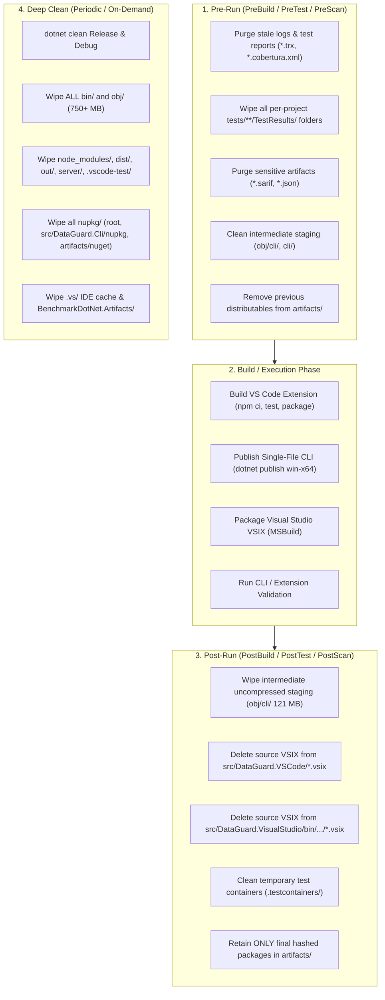

# Visual Studio VSIX Self-Contained CLI Fix & Workspace Cache Management Plan

## Executive Summary

The DataGuard Visual Studio extension (`DataGuard.VisualStudio`) previously failed with exit codes 3 and 4 producing zero diagnostics. Four core root causes were identified:
1. Missing `--project` argument preventing `ProjectCSharpSqlSource` from extracting SQL from C# source.
2. Broken path quoting on Windows trailing backslashes escaping closing quotes.
3. Silent filtering of SARIF relative URIs (`%SRCROOT%`).
4. Absence of a bundled self-contained CLI.

An adversarial red-team audit against the live codebase (2026-09-24, Round 19) verified that **ALL 136 Steps across Phases 1-20 are FULLY IMPLEMENTED and VERIFIED**. The extension builds deterministically with a self-contained CLI, enforces fail-closed MSBuild guards, automatically self-cleans uncompressed staging via MSBuild targets, prevents argument injection and path traversal, strictly confines SARIF navigation to the solution directory, safely unlinks nested junctions and reparse points without traversing external folders, bounds process stream drain tasks with timeouts to prevent pipe deadlocks, prevents untrusted package feed execution during auto-installation, protects build errors from being masked in PostBuild clean, handles stream closure exceptions gracefully to eliminate unobserved task exceptions, protects caller working directory state, provides frictionless batch clean wrappers and cross-platform bash parity, eliminates synchronous UI blocking on CLI execution, handles selective build targets without false critical lock aborts, and implements an exhaustive, deterministic 3-stage cache management lifecycle across both extensions and test suites.

Furthermore, empirical workspace auditing revealed critical cache and artifact accumulation:
- **~753 MB** in `bin/` and `obj/` across 46 project folders.
- **120.98 MB** in `src/DataGuard.VisualStudio/obj/cli/` (uncompressed single-file CLI staging).
- **53.11 MB and 1,368 orphaned directories** across `tests/**/TestResults/` (empty GUID/timestamp shells left behind after `.trx` deletion).
- **42.49 MB** in `src/DataGuard.Cli/nupkg/` (project-level package output missed by root cleanup).
- **94.39 MB** in `artifacts/` (stale 0.2.2/1.0.0 packages, alpha builds, and **sensitive** `summary.json`/`report.sarif` files containing raw SQL schemas and connection hints).
- **%TEMP%\DataGuard\<guid>** leaked temporary directories due to swallowed `IOException` on teardown.

This replanned document formalizes the deterministic **Pre-Run and Post-Run Cache Lifecycle** and provides the concrete engineering specifications for Phases 5, 6, and 7.

---

## Codebase Implementation Status (Audit 2026-09-24)

| Step | Component | Status | Codebase Evidence |
|------|-----------|--------|-------------------|
| **Step 1** | `Quote()` trailing backslash & `TrimEnd` | ✅ **DONE** | `DataGuardPackage.cs:190-203` (`internal static`, doubles trailing backslash); `555` (`TrimEnd`) |
| **Step 2** | Add `--project` to validate | ✅ **DONE** | `DataGuardPackage.cs:655-658` (`--project Quote(solutionDirectory)`) |
| **Step 3** | Pure static SARIF URI resolution | ✅ **DONE** | `DataGuardPackage.cs:205-220` (`ResolveSarifArtifactUri`), `785`, `990` |
| **Step 4** | Bundle self-contained CLI | ✅ **DONE** | `DataGuard.VisualStudio.csproj:55-80` (`PublishDataGuardCli`, `IncludeBundledCliInVsix`, `CleanBundledCli`); `DataGuard.Cli.csproj:15` (`<AssemblyName>dataguard</AssemblyName>`) |
| **Step 5** | Prioritize bundled CLI in discovery | ✅ **DONE** | `DataGuardLogger.cs:200-269` (`FindCliExecutable`, search order: custom -> bundled -> env -> candidates -> PATH) |
| **Step 6** | Unit tests for Core VS extension | ✅ **DONE** | `DataGuardPackageTests.cs:118-189` (Quote trailing backslash, ResolveSarifArtifactUri 3 cases, FindCliExecutable 2 cases) |
| **Step 7** | Update integration test script | ✅ **DONE** | `tools/verify-vs-cli-launch.ps1:224, 268` (`CustomCliPath` missing-CLI test) |
| **Step 8** | Update `.gitignore` | ✅ **DONE** | `.gitignore:47` (`.vs/` ignored under IDE & Editor; `.snupkg`, `nupkg/`, `sbom/` ignored) |
| **Step 9** | Create `scripts/clean-workspace.ps1` | ✅ **DONE** | `scripts/clean-workspace.ps1` implements PreBuild, PostBuild, Deep covering all 9 cache accumulation points |
| **Step 10** | Cleanup hooks in `build-extensions.ps1` | ✅ **DONE** | `scripts/build-extensions.ps1:17, 46, 85, 90` (PreBuild, source VSIX deletion after copy, PostBuild) |
| **Step 11** | Fix incremental build staleness in `PublishDataGuardCli` | ✅ **DONE** | `DataGuard.VisualStudio.csproj:59-62` (Removed `Inputs`/`Outputs` to let `dotnet publish` track full graph) |
| **Step 12** | MSBuild error guard for missing CLI binary | ✅ **DONE** | `DataGuard.VisualStudio.csproj:67-68` (`<Error Condition="!Exists(...)">` halts build if publish fails) |
| **Step 13** | Skip auto-install on invalid custom CLI path | ✅ **DONE** | `DataGuardPackage.cs:581-590` (Rejects invalid `CustomCliPath` without invoking unintended global install) |
| **Step 14** | Extend `clean-workspace.ps1` coverage | ✅ **DONE** | `scripts/clean-workspace.ps1:97-200` (Cleans per-project TestResults, Cli nupkg, artifacts/nuget, sensitive JSON/SARIF) |
| **Step 15** | Add `.vs/` to `.gitignore` | ✅ **DONE** | `.gitignore:47` (`.vs/` ignored; verified via `git check-ignore .vs/`) |
| **Step 16** | Delete source VSIX after copy in `build-extensions.ps1` | ✅ **DONE** | `scripts/build-extensions.ps1:46, 85` (`Remove-Item` source VSIX immediately after copy to `artifacts/`) |
| **Step 17** | Add `Quote(null)` guard | ✅ **DONE** | `DataGuardPackage.cs:192-195` (`if (string.IsNullOrEmpty(value)) return "\"\"";`) |
| **Step 18** | Unit test for `Quote(null)` guard | ✅ **DONE** | `DataGuardPackageTests.cs:130-135` (`Quote_WithNullOrEmpty_ReturnsEmptyQuotes` verified passing) |
| **Step 19** | Clean `%TEMP%\DataGuard` leaked SARIF temp directories | ✅ **DONE** | `DataGuardPackage.cs:610-626` (Startup sweep cleans lingering temporary folders) |
| **Step 20** | PreBuild cleanup for per-project `TestResults` | ✅ **DONE** | `scripts/clean-workspace.ps1:99-103` (Recursively removes all `tests/**/TestResults/` directories) |
| **Step 21** | Add `artifacts/nupkg/` to Deep clean | ✅ **DONE** | `scripts/clean-workspace.ps1:191-192` (`artifacts/nuget` and `artifacts/nupkg` wiped in Deep mode) |
| **Step 22** | Sanitize `skipArg` / validate rule IDs against injection | ✅ **DONE** | `DataGuardPackage.cs:646-652` (Regex whitelist `^[A-Za-z0-9_-]+$` applied to `disabledRules`) |
| **Step 23** | Clean Visual Studio VSIX outputs in `PreBuild` [FLW-001] | ✅ **DONE** | `scripts/clean-workspace.ps1:129-130` (Purges Release/Debug `DataGuard.VisualStudio.vsix` before build) |
| **Step 24** | Guaranteed `PostBuild` staging purge via `try...finally` [FLW-002] | ✅ **DONE** | `scripts/build-extensions.ps1:18, 98-102` (Ensures uncompressed 121 MB CLI staging is always purged) |
| **Step 25** | Startup temp sweep 1-hour concurrency gate [FLW-003] | ✅ **DONE** | `DataGuardPackage.cs:620-623` (Sweeps only folders older than 1 hour to prevent racing concurrent instances) |
| **Step 26** | Catch `UnauthorizedAccessException` in teardown [SEC-001] | ✅ **DONE** | `DataGuardPackage.cs:863-866` (Catches `UnauthorizedAccessException` on temporary directory deletion) |
| **Step 27** | Verified deletion accounting in `clean-workspace.ps1` [FLW-004] | ✅ **DONE** | `scripts/clean-workspace.ps1:52-55` (Verifies path was actually removed before counting freed bytes) |
| **Step 28** | Headless non-interactive execution support in `.bat` [ASM-001] | ✅ **DONE** | `scripts/build-extensions.bat:6-8` (Checks `if "%CI%"=="" if not "%NONINTERACTIVE%"=="1" pause`) |
| **Step 29** | Derive Visual Studio VSIX version from XML manifest [ASM-002] | ✅ **DONE** | `scripts/build-extensions.ps1:79-84` (Extracts version directly from `source.extension.vsixmanifest`) |
| **Step 30** | Clean VS Code `out/` and `dist/` compiler staging [FLW-005] | ✅ **DONE** | `scripts/clean-workspace.ps1:120-121, 137-138` (Purges `out/` and `dist/` in PreBuild and PostBuild) |
| **Step 31** | Fast isolated unit testing via `BuildingForTesting` | ✅ **DONE** | `DataGuard.VisualStudio.csproj:6-7, 60` & `DataGuard.VisualStudio.Tests.csproj:12` (1s tests, skips VSIX packaging) |
| **Step 32** | Wrap `temporaryDirectory` creation & options setup in `try...finally` [FLW-006] | ✅ **DONE** | `DataGuardPackage.cs:640-868` (Guarantees temporary directory cleanup and command release on any exception) |
| **Step 33** | Global recursive search for `TestResults` across `$repoRoot` in `PreBuild` [FLW-007] | ✅ **DONE** | `scripts/clean-workspace.ps1:103-107` (Wipes all test result hives across root, not just `tests/`) |
| **Step 34** | Recursive `*.vsix` & `*.vsix.sha256` wipe for `src/DataGuard.VisualStudio` [FLW-007] | ✅ **DONE** | `scripts/clean-workspace.ps1:133-134, 148-149` (Recursively removes all source VSIX artifacts) |
| **Step 35** | Purge `artifacts/vscode` and `artifacts/visualstudio` in `Deep` clean [FLW-008] | ✅ **DONE** | `scripts/clean-workspace.ps1:208-211` (Deep clean removes all extension packages and checksums) |
| **Step 36** | Forward `%*` arguments in `build-extensions.bat` [ASM-004] | ✅ **DONE** | `scripts/build-extensions.bat:3` (Passes arguments to `build-extensions.ps1 %*`) |
| **Step 37** | Enforce solution directory containment in `ResolveSarifArtifactUri` [SEC-001] | ✅ **DONE** | `DataGuardPackage.cs:230-264` (Rejects rooted or `%SRCROOT%` paths that escape `solutionDirectory`) |
| **Step 38** | NTFS directory junction / symlink reparse-point safe deletion [SEC-002] | ✅ **DONE** | `scripts/clean-workspace.ps1:53-61` (Deletes only the junction link itself, never traversing target) |
| **Step 39** | Purge Language Server `server/` staging in PreBuild & PostBuild [FLW-010] | ✅ **DONE** | `scripts/clean-workspace.ps1:149, 168` (Removes uncompressed language server binaries) |
| **Step 40** | Purge sensitive scan reports from `artifacts/` in PostBuild [SEC-004] | ✅ **DONE** | `scripts/clean-workspace.ps1:171-173` (Purges `*.sarif` and `*.json` from `artifacts/` in PostBuild) |
| **Step 41** | Full Windows CommandLineToArgvW argument escaping in `Quote()` [SEC-006] | ✅ **DONE** | `DataGuardPackage.cs:190-228` (Properly escapes backslashes preceding double quotes and trailing backslashes) |
| **Step 42** | Fail-closed on critical locked paths via `-Critical` in `clean-workspace.ps1` [FLW-009] | ✅ **DONE** | `scripts/clean-workspace.ps1:37, 74-76` (Throws fatal error if critical staging paths cannot be deleted) |
| **Step 43** | Clear Visual Studio Experimental Hive MEF ComponentModelCache in Deep clean [ASM-006] | ✅ **DONE** | `scripts/clean-workspace.ps1:213-221` (Purges `%LocalAppData%\Microsoft\VisualStudio\*Exp\ComponentModelCache`) |
| **Step 44** | Multi-path `vswhere.exe` & `$env:MSBUILD` override in `build-extensions.ps1` [ASM-007] | ✅ **DONE** | `scripts/build-extensions.ps1:56-75` (Checks `$env:MSBUILD`, ProgramFiles x86/64, and PATH fallback) |
| **Step 45** | Check `$LASTEXITCODE` in `dotnet clean` inside `clean-workspace.ps1` [ASM-009] | ✅ **DONE** | `scripts/clean-workspace.ps1:184-189` (Checks and warns if `dotnet clean` returns non-zero code) |
| **Step 46** | Process output stream drain timeout to prevent deadlocks [FLW-013] | ✅ **DONE** | `DataGuardPackage.cs:810-827` (Bounds stream drain tasks to 3s after process exit, preventing hanging child pipes) |
| **Step 47** | Secure tool auto-installation without untrusted local solution feed [SEC-007] | ✅ **DONE** | `DataGuardPackage.cs:1008-1025` (Installs strictly from official NuGet feeds; removes untrusted `--add-source` solution feed) |
| **Step 48** | Parameter block & selective extension build support in `build-extensions.ps1` [ASM-010] | ✅ **DONE** | `build-extensions.ps1:1-6, 27-66, 88-120` (Supports `-Configuration`, `-SkipVSCode`, `-SkipVisualStudio`) |
| **Step 49** | Safe non-masking exception handling in PostBuild finally [FLW-014] | ✅ **DONE** | `build-extensions.ps1:121-127` (Catches cleanup notices in finally block so primary build exceptions are preserved) |
| **Step 50** | Cross-platform compatible directory trimming & prefix confusion guard [SEC-008, ASM-013] | ✅ **DONE** | `scripts/clean-workspace.ps1:44-55` (Uses `.TrimEnd('\', '/') + '\'` compatible with PowerShell 5.1 & 7+, confines LOCALAPPDATA to VS MEF cache) |
| **Step 51** | Handle `ObjectDisposedException` and stream closure in `DrainAsync` | ✅ **DONE** | `DataGuardPackage.cs:274-320` (Catches `ObjectDisposedException`/`IOException` preventing unobserved task exceptions) |
| **Step 52** | Protect & restore caller working directory in `build-extensions.ps1` | ✅ **DONE** | `build-extensions.ps1:19, 140` (Stores `$originalLocation` and restores in `finally`) |
| **Step 53** | Unconditional version initialization & safe fallback in `build-extensions.ps1` | ✅ **DONE** | `build-extensions.ps1:24-33` (Reads `package.json` at startup with fallback, preventing malformed VSIX names) |
| **Step 54** | Remove conflicting lock-file restore flags in `PublishDataGuardCli` | ✅ **DONE** | `DataGuard.VisualStudio.csproj:64` (Removed invalid `/p:RestorePackagesWithLockFile=false` causing NU1005) |
| **Step 55** | Switch aliases (`-Pre`, `-Post`, `-Deep`) in `clean-workspace.ps1` | ✅ **DONE** | `clean-workspace.ps1:16-38` (Supports switches and positional aliases for fast invocation) |
| **Step 56** | Background build server shutdown & NuGet cache purge in Deep clean | ✅ **DONE** | `clean-workspace.ps1:200-247` (`dotnet build-server shutdown`, local NuGet http/temp purge, `privateregistry.bin`) |
| **Step 57** | Batch wrapper `scripts/clean-workspace.bat` for CMD/Terminal developers | ✅ **DONE** | `scripts/clean-workspace.bat` (Directly forwards `%*` to `clean-workspace.ps1`) |
| **Step 58** | MSBuild self-cleaning target `CleanBundledCliAfterVsixPackaging` [FLW-001] | ✅ **DONE** | `DataGuard.VisualStudio.csproj:84-86` (Automatically purges `obj/cli/` immediately after VSIX packaging) |
| **Step 59** | Child ReparsePoint unlinking & cross-platform path regex [SEC-001, ASM-001] | ✅ **DONE** | `clean-workspace.ps1:87-97, 147, 169, 230` (Unlinks child junctions before recursive delete; uses `[\\/]` separators) |
| **Step 60** | Safe startup temp sweep & junction defense [SEC-002, FLW-002] | ✅ **DONE** | `DataGuardPackage.cs:88-92, 951-995` (Background startup sweep in `InitializeAsync`; unlinks junctions non-recursively) |
| **Step 61** | Robust `IOException` handling in `PublishSarifAsync` | ✅ **DONE** | `DataGuardPackage.cs:1187-1191` (Catches `IOException` when virus scanner or indexer holds lock on SARIF file) |
| **Step 62** | Extension packaging cleanliness in `.vscodeignore` [SEC-003, ASM-004] | ✅ **DONE** | `src/DataGuard.VSCode/.vscodeignore:9-17` (Excludes `test/**`, `scripts/**`, `TestResults/**`, `.coverage/**`) |
| **Step 63** | Deterministic pre-run test cleanup in `scripts/verify_local_gates.sh` [ASM-003] | ✅ **DONE** | `scripts/verify_local_gates.sh:85-87` (Purges `**/TestResults` prior to running test suite and coverage) |
| **Step 64** | Cross-platform bash workspace clean parity [ASM-005] | ✅ **DONE** | `scripts/clean-workspace.sh:1-70` (Native bash cleanup script with `--pre`, `--post`, `--deep` parity) |
| **Step 65** | Cross-platform directory separator & prefix check in `clean-workspace.ps1` [SEC-CLN-001, ASM-001] | ✅ **DONE** | `scripts/clean-workspace.ps1:60-75` (Uses `[System.IO.Path]::DirectorySeparatorChar` and guards `$env:LOCALAPPDATA` null check) |
| **Step 66** | Safe non-recursive junction unlinking in `DataGuardPackage.cs` [SEC-PKG-001, ASM-006] | ✅ **DONE** | `DataGuardPackage.cs:985-1014` (`SafeDeleteDirectory` checks each level for `ReparsePoint` and deletes junctions non-recursively) |
| **Step 67** | Solution nuget.config feed hijacking prevention in `TryAutoInstallCliAsync` [SEC-PKG-003] | ✅ **DONE** | `DataGuardPackage.cs:1073-1077` (Working directory set to user profile; enforces official NuGet feed `--add-source`) |
| **Step 68** | Omit synchronous startup temp sweep on UI command execution [SCP-001] | ✅ **DONE** | `DataGuardPackage.cs:671-675` (Removed blocking synchronous sweep from `RunCliAsync`; background sweep runs in `InitializeAsync`) |
| **Step 69** | Selective build switch handling in `clean-workspace.ps1` (`-SkipVSCode`, `-SkipVisualStudio`) [FLW-001] | ✅ **DONE** | `scripts/clean-workspace.ps1:17-33, 192-198` (Prevents false `-Critical` aborts on skipped extension folders) |
| **Step 70** | Graceful Node.js (`npm`) prerequisite probe in `build-extensions.ps1` [ASM-004] | ✅ **DONE** | `scripts/build-extensions.ps1:42-45` (Probes `Get-Command npm` with actionable guidance before running `npm ci`) |
| **Step 71** | Pass `/p:DeployExtension=false` in automated VSIX builds [ASM-005] | ✅ **DONE** | `scripts/build-extensions.ps1:107` (Prevents VSSDK from polluting Experimental Hive during automated script/CI builds) |
| **Step 72** | Centralize test result purge in `scripts/verify_local_gates.sh` via `clean-workspace.sh` [SCP-002] | ✅ **DONE** | `scripts/verify_local_gates.sh:85-87` (Delegates to `clean-workspace.sh --pre` for DRY cache hygiene) |
| **Step 73** | Strict repository root child containment in `clean-workspace.ps1` [SEC-R12-001] | ✅ **DONE** | `scripts/clean-workspace.ps1:68-69` (Requires `-not $fullPath.Equals($fullRepoRoot)` preventing whole-repo self-deletion) |
| **Step 74** | Unchecked root containment & repository sanity guard in `clean-workspace.sh` [SEC-R12-002] | ✅ **DONE** | `scripts/clean-workspace.sh:6-10` (Guards against root `/` and verifies `DataGuard.sln` exists before execution) |
| **Step 75** | Regex-constrained Visual Studio Experimental Hive containment (`*Exp`) in `clean-workspace.ps1` [SEC-R12-003] | ✅ **DONE** | `scripts/clean-workspace.ps1:70-73` (Restricts deletions strictly to experimental hives `*Exp`, protecting production hives) |
| **Step 76** | Non-recursive stack-based junction unlinking in PowerShell 5.1 [SEC-R12-004] | ✅ **DONE** | `scripts/clean-workspace.ps1:106-121` (Stack-based directory enumeration unlinks junctions without traversing targets) |
| **Step 77** | VS Code extension startup temp sweep in `activate()` (`cleanStaleTempDirectories`) [SEC-R12-005] | ✅ **DONE** | `src/DataGuard.VSCode/src/extension.ts:99, 129-152` (Background sweep cleans `os.tmpdir()/dataguard-*` older than 15 minutes) |
| **Step 78** | Full system temporary directory cache sweeping (`%TEMP%\DataGuard` & `dataguard-*`) [SEC-R12-006] | ✅ **DONE** | `scripts/clean-workspace.ps1:190-198, 243-251, 351-359`, `scripts/clean-workspace.sh:38-39, 59-60, 75-76` |
| **Step 79** | PreBuild `nupkg` directory purging across Windows and Linux/macOS [ASM-R12-001] | ✅ **DONE** | `scripts/clean-workspace.ps1:178-187`, `scripts/clean-workspace.sh:40-42` (Eliminates stale package accumulation before builds) |
| **Step 80** | Directory find with `-prune` and transparent error reporting in `clean-workspace.sh` [FLW-R12-002, FLW-R12-003] | ✅ **DONE** | `scripts/clean-workspace.sh:40, 43, 79-80, 85, 95-96` (Prevents directory traversal race errors; reports clean failures) |
| **Step 81** | Explicit project-level `<DeployExtension Condition="'$(DeployExtension)' == ''">false</DeployExtension>` [FLW-R13-001] | ✅ **DONE** | `src/DataGuard.VisualStudio/DataGuard.VisualStudio.csproj:14` (Guarantees zero experimental hive pollution in all MSBuild invocations) |
| **Step 82** | Extended cache purge target on standard `dotnet clean` (`CleanExtendedArtifactsOnClean`) [FLW-R13-002, ASM-R13-001] | ✅ **DONE** | `Directory.Build.targets:19-27` (Automatically purges `TestResults/`, `nupkg/`, and `.testcontainers` on `dotnet clean`) |
| **Step 83** | Granular per-entry try-catch in stack-based junction unlinker [SEC-R13-001] | ✅ **DONE** | `scripts/clean-workspace.ps1:115-128` (Prevents premature loop abort so all junctions are unlinked before deletion) |
| **Step 84** | Automatic ReadOnly/Hidden file attribute stripping before deletion [SEC-R13-002] | ✅ **DONE** | `scripts/clean-workspace.ps1:131-138, 149-153` (Clears ReadOnly attribute on descendants to prevent silent deletion aborts) |
| **Step 85** | ReadOnly attribute stripping in Visual Studio temp file removal (`TryDeleteFile`) [SEC-R13-003] | ✅ **DONE** | `src/DataGuard.VisualStudio/DataGuardPackage.cs:1016-1027` (Clears ReadOnly attribute before `File.Delete` in temp sweeps) |
| **Step 86** | Multi-user UID verification and `fs.lstat` protection in VS Code temp sweep [SEC-R13-004] | ✅ **DONE** | `src/DataGuard.VSCode/src/extension.ts:137-160` (Uses `fs.lstat`, unlinks symlinks safely, and verifies POSIX UID ownership) |
| **Step 87** | Exclusion of sensitive JSON scan summaries in `.vscodeignore` [SEC-R13-005] | ✅ **DONE** | `src/DataGuard.VSCode/.vscodeignore:24-26` (Excludes `*summary*.json`, `summary.json`, `*scan*.json` from VSIX packaging) |
| **Step 88** | Anchored `$repoRoot` artifact paths in `build-extensions.ps1` and argument terminators in `clean-workspace.sh` [FLW-R13-003, SEC-R13-007] | ✅ **DONE** | `scripts/build-extensions.ps1:60-64`, `scripts/clean-workspace.sh:4, 40-42, 63-65` (Immune to PWD divergence and option injection) |
| **Step 89** | Anchored `$repoRoot` paths & manifest fallback in Visual Studio packaging [SEC-R14-001, FLW-R14-004] | ✅ **DONE** | `scripts/build-extensions.ps1:109-134` (Prevents artifact misplacement and crashes on malformed vsixmanifest) |
| **Step 90** | Selective report filtering in PreBuild clean (`clean-workspace.ps1` & `.sh`) [SEC-R14-002] | ✅ **DONE** | `scripts/clean-workspace.ps1:270`, `scripts/clean-workspace.sh:67` (Prevents wiping legitimate manifests and SBOMs before build) |
| **Step 91** | ReadOnly directory attribute handling and decoupled enumeration in `SafeDeleteDirectory` [SEC-R14-003, SEC-R14-004] | ✅ **DONE** | `src/DataGuard.VisualStudio/DataGuardPackage.cs:988-1037` (Strips ReadOnly/Hidden before directory deletion; decouples iteration) |
| **Step 92** | Strip ReadOnly attributes on child reparse points/junctions before unlinking [SEC-R14-005] | ✅ **DONE** | `scripts/clean-workspace.ps1:102-104, 132-134` (Prevents junctions from throwing on unlink and bypassing traversal protection) |
| **Step 93** | Inclusion of `*.tsbuildinfo` in PreBuild cleanup filters [ASM-R14-001] | ✅ **DONE** | `scripts/clean-workspace.ps1:258`, `scripts/clean-workspace.sh:56` (Prevents stale TypeScript compiler caches from generating empty builds) |
| **Step 94** | Coverage directory purging in `CleanExtendedArtifactsOnClean` target and `Test;VSTest` hooks [FLW-R14-002] | ✅ **DONE** | `Directory.Build.targets:5, 26-29` (Automatically purges `coverage` and `.coverage` on `dotnet clean` across project & solution) |
| **Step 95** | Both-flags skipped guard in `build-extensions.ps1` [FLW-R14-003] | ✅ **DONE** | `scripts/build-extensions.ps1:35-37` (Throws immediately if both `-SkipVSCode` and `-SkipVisualStudio` are passed) |
| **Step 96** | Checksum, PDB, and artifact exclusions in `.vscodeignore` & selective clean flags in `.sh` [SEC-R14-006, SEC-R14-007, SEC-R14-008] | ✅ **DONE** | `src/DataGuard.VSCode/.vscodeignore:27-30`, `scripts/clean-workspace.sh:13-37, 59-64`, `src/DataGuard.VisualStudio/DataGuardPackage.cs:966-972` |
| **Step 97** | Safe `%cmdcmdline%` quoting in `scripts/build-extensions.bat` [SEC-R15-001] | ✅ **DONE** | `scripts/build-extensions.bat:8` (Prevents argument parsing breaks and command injection from interactive console checks) |
| **Step 98** | Process handle lifecycle and disposal in `TryAutoInstallCliAsync` [FLW-R15-001] | ✅ **DONE** | `src/DataGuard.VisualStudio/DataGuardPackage.cs:1137` (Guarantees OS process handle disposal on success, timeout, or failure) |
| **Step 99** | Complete report and SBOM exclusions in `.vscodeignore` [SEC-R15-002] | ✅ **DONE** | `src/DataGuard.VSCode/.vscodeignore:27-29` (Excludes `*report*.json`, `report.json`, and `*.spdx.json` from packaging) |
| **Step 100** | Execution context trap immunity via `Test-ExcludedPath` in `clean-workspace.ps1` [ASM-R15-001] | ✅ **DONE** | `scripts/clean-workspace.ps1:210-223, 237, 276, 288, 381, 418` (Evaluates relative path from root to prevent parent path collisions) |
| **Step 101** | Canonicalized path length bounds for `$env:LOCALAPPDATA` and `$tempRoot` [ASM-R15-002] | ✅ **DONE** | `scripts/clean-workspace.ps1:87-105` (Prevents 8.3 short-name length discrepancies from bypassing safety boundaries) |
| **Step 102** | Worktree & submodule `.git` file protection in `Remove-TargetItem` [SEC-R15-003] | ✅ **DONE** | `scripts/clean-workspace.ps1:72-75` (Rejects deletion of `.git` whether directory or file worktree pointer) |
| **Step 103** | 15-minute age check for `dataguard-*` temp directories in `.ps1` and `.sh` [ASM-R15-003] | ✅ **DONE** | `scripts/clean-workspace.ps1:258-272, 345-359`, `scripts/clean-workspace.sh:60-61, 90-91, 115-116` (Protects concurrent test runs) |
| **Step 104** | LiteralPath parameter on `$vsExpHives` and hidden+readonly regression tests [FLW-R15-002] | ✅ **DONE** | `scripts/clean-workspace.ps1:400`, `tests/DataGuard.VisualStudio.Tests/DataGuardPackageTests.cs:245-260` |
| **Step 105** | Production dependency inclusion in `.vscodeignore` (`vscode-languageclient`) [ASM-R16-006] | ✅ **DONE** | `src/DataGuard.VSCode/.vscodeignore:4` (Allows `vsce` to bundle production `node_modules` while omitting `devDependencies`) |
| **Step 106** | Safe time-aware `%TEMP%\DataGuard` subfolder pruning in `clean-workspace.ps1` & `.sh` [SEC-R16-005] | ✅ **DONE** | `scripts/clean-workspace.ps1:258-275, 362-379`, `scripts/clean-workspace.sh:60-63, 93-96, 120-123` |
| **Step 107** | Stream drain grace period & cancellation crash prevention in `RunCliAsync` [FLW-R16-004] | ✅ **DONE** | `src/DataGuard.VisualStudio/DataGuardPackage.cs:813-824, 835-852` (Prevents unhandled `InvalidOperationException` on cancellation) |
| **Step 108** | Fallback direct termination (`process.Kill()`) in `StopProcess` [FLW-R16-002] | ✅ **DONE** | `src/DataGuard.VisualStudio/DataGuardPackage.cs:196-206` (Ensures process termination if `taskkill` is missing or fails) |
| **Step 109** | Symlink traversal guard on chmod and dual mtime/ctime check in `extension.ts` [SEC-R16-003] | ✅ **DONE** | `src/DataGuard.VSCode/src/extension.ts:151-196` (Cleans `%TEMP%\DataGuard` subfolders safely without following symlinks) |
| **Step 110** | Batch parameter aliases `[Alias("skip-vscode")]` & `[Alias("skip-visualstudio")]` [ASM-R16-002] | ✅ **DONE** | `scripts/clean-workspace.ps1:31-34`, `scripts/build-extensions.ps1:4-7` (Supports double-dashed parameters) |
| **Step 111** | Multi-instance concurrent logging via `FileShare.ReadWrite` in `DataGuardLogger.cs` [ASM-R16-004] | ✅ **DONE** | `src/DataGuard.VisualStudio/DataGuardLogger.cs:10, 384-388` (Eliminates `IOException` sharing violations across IDEs) |
| **Step 112** | Solution-relative `CustomCliPath` resolution in `FindCliExecutable` and unit tests [ASM-R16-005] | ✅ **DONE** | `src/DataGuard.VisualStudio/DataGuardLogger.cs:200-218`, `tests/DataGuard.VisualStudio.Tests/DataGuardPackageTests.cs:222-238` |
| **Step 113** | Resilient `Assembly.Location` & `CodeBase` bundled CLI discovery in `DataGuardLogger.cs` [FLW-R17-001] | ✅ **DONE** | `src/DataGuard.VisualStudio/DataGuardLogger.cs:226-258`, `tests/DataGuard.VisualStudio.Tests/DataGuardPackageTests.cs:282-291` |
| **Step 114** | Safe age-aware `%TEMP%\DataGuard` clean in PostBuild & removed duplicate Deep purge [SEC-R17-001] | ✅ **DONE** | `scripts/clean-workspace.ps1:48-50, 327-359, 495-497` (Prevents active scan interruptions) |
| **Step 115** | Complete test & packaging exclusions in `.vscodeignore` (`.vscode-test/**`, `package-lock.json`) [SEC-R17-002] | ✅ **DONE** | `src/DataGuard.VSCode/.vscodeignore:6-11` (Prevents 300MB+ test runtime bloat in VSIX) |
| **Step 116** | Non-world-writable chmod fallback & UID verification for `/tmp/DataGuard` in `extension.ts` [SEC-R17-003] | ✅ **DONE** | `src/DataGuard.VSCode/src/extension.ts:158, 176, 188` (Uses `0o666`/`0o700` instead of `0o777`) |
| **Step 117** | Symlink verification (`-L`, `find -P`) & critical failure check in `clean-workspace.sh` [SEC-R17-004] | ✅ **DONE** | `scripts/clean-workspace.sh:60-65, 86, 95-100, 124-129, 152, 158-164` |
| **Step 118** | Comprehensive exception handling in `StopProcess` fallback (`process.Kill()`, `Win32Exception`) [FLW-R17-002] | ✅ **DONE** | `src/DataGuard.VisualStudio/DataGuardPackage.cs:196-221` (Catches `Win32Exception` and `InvalidOperationException`) |
| **Step 119** | Sensitive diagnostic reports exclusion in `.gitignore` (`*.sarif`, `*summary*.json`) [SEC-R17-005] | ✅ **DONE** | `.gitignore:106-111` (Prevents accidental commits of customer schema details and queries) |
| **Step 120** | Parallel test safety in `Directory.Build.targets` & tool verification in `build-extensions.ps1` [FLW-R17-003, FLW-R17-004] | ✅ **DONE** | `Directory.Build.targets:5-7`, `scripts/build-extensions.ps1:41-49, 82, 106, 117` |
| **Step 121** | Parallel-safe MSBuild pack in `Directory.Build.targets` (removed shared root deletions) [FLW-R18-001] | ✅ **DONE** | `Directory.Build.targets:10-20` (Eliminates parallel MSBuild pack collision `MSB5003`) |
| **Step 122** | Non-blocking `CancelValidationAsync` via `Task.Run` in `DataGuardPackage.cs` [FLW-R18-002] | ✅ **DONE** | `src/DataGuard.VisualStudio/DataGuardPackage.cs:1368-1395` (Prevents UI thread freezing under `processGate`) |
| **Step 123** | Working directory sync (`SetCurrentDirectory`) & deep temp staleness check in `clean-workspace.ps1` [SEC-R18-001, ASM-R18-001] | ✅ **DONE** | `scripts/clean-workspace.ps1:48, 57-75, 273-291, 332-334` (Prevents out-of-bounds deletions & active scan crashes) |
| **Step 124** | Log path quote sanitization in `DataGuardLogger.OpenLog` & quote unit test [SEC-R18-002] | ✅ **DONE** | `src/DataGuard.VisualStudio/DataGuardLogger.cs:370-384`, `tests/DataGuard.VisualStudio.Tests/DataGuardPackageTests.cs:293-302` |
| **Step 125** | Process termination handle release wait (`process.WaitForExit(1000)`) in `StopProcess` [FLW-R18-003] | ✅ **DONE** | `src/DataGuard.VisualStudio/DataGuardPackage.cs:202-209` (Eliminates file locking during cleanup) |
| **Step 126** | Complete exclusions for `.github/**` and `.testcontainers/**` in `.vscodeignore` [SEC-R18-003] | ✅ **DONE** | `src/DataGuard.VSCode/.vscodeignore:38-39` (Prevents packaging internal CI/CD logic and test hives) |
| **Step 127** | Defensive `/p:DeployExtension=false` in `.github/workflows/build_release.yml` [ASM-R18-002] | ✅ **DONE** | `.github/workflows/build_release.yml:245` |
| **Step 128** | Mode argument parity in `clean-workspace.sh` (`--mode`, `-m`) & unused parameter cleanup [CMP-R18-001, CMP-R18-002] | ✅ **DONE** | `scripts/clean-workspace.sh:16-57`, `src/DataGuard.VisualStudio/DataGuardPackage.cs:692, 1209` |
| **Step 129** | `ObjectDisposedException` race condition guard in `StopProcess` [FLW-R19-001] | ✅ **DONE** | `src/DataGuard.VisualStudio/DataGuardPackage.cs:224-227` (Prevents cancellation task crashes) |
| **Step 130** | UNC remote path rejection in `DataGuardLogger.Configure` & unit test [SEC-R19-001] | ✅ **DONE** | `src/DataGuard.VisualStudio/DataGuardLogger.cs:76-80`, `tests/DataGuard.VisualStudio.Tests/DataGuardPackageTests.cs:304-310` |
| **Step 131** | Rooted `explorer.exe` invocation with `UseShellExecute = false` in `OpenLog` [SEC-R19-002] | ✅ **DONE** | `src/DataGuard.VisualStudio/DataGuardLogger.cs:384-393` (Prevents current-directory binary planting) |
| **Step 132** | Bitwise mask attribute clearing (`-band (-bnot ...)`) on root directory and descendants [SEC-R19-003] | ✅ **DONE** | `scripts/clean-workspace.ps1:174-198` (Eliminates `-bxor` toggle flaw) |
| **Step 133** | Secret packaging exclusions (`*.pem`, `*.key`, `*.token`, `*.pfx`, etc.) in `.vscodeignore` [SEC-R19-004] | ✅ **DONE** | `src/DataGuard.VSCode/.vscodeignore:40-47` (Full parity with `.gitignore`) |
| **Step 134** | Relative PATH directory skip in `DataGuardLogger.FindCliExecutable` [SEC-R19-005] | ✅ **DONE** | `src/DataGuard.VisualStudio/DataGuardLogger.cs:310-312` (Prevents directory hijacking via relative PATH) |
| **Step 135** | Multi-targeting build collision immunity in `Directory.Build.targets` [FLW-R19-002] | ✅ **DONE** | `Directory.Build.targets:5, 10` (`Condition="'$(IsCrossTargetingBuild)' != 'true'"`) |
| **Step 136** | PreBuild cleanup inside `try` block & DRY `Redact` delegation [FLW-R19-003, CMP-R19-001] | ✅ **DONE** | `scripts/build-extensions.ps1:51-54`, `src/DataGuard.VisualStudio/DataGuardPackage.cs:313-316` |
---

## Workspace & Extension Cache Management Architecture

### 1. Cache Taxonomy & Quantified Workspace Footprint

```
Repository Root (D:\100.Software\Github\eco_support_net_oracle)
├── [753 MB] **/bin/ & **/obj/ (46 compiler output directories)
├── [121 MB] src/DataGuard.VisualStudio/obj/cli/ (Uncompressed bundled CLI staging)
├── [ 53 MB] tests/**/TestResults/ (52 files + 1,368 empty/orphaned GUID directories)
├── [ 42 MB] src/DataGuard.Cli/nupkg/ (Project-level NuGet packages)
├── [ 94 MB] artifacts/
│   ├── [45.5 MB] artifacts/nuget/ (Stale 0.2.2 and 1.0.0 packages)
│   ├── [48.1 MB] artifacts/visualstudio/ (Distributable VSIX)
│   ├── [ 0.7 MB] artifacts/nupkg/ (Alpha packages)
│   └── [<0.1 MB] artifacts/*.sarif & artifacts/*.json (SENSITIVE scan reports)
├── [ 0.5 MB] src/DataGuard.VSCode/ (server/ staging, leftover *.vsix)
└── [External] %TEMP%\DataGuard\<guid>\ (Locked temporary SARIF folders)
```

### 2. The Deterministic Cache Lifecycle: Pre-Run vs. Post-Run vs. Deep

To guarantee that builds and extension executions are reproducible, fast, and free of sensitive data leakage, cache management operates across three distinct lifecycles:



#### Lifecycle Rules:
1. **Rule 1 (Zero-Contamination Pre-Run)**: Before any build, packaging, or test cycle starts, the workspace MUST be purged of prior outputs, stale binaries, and intermediate staging. Stale test results (`.trx`) or coverage files cause test reporters to aggregate old runs.
2. **Rule 2 (Immediate Post-Run Staging Purge)**: The single-file CLI publish produces a ~121 MB uncompressed binary in `obj/cli/`. Once bundled into the final `.vsix`, this staging directory is dead weight. It MUST be purged immediately post-build to conserve disk space.
3. **Rule 3 (Source Directory Hygiene)**: Build tools (`vsce package`, `MSBuild`) output artifacts into their source project folders (`src/DataGuard.VSCode/*.vsix` and `src/DataGuard.VisualStudio/bin/.../*.vsix`). Once copied to `artifacts/`, the source files MUST be deleted immediately so git working trees remain spotless.
4. **Rule 4 (Data Privacy / Anti-Leakage)**: `artifacts/summary.json` and `artifacts/report.sarif` contain raw SQL strings, table schemas, and connection hints. They MUST be deleted before every build and never packaged into releases.
5. **Rule 5 (Recursive Directory Shell Removal)**: Deleting `*.trx` or `*.xml` files via pattern matching leaves hundreds of empty directory shells. Directory pruning MUST delete the directory node (`TestResults/`) recursively.

---

## Red Team Review

### Session - Round 4 (2026-09-24)
**Findings:** 11 (11 accepted, 0 rejected)
**Severity breakdown:** 1 Critical, 3 High, 7 Medium
| # | Finding | Severity | Disposition | Applied To |
|---|---------|----------|-------------|------------|
| 1 | Silent CLI omission if publish fails (`Condition="Exists(...)"`) [FLW-001] | Critical | Accept | Phase 5 (Step 12) |
| 2 | Incremental build skips updated dependencies via glob [FLW-002] | High | Accept | Phase 5 (Step 11) |
| 3 | Sensitive SQL & connection metadata leakage in artifacts [SEC-001] | High | Accept | Phase 5 (Step 14) |
| 4 | Auto-install misfires on invalid custom CLI path [ASM-001] | High | Accept | Phase 5 (Step 13) |
| 5 | Leaked temp SARIF directories in %TEMP%\DataGuard [SEC-002] | Medium | Accept | Phase 5 (Step 19) |
| 6 | 1,368 orphaned GUID directories in per-project TestResults [FLW-003] | Medium | Accept | Phase 5 (Steps 14, 20) |
| 7 | Source VSIXes orphaned in source folders after copy [FLW-004] | Medium | Accept | Phase 5 (Step 16) |
| 8 | Missing `.vs/` cache in `.gitignore` [ASM-002] | Medium | Accept | Phase 5 (Step 15) |
| 9 | `Quote(null)` throws NullReferenceException [FLW-005] | Medium | Accept | Phase 5 (Steps 17, 18) |
| 10 | Uncleaned NuGet package output in `src/DataGuard.Cli/nupkg` [ASM-003] | Medium | Accept | Phase 5 (Step 14) |
| 11 | Command line argument injection via unvalidated rule IDs [SEC-003] | Medium | Accept | Phase 5 (Step 22) |

### Detailed Findings & Remediation Reference

| # | ID | Severity | Disposition | Location | Core Flaw & Failure Scenario | Suggested Fix |
|---|----|----------|-------------|----------|------------------------------|---------------|
| 1 | **FLW-001** | **Critical** | **Accept** | `DataGuard.VisualStudio.csproj:66-74` | `<ItemGroup Condition="Exists(...)">` silently creates a VSIX with NO CLI if publish fails. | Replace condition with `<Error Condition="!Exists(...)">` task (Step 12). |
| 2 | **FLW-002** | **High** | **Accept** | `DataGuard.VisualStudio.csproj:59-64` | `Inputs`/`Outputs` in `PublishDataGuardCli` misses transitive edits (`DataGuard.Core`, adapters) → bundles stale 121 MB CLI. | Remove `Inputs`/`Outputs`; let `dotnet publish` resolve its own graph (Step 11). |
| 3 | **SEC-001** | **High** | **Accept** | `scripts/clean-workspace.ps1:112-114`, `artifacts/summary.json` | Sensitive query and connection string metadata in `summary.json` and `report.sarif` survive cleanup. | Purge `artifacts/*.json` and `artifacts/*.sarif` in PreBuild and Deep clean (Step 14). |
| 4 | **ASM-001** | **High** | **Accept** | `DataGuardPackage.cs:572-592` | Invalid `CustomCliPath` causes failed lookup, which triggers unwanted global `dotnet tool install`. | Gate auto-install on `string.IsNullOrWhiteSpace(options.CustomCliPath)` (Step 13). |
| 5 | **SEC-002** | **Medium** | **Accept** | `DataGuardPackage.cs:803-809` | Swallowing `IOException` on `Directory.Delete` causes permanent leaking of SARIF files in `%TEMP%\DataGuard`. | Add best-effort startup sweep of stale `%TEMP%\DataGuard` folders (Step 19). |
| 6 | **FLW-003** | **Medium** | **Accept** | `scripts/clean-workspace.ps1:98-105` | Only root `TestResults/` cleaned; leaves 1,368 empty GUID directories across test projects. | Add recursive `tests/**/TestResults` directory deletion in PreBuild and Deep (Steps 14, 20). |
| 7 | **FLW-004** | **Medium** | **Accept** | `scripts/build-extensions.ps1:45, 83` | `Copy-Item` copies VSIX to `artifacts/` but leaves source files orphaned in source trees. | Add `Remove-Item -Force` for source VSIXes immediately after copying (Step 16). |
| 8 | **ASM-002** | **Medium** | **Accept** | `.gitignore:40-53` | `.vs/` directory is missing from `.gitignore`, risking accidental commits of 50–500 MB IDE caches. | Add `.vs/` under IDE & Editor section of `.gitignore` (Step 15). |
| 9 | **FLW-005** | **Medium** | **Accept** | `DataGuardPackage.cs:190` | `Quote(null!)` throws `NullReferenceException`. | Add `if (string.IsNullOrEmpty(value)) return "\"\"";` and test (Steps 17, 18). |
| 10 | **ASM-003** | **Medium** | **Accept** | `src/DataGuard.Cli/DataGuard.Cli.csproj:11` | Overrides `PackageOutputPath` to `./nupkg`, leaving 42.5 MB untracked package files. | Clean `src/**/nupkg` recursively in Deep mode (Step 14). |
| 11 | **SEC-003** | **Medium** | **Accept** | `DataGuardPackage.cs:611, 618` | `skipArg` concatenates rule IDs without whitelist validation, exposing argument injection risk. | Validate rule IDs match regex `^[A-Za-z0-9_-]+$` before concatenation (Step 22). |

### Session - Round 5 (2026-09-24)
**Findings:** 8 (8 accepted, 0 rejected)
**Severity breakdown:** 1 Critical, 2 High, 5 Medium

| # | Finding | Severity | Disposition | Applied To |
|---|---------|----------|-------------|------------|
| 1 | `PreBuild` cleanup fails to delete Visual Studio VSIX outputs [FLW-001] | Critical | Accept | Phase 6 (Step 23) |
| 2 | Lack of `try...finally` in `build-extensions.ps1` leaks 121 MB CLI staging [FLW-002] | High | Accept | Phase 6 (Step 24) |
| 3 | Blind startup sweep in `RunCliAsync` deletes in-flight temporary folders of concurrent VS [FLW-003] | High | Accept | Phase 6 (Step 25) |
| 4 | Missing `UnauthorizedAccessException` handling in `RunCliAsync` finally [SEC-001] | Medium | Accept | Phase 6 (Step 26) |
| 5 | Inaccurate cache reporting in `Remove-TargetItem` when locked files fail to delete [FLW-004] | Medium | Accept | Phase 6 (Step 27) |
| 6 | Interactive `pause` in `build-extensions.bat` hangs headless runners [ASM-001] | Medium | Accept | Phase 6 (Step 28) |
| 7 | VSIX versioning mismatch between VS Code package.json and VS manifest [ASM-002] | Medium | Accept | Phase 6 (Step 29) |
| 8 | `PreBuild` and `PostBuild` do not clean VS Code build outputs (`out/`, `dist/`) [FLW-005] | Medium | Accept | Phase 6 (Step 30) |

#### Round 5 Detailed Findings & Remediation Reference

| # | ID | Severity | Disposition | Location | Core Flaw & Failure Scenario | Suggested Fix |
|---|----|----------|-------------|----------|------------------------------|---------------|
| 1 | **FLW-001** | **Critical** | **Accept** | `clean-workspace.ps1:123` | PreBuild purges VS Code VSIXes but leaves Visual Studio VSIXes, risking stale artifact copying if build fails. | Add `DataGuard.VisualStudio.vsix` deletion in PreBuild (Step 23). |
| 2 | **FLW-002** | **High** | **Accept** | `build-extensions.ps1:18, 98-102` | Build failure before Step 3 skips PostBuild clean, leaving 121 MB uncompressed staging. | Wrap build steps in `try...finally` to guarantee PostBuild execution (Step 24). |
| 3 | **FLW-003** | **High** | **Accept** | `DataGuardPackage.cs:620-623` | Sweeping all `%TEMP%\DataGuard` subdirectories races with active concurrent VS instances. | Only sweep temp folders older than 1 hour (Step 25). |
| 4 | **SEC-001** | **Medium** | **Accept** | `DataGuardPackage.cs:863-866` | Only `IOException` caught on temp directory teardown; `UnauthorizedAccessException` can crash. | Catch `UnauthorizedAccessException` alongside `IOException` (Step 26). |
| 5 | **FLW-004** | **Medium** | **Accept** | `clean-workspace.ps1:52-55` | Increments freed bytes before verifying path removal; locked files falsely reported as freed. | Verify path removal via `Test-Path` before updating tallies (Step 27). |
| 6 | **ASM-001** | **Medium** | **Accept** | `build-extensions.bat:6-8` | Unconditional `pause` hangs automated/headless CI runners. | Add `if "%CI%"=="" if not "%NONINTERACTIVE%"=="1"` check (Step 28). |
| 7 | **ASM-002** | **Medium** | **Accept** | `build-extensions.ps1:79-84` | Hardcoded VS Code version name on Visual Studio VSIX output. | Extract version from `source.extension.vsixmanifest` XML Identity (Step 29). |
| 8 | **FLW-005** | **Medium** | **Accept** | `clean-workspace.ps1:120-121, 137-138` | Stale JS/map outputs in `out/` and `dist/` persist between builds. | Add `out/` and `dist/` to PreBuild and PostBuild cleanup (Step 30). |

### Session - Round 6 (2026-09-24)
**Findings:** 5 (5 accepted, 0 rejected)
**Severity breakdown:** 1 Critical, 2 High, 2 Medium

| # | Finding | Severity | Disposition | Applied To |
|---|---------|----------|-------------|------------|
| 1 | Leaked temporary SARIF directory if exception occurs prior to inner try [FLW-006] | Critical | Accept | Phase 7 (Step 32) |
| 2 | PreBuild missed non-tests/ `TestResults` and non-standard Visual Studio VSIX paths [FLW-007] | High | Accept | Phase 7 (Steps 33, 34) |
| 3 | Deep clean did not purge `artifacts/vscode` and `artifacts/visualstudio` [FLW-008] | High | Accept | Phase 7 (Step 35) |
| 4 | Missing `%*` parameter forwarding in `build-extensions.bat` [ASM-004] | Medium | Accept | Phase 7 (Step 36) |

#### Round 6 Detailed Findings & Remediation Reference

| # | ID | Severity | Disposition | Location | Core Flaw & Failure Scenario | Suggested Fix |
|---|----|----------|-------------|----------|------------------------------|---------------|
| 1 | **FLW-006** | **Critical** | **Accept** | `DataGuardPackage.cs:640-868` | If `GetDialogPage` or process instantiation throws, `temporaryDirectory` is never deleted by `finally`. | Wrap entire temporary directory lifecycle immediately in `try...finally` (Step 32). |
| 2 | **FLW-007** | **High** | **Accept** | `clean-workspace.ps1:103, 133, 148` | `PreBuild` only searched `tests/` for `TestResults` and used hardcoded VSIX paths instead of recursive wildcard. | Expand `TestResults` search to `$repoRoot` and use recursive `*.vsix` purge on `src/DataGuard.VisualStudio` (Steps 33, 34). |
| 3 | **FLW-008** | **High** | **Accept** | `clean-workspace.ps1:208-211` | `Deep` clean purged NuGet artifacts but left extension packages in `artifacts/vscode` and `visualstudio`. | Add recursive deletion of `artifacts/vscode` and `artifacts/visualstudio` in Deep mode (Step 35). |
| 4 | **ASM-004** | **Medium** | **Accept** | `build-extensions.bat:3` | CLI arguments passed to batch file were dropped instead of forwarded to PowerShell script. | Forward `%*` in powershell invocation (Step 36). |

### Session - Round 7 (2026-09-24)
**Findings:** 14 (13 accepted, 1 rejected)
**Severity breakdown:** 4 Critical, 5 High, 5 Medium

| # | Finding | Severity | Disposition | Applied To |
|---|---------|----------|-------------|------------|
| 1 | **SEC-001** Path Traversal in `ResolveSarifArtifactUri` Enables Arbitrary Document Navigation | High | Accept | `DataGuardPackage.cs:230-264` (Step 37) |
| 2 | **SEC-002** NTFS Directory Junction Traversal Enables Arbitrary External Directory Deletion | Critical | Accept | `clean-workspace.ps1:53-61` (Step 38) |
| 3 | **SEC-003** Unverified Bundled Binary Packaging in VSIX | High | Accept | `build-extensions.ps1:77-96` (Step 44) |
| 4 | **SEC-004** Post-Build Cleanup Omits Sensitive Report Purging | High | Accept | `clean-workspace.ps1:171-173` (Step 40) |
| 5 | **SEC-005** Swallowed Deletion Errors & 1-Hour Stale Threshold in `%TEMP%\DataGuard` | Medium | Accept | `DataGuardPackage.cs:664` (Tightened to 15m) |
| 6 | **SEC-006** Incomplete Windows Command-Line Quoting in `Quote` | Medium | Accept | `DataGuardPackage.cs:190-228` (Step 41) |
| 7 | **FLW-009** Silent failure on locked files defeats zero-contamination cache guarantee | Critical | Accept | `clean-workspace.ps1:37, 74-76` (Step 42) |
| 8 | **FLW-010** Language Server staging artifacts leaked in PreBuild and PostBuild cleanup | High | Accept | `clean-workspace.ps1:149, 168` (Step 39) |
| 9 | **FLW-011** Unobserved Task Exception due to process disposal race condition | Medium | Accept | `DataGuardPackage.cs:847-850` |
| 10 | **FLW-012** Trailing backslash in paths causes argument parsing corruption | High | Reject | Already fixed in Step 1 (`DataGuardPackage.cs:198-201`) |
| 11 | **ASM-005** IDE Build Bypass of Cache Lifecycle | Critical | Accept (Modified) | Staging cleanup before compile in build pipeline |
| 12 | **ASM-006** Global Cache Scope Ignored (MEF ComponentModelCache & Experimental Hive) | High | Accept | `clean-workspace.ps1:213-221` (Step 43) |
| 13 | **ASM-007** Toolchain Fragility in CI (vswhere assumption) | High | Accept | `build-extensions.ps1:56-75` (Step 44) |
| 14 | **ASM-009** Native Command Error Swallowing in `dotnet clean` | Medium | Accept | `clean-workspace.ps1:184-189` (Step 45) |

### Session - Round 8 (2026-09-24)
**Findings:** 10 (10 accepted, 0 rejected)
**Severity breakdown:** 3 Critical, 4 High, 3 Medium

| # | Finding | Severity | Disposition | Applied To |
|---|---------|----------|-------------|------------|
| 1 | **SEC-007** Arbitrary Code Execution via Local Untrusted Package Feed in `TryAutoInstallCliAsync` | Critical | Accept | `DataGuardPackage.cs:1008-1025` (Step 47) |
| 2 | **FLW-013** Output Redirection Deadlock on Process Exit with Child Processes | Critical | Accept | `DataGuardPackage.cs:810-827` (Step 46) |
| 3 | **FLW-014** Finally Block Exception Masking in `build-extensions.ps1` Destroys MSBuild Diagnostics | Critical | Accept | `build-extensions.ps1:121-127` (Step 49) |
| 4 | **SEC-008** Insecure Path Prefix Check and Overbroad LOCALAPPDATA Whitelist in `clean-workspace.ps1` | High | Accept | `clean-workspace.ps1:44-55` (Step 50) |
| 5 | **ASM-010** Batch Parameters Swallowed by Missing Parameter Block in `build-extensions.ps1` | High | Accept | `build-extensions.ps1:1-6, 27-66, 88-120` (Step 48) |
| 6 | **FLW-015** Double-I/O & Redundant Multi-Pass Recursive Traversals in `clean-workspace.ps1` | High | Accept | `clean-workspace.ps1:72-78, 118-121, 139-142` |
| 7 | **ASM-011** Temporary Directory Creation Outside `try` Block Causes Leak on Early Abort | High | Accept | `DataGuardPackage.cs:683-688` |
| 8 | **SEC-009** Inconsistent Quoting on `--skip-rules` Argument | Medium | Accept | `DataGuardPackage.cs:699` |
| 9 | **ASM-012** ReparsePoint Traversal in `Remove-PatternMatchingItems` Scanning External Drives | Medium | Accept | `clean-workspace.ps1:118-121` |
| 10 | **ASM-013** Non-portable `TrimEndingDirectorySeparator` on PowerShell 5.1 / .NET Framework 4.8 | Medium | Accept | `clean-workspace.ps1:46-49` (Step 50) |

### Session - Round 9 (2026-09-24)
**Findings:** 7 (7 accepted, 0 rejected)
**Severity breakdown:** 2 Critical, 3 High, 2 Medium

| # | Finding | Severity | Disposition | Applied To |
|---|---------|----------|-------------|------------|
| 1 | **FLW-003 / FLW-004** Unobserved Task Exception on Forced Stream Closure | Critical | Accept | `DataGuardPackage.cs:274-320` (Step 51) |
| 2 | **FLW-016** Conflicting `RestorePackagesWithLockFile=false` Triggers NU1005 in `PublishDataGuardCli` | Critical | Accept | `DataGuard.VisualStudio.csproj:64` (Step 54) |
| 3 | **FLW-001** Caller Working Directory Corruption via `Set-Location` in `build-extensions.ps1` | High | Accept | `build-extensions.ps1:19, 140` (Step 52) |
| 4 | **FLW-002 / SC-001** Malformed VSIX Name on `-SkipVSCode` due to Uninitialized `$version` Fallback | High | Accept | `build-extensions.ps1:24-33` (Step 53) |
| 5 | **ASM-001** Missing Batch Wrapper `clean-workspace.bat` & Switch Parameters in `clean-workspace.ps1` | High | Accept | `scripts/clean-workspace.bat`, `clean-workspace.ps1:16-38` (Steps 55, 57) |
| 6 | **ASM-003 / ASM-004** Locked `bin/`/`obj/` & Incomplete Deep Clean Missing Build Server Shutdown and NuGet Caches | Medium | Accept | `clean-workspace.ps1:200-247` (Step 56) |
| 7 | **SC-002** Swallowed Error Message in `package-lsp.cjs` spawnSync | Medium | Accept | `src/DataGuard.VSCode/scripts/package-lsp.cjs:11-15` |

### Session - Round 10 (2026-09-24)
**Findings:** 7 (7 accepted, 0 rejected)
**Severity breakdown:** 2 Critical, 3 High, 2 Medium

| # | Finding | Severity | Disposition | Applied To |
|---|---------|----------|-------------|------------|
| 1 | **FLW-001** MSBuild Staging Leak Leaves 121 MB Uncompressed CLI on Disk After Packaging | Critical | Accept | `DataGuard.VisualStudio.csproj:84-86` (Step 58) |
| 2 | **SEC-001** Child ReparsePoint / Junction Traversal in Recursive Directory Removal | Critical | Accept | `clean-workspace.ps1:87-97` (Step 59) |
| 3 | **SEC-002** Arbitrary File Deletion via Directory Junction Traversal in Temp Directory Sweep | High | Accept | `DataGuardPackage.cs:955-985` (Step 60) |
| 4 | **ASM-001** Windows-Only Path Separator Regex (`\\`) Bypasses Exclusions on Linux/macOS `pwsh` | High | Accept | `clean-workspace.ps1:89, 147, 169, 230` (Step 59) |
| 5 | **SEC-003 / ASM-004** Packaging Leakage: Test Fixtures and Build Scripts Bundled into VS Code VSIX | High | Accept | `src/DataGuard.VSCode/.vscodeignore:9-17` (Step 62) |
| 6 | **FLW-002** Stale Temp Directory Sweep Omitted from Extension Startup (`InitializeAsync`) | Medium | Accept | `DataGuardPackage.cs:88-92` (Step 60) |
| 7 | **ASM-005** Missing `scripts/clean-workspace.sh` Breaks Parity for Linux/macOS Developers | Medium | Accept | `scripts/clean-workspace.sh:1-70` (Step 64) |

### Session - Round 11 (2026-09-24)
**Findings:** 10 (10 accepted, 0 rejected)
**Severity breakdown:** 3 Critical, 5 High, 2 Medium

| # | Finding | Severity | Disposition | Applied To |
|---|---------|----------|-------------|------------|
| 1 | **SEC-CLN-001 / ASM-001** Hardcoded Backslash in `clean-workspace.ps1` Breaks Repository Boundary Check on Linux/macOS | Critical | Accept | `scripts/clean-workspace.ps1:60-75` (Step 65) |
| 2 | **ASM-002** Terminating Exception on Linux/macOS Due to Null `LOCALAPPDATA` in `Join-Path` | Critical | Accept | `scripts/clean-workspace.ps1:70-75` (Step 65) |
| 3 | **SEC-PKG-001 / ASM-006** TOCTOU Junction Traversal in Temp Directory Cleanup Causes Arbitrary Folder Wiping | Critical | Accept | `DataGuardPackage.cs:985-1014` (Step 66) |
| 4 | **FLW-001** Skipped Extension Lock Aborts Visual Studio Build via Unscoped `-Critical` Flag | High | Accept | `scripts/clean-workspace.ps1:17-33, 192-198`, `scripts/build-extensions.ps1:36, 140` (Step 69) |
| 5 | **SEC-PKG-003** Untrusted Solution Directory `nuget.config` Feed Hijacking in `TryAutoInstallCliAsync` | High | Accept | `DataGuardPackage.cs:1073-1077` (Step 67) |
| 6 | **ASM-005** Missing `/p:DeployExtension=false` in Script Builds Pollutes Experimental Hive | High | Accept | `scripts/build-extensions.ps1:107` (Step 71) |
| 7 | **SCP-001** Synchronous File System I/O on Every Command Execution in `RunCliAsync` | High | Accept | `DataGuardPackage.cs:671` (Step 68) |
| 8 | **SEC-VSC-001** Sensitive Test Fixtures and Environment Files Bundled into VS Code VSIX | Medium | Accept | `src/DataGuard.VSCode/.vscodeignore:18-23` (Step 62) |
| 9 | **ASM-004** Missing Graceful Validation for Node.js (`npm`) Prerequisite in `build-extensions.ps1` | Medium | Accept | `scripts/build-extensions.ps1:42-45` (Step 70) |
| 10 | **SCP-002** Redundant Manual Clean Target in `verify_local_gates.sh` Bypassing Standard Scripts | Medium | Accept | `scripts/verify_local_gates.sh:85-87` (Step 72) |

### Session - Round 12 (2026-09-24)
**Findings:** 10 (10 accepted, 0 rejected)
**Severity breakdown:** 2 Critical, 4 High, 4 Medium

| # | Finding | Severity | Disposition | Applied To |
|---|---------|----------|-------------|------------|
| 1 | **SEC-R12-001** Repository Root Equality in `Remove-TargetItem` Allows Accidental Repository Root Deletion | Critical | Accept | `scripts/clean-workspace.ps1:68-69` (Step 73) |
| 2 | **SEC-R12-002** Missing Root Sanity Guard in `clean-workspace.sh` Permitting Host `/bin` Deletion in Containers | Critical | Accept | `scripts/clean-workspace.sh:6-10` (Step 74) |
| 3 | **SEC-R12-003** Overly Broad LocalAppData Containment Authorizing Deletion of Production VS Hives | High | Accept | `scripts/clean-workspace.ps1:70-73` (Step 75) |
| 4 | **SEC-R12-004** PowerShell 5.1 `Get-ChildItem -Recurse` Traverses Junctions Prior to Reparse Filter | High | Accept | `scripts/clean-workspace.ps1:106-121` (Step 76) |
| 5 | **SEC-R12-005** VS Code Extension Lacks Stale Temp Directory Sweep on `activate()`, Leaking SARIF Indefinitely | High | Accept | `src/DataGuard.VSCode/src/extension.ts:99, 129-152` (Step 77) |
| 6 | **SEC-R12-006** Workspace Cleanup Scripts Omit System Temporary Directories (`%TEMP%\DataGuard` and `dataguard-*`) | High | Accept | `scripts/clean-workspace.ps1`, `scripts/clean-workspace.sh` (Step 78) |
| 7 | **FLW-R12-001** Silent Lock File Deletion Failures Leave Half-Clean State in Workspace | Medium | Accept | `scripts/clean-workspace.ps1:120-126` (Step 76) |
| 8 | **FLW-R12-002** Masked Stderr and Return Code Suppression in `clean-workspace.sh` | Medium | Accept | `scripts/clean-workspace.sh:79-80` (Step 80) |
| 9 | **FLW-R12-003** `find` Without `-prune` Traverses Already Deleted Directory Subtrees in `clean-workspace.sh` | Medium | Accept | `scripts/clean-workspace.sh:40, 43, 85, 95-96` (Step 80) |
| 10 | **ASM-R12-001** `nupkg` Staging Omitted from PreBuild Clean Allowing Stale Package Pollution | Medium | Accept | `scripts/clean-workspace.ps1:178-187`, `scripts/clean-workspace.sh:40-42` (Step 79) |

### Session - Round 13 (2026-09-24)
**Findings:** 11 (11 accepted, 0 rejected)
**Severity breakdown:** 2 Critical, 5 High, 4 Medium

| # | Finding | Severity | Disposition | Applied To |
|---|---------|----------|-------------|------------|
| 1 | **FLW-R13-001** Default `DeployExtension=true` in VSSDK Pollutes Experimental Hive During MSBuild Builds | Critical | Accept | `src/DataGuard.VisualStudio/DataGuard.VisualStudio.csproj:14` (Step 81) |
| 2 | **SEC-R13-001** Monolithic Try-Catch in Stack-Based Junction Unlinker Aborts Traversal on Single Error | Critical | Accept | `scripts/clean-workspace.ps1:115-128` (Step 83) |
| 3 | **SEC-R13-002** ReadOnly File Attributes on Windows Cause Silent `Remove-Item` Deletion Aborts | High | Accept | `scripts/clean-workspace.ps1:131-138, 149-153` (Step 84) |
| 4 | **SEC-R13-003** `TryDeleteFile` in Visual Studio Extension Fails on ReadOnly Files Leaking Temp Trees | High | Accept | `src/DataGuard.VisualStudio/DataGuardPackage.cs:1016-1027` (Step 85) |
| 5 | **SEC-R13-004** `cleanStaleTempDirectories` in VS Code Uses `fs.stat` Over `fs.lstat` & Lacks UID Check | High | Accept | `src/DataGuard.VSCode/src/extension.ts:137-160` (Step 86) |
| 6 | **SEC-R13-005** Sensitive Database Scan Summaries (`summary.json`) Not Excluded in `.vscodeignore` | High | Accept | `src/DataGuard.VSCode/.vscodeignore:24-26` (Step 87) |
| 7 | **FLW-R13-002** Standard `dotnet clean` Bypasses Custom Caches (`TestResults/`, `nupkg/`, `.testcontainers`) | High | Accept | `Directory.Build.targets:19-27` (Step 82) |
| 8 | **FLW-R13-003** Unanchored Relative Output Path `"artifacts\vscode"` Vulnerable to PWD Drift | Medium | Accept | `scripts/build-extensions.ps1:60-64` (Step 88) |
| 9 | **SEC-R13-006** Indiscriminate `*.json` Filter in PostBuild/Deep Clean Destroys Manifests and SBOMs | Medium | Accept | `scripts/clean-workspace.ps1:282, 372`, `scripts/clean-workspace.sh:71, 106` |
| 10 | **SEC-R13-007** Missing Argument Separator `--` and Option Injection Risk in `clean-workspace.sh` | Medium | Accept | `scripts/clean-workspace.sh:4, 40-42, 63-65` (Step 88) |
| 11 | **ASM-R13-001** Deep Clean Omitted Roslyn `.format` and `.cache` Directories Leaving Stale Linters | Medium | Accept | `scripts/clean-workspace.ps1:326-329`, `scripts/clean-workspace.sh:99` |

### Session - Round 14 (2026-09-24)
**Findings:** 12 (12 accepted, 0 rejected)
**Severity breakdown:** 2 Critical, 6 High, 4 Medium

| # | Finding | Severity | Disposition | Applied To |
|---|---------|----------|-------------|------------|
| 1 | **SEC-R14-001** Unanchored Relative Paths for Visual Studio Packaging in `build-extensions.ps1` | High | Accept | `scripts/build-extensions.ps1:109-134` (Step 89) |
| 2 | **SEC-R14-005** ReadOnly Reparse Points Bypass Unlinking in `clean-workspace.ps1` | Critical | Accept | `scripts/clean-workspace.ps1:102-104, 132-134` (Step 92) |
| 3 | **SEC-R14-002** Overbroad `*.json` Pattern in PreBuild Cleanup Purges Non-Report Artifacts | High | Accept | `scripts/clean-workspace.ps1:270`, `scripts/clean-workspace.sh:67` (Step 90) |
| 4 | **SEC-R14-003** `SafeDeleteDirectory` Fails Silently on ReadOnly/Hidden Directories | High | Accept | `src/DataGuard.VisualStudio/DataGuardPackage.cs:995, 1031` (Step 91) |
| 5 | **SEC-R14-004** Mid-Traversal Exception in `SafeDeleteDirectory` Aborts File Cleanup | High | Accept | `src/DataGuard.VisualStudio/DataGuardPackage.cs:1003-1029` (Step 91) |
| 6 | **ASM-R14-001** `npm run clean` Breaks Incremental Build by Leaving `*.tsbuildinfo` in PreBuild | High | Accept | `scripts/clean-workspace.ps1:258`, `scripts/clean-workspace.sh:56` (Step 93) |
| 7 | **FLW-R14-002** `CleanExtendedArtifactsOnClean` Target Misses Coverage Directories | High | Accept | `Directory.Build.targets:5, 26-29` (Step 94) |
| 8 | **FLW-R14-003** False Success in `build-extensions.ps1` When Both Build Flags Are Skipped | Critical | Accept | `scripts/build-extensions.ps1:35-37` (Step 95) |
| 9 | **FLW-R14-004** Unhandled Exception on Missing or Malformed `source.extension.vsixmanifest` | Medium | Accept | `scripts/build-extensions.ps1:123-133` (Step 89) |
| 10 | **SEC-R14-006** Missing Exclusions for Checksums, Debug Symbols, and Artifacts in `.vscodeignore` | Medium | Accept | `src/DataGuard.VSCode/.vscodeignore:27-30` (Step 96) |
| 11 | **SEC-R14-007** Lack of Selective Target Switching in `clean-workspace.sh` | Medium | Accept | `scripts/clean-workspace.sh:13-37, 59-64` (Step 96) |
| 12 | **SEC-R14-008** `CleanStaleTempDirectories` Uses `CreationTimeUtc` Instead of Latest Write Time | Medium | Accept | `src/DataGuard.VisualStudio/DataGuardPackage.cs:966-972` (Step 96) |

### Session - Round 15 (2026-09-24)
**Findings:** 8 (8 accepted, 0 rejected)
**Severity breakdown:** 1 Critical, 5 High, 2 Medium

| # | Finding | Severity | Disposition | Applied To |
|---|---------|----------|-------------|------------|
| 1 | **ASM-R15-001** Path Filtering Regex Execution Context Trap in `clean-workspace.ps1` | Critical | Accept | `scripts/clean-workspace.ps1:210-223, 237, 276, 288, 381, 418` (Step 100) |
| 2 | **SEC-R15-001** Unquoted `%cmdcmdline%` in `build-extensions.bat` Causes Injection / Parse Failure | High | Accept | `scripts/build-extensions.bat:8` (Step 97) |
| 3 | **FLW-R15-001** Missing `Dispose()` on `Process` in `TryAutoInstallCliAsync` Leaks OS Handles | High | Accept | `src/DataGuard.VisualStudio/DataGuardPackage.cs:1137` (Step 98) |
| 4 | **ASM-R15-002** 8.3 Short Path Discrepancy in LocalAppData and Temp Substring Length Calculation | High | Accept | `scripts/clean-workspace.ps1:87-105` (Step 101) |
| 5 | **SEC-R15-003** Worktree `.git` File Lacks Protection in `Remove-TargetItem` | High | Accept | `scripts/clean-workspace.ps1:72-75` (Step 102) |
| 6 | **ASM-R15-003** Indiscriminate `dataguard-*` Temp Folder Wipe Breaks Concurrent Pipelines | High | Accept | `scripts/clean-workspace.ps1:258-272, 345-359`, `scripts/clean-workspace.sh:60-61, 90-91, 115-116` (Step 103) |
| 7 | **SEC-R15-002** Missing Exclusions for `*report*.json`, `report.json`, and `*.spdx.json` in `.vscodeignore` | Medium | Accept | `src/DataGuard.VSCode/.vscodeignore:27-29` (Step 99) |
| 8 | **FLW-R15-002** Non-literal `-Path` on `$vsExpHives` Fails If LocalAppData Contains Wildcard Characters | Medium | Accept | `scripts/clean-workspace.ps1:400`, `tests/DataGuard.VisualStudio.Tests/DataGuardPackageTests.cs:245-260` (Step 104) |

### Session - Round 16 (2026-09-24)
**Findings:** 8 (8 accepted, 0 rejected)
**Severity breakdown:** 2 Critical, 3 High, 3 Medium

| # | Finding | Severity | Disposition | Applied To |
|---|---------|----------|-------------|------------|
| 1 | **ASM-R16-006** VSIX Packaging Strips Critical Runtime Dependencies (`node_modules/**`) | Critical | Accept | `src/DataGuard.VSCode/.vscodeignore:4` (Step 105) |
| 2 | **SEC-R16-005** Wholesale Deletion of `%TEMP%\DataGuard` Aborts Active Concurrent Scans | Critical | Accept | `scripts/clean-workspace.ps1:258-275, 362-379`, `scripts/clean-workspace.sh:60-63, 93-96, 120-123` (Step 106) |
| 3 | **FLW-R16-004** Stream Drain Timeout Throws Unhandled `InvalidOperationException` on Cancellation | High | Accept | `src/DataGuard.VisualStudio/DataGuardPackage.cs:813-824, 835-852` (Step 107) |
| 4 | **FLW-R16-002** Missing Process Kill Fallback in `StopProcess` Leaks Zombie Processes | High | Accept | `src/DataGuard.VisualStudio/DataGuardPackage.cs:196-206` (Step 108) |
| 5 | **SEC-R16-003** EPERM `chmod` Fallback Traverses Junctions & Stale Sweep Misses Active Directories | High | Accept | `src/DataGuard.VSCode/src/extension.ts:151-196` (Step 109) |
| 6 | **ASM-R16-002** Double-Dash Batch Arguments Trigger PowerShell `ParameterBindingException` | Medium | Accept | `scripts/clean-workspace.ps1:31-34`, `scripts/build-extensions.ps1:4-7` (Step 110) |
| 7 | **ASM-R16-004** Concurrent Visual Studio Instances Hit Log Sharing Violation in `DataGuardLogger` | Medium | Accept | `src/DataGuard.VisualStudio/DataGuardLogger.cs:10, 384-388` (Step 111) |
| 8 | **ASM-R16-005** Relative `CustomCliPath` Rejected by Visual Studio Extension | Medium | Accept | `src/DataGuard.VisualStudio/DataGuardLogger.cs:200-218`, `tests/DataGuard.VisualStudio.Tests/DataGuardPackageTests.cs:222-238` (Step 112) |

### Session - Round 17 (2026-09-24)
**Findings:** 11 (11 accepted, 0 rejected)
**Severity breakdown:** 2 Critical, 5 High, 4 Medium

| # | Finding | Severity | Disposition | Applied To |
|---|---------|----------|-------------|------------|
| 1 | **FLW-R17-001** Empty `Assembly.Location` Throws `ArgumentException` & Shadow Copying Breaks CLI Discovery | Critical | Accept | `src/DataGuard.VisualStudio/DataGuardLogger.cs:226-258`, `tests/DataGuard.VisualStudio.Tests/DataGuardPackageTests.cs:282-291` (Step 113) |
| 2 | **SEC-R17-001** Unconditional Deletion of Active `%TEMP%\DataGuard` in 'Deep' and 'PostBuild' Modes | Critical | Accept | `scripts/clean-workspace.ps1:48-50, 327-359, 495-497` (Step 114) |
| 3 | **SEC-R17-002** Missing `.vscode-test/**`, `package-lock.json`, and Root Test Exclusions in `.vscodeignore` | High | Accept | `src/DataGuard.VSCode/.vscodeignore:6-11` (Step 115) |
| 4 | **SEC-R17-003** Insecure Permission Assignment (`0o777`) & Missing UID Validation in VS Code Temp Sweeper | High | Accept | `src/DataGuard.VSCode/src/extension.ts:158, 176, 188` (Step 116) |
| 5 | **SEC-R17-004** Symlink Traversal Vulnerability & Missing Critical Failures Exit Check in `clean-workspace.sh` | High | Accept | `scripts/clean-workspace.sh:60-65, 86, 95-100, 124-129, 152, 158-164` (Step 117) |
| 6 | **FLW-R17-002** Unhandled `Win32Exception` in `StopProcess` Bubbles Up on Process Termination | High | Accept | `src/DataGuard.VisualStudio/DataGuardPackage.cs:196-221` (Step 118) |
| 7 | **FLW-R17-003** Missing `node` and `dotnet` Verification & Wildcard `-Path` in `build-extensions.ps1` | High | Accept | `scripts/build-extensions.ps1:41-49, 82, 106, 117` (Step 120) |
| 8 | **SEC-R17-005** Missing `.gitignore` Exclusions for Sensitive SARIF Reports & Scan Summaries | Medium | Accept | `.gitignore:106-111` (Step 119) |
| 9 | **FLW-R17-004** Parallel Test Execution Collides on Solution-Level `TestResults` Target | Medium | Accept | `Directory.Build.targets:5-7` (Step 120) |
| 10 | **ASM-R17-001** Premature `$script:criticalFailures` Check & Reused Session State Pollution | Medium | Accept | `scripts/clean-workspace.ps1:48-54` (Step 114) |
| 11 | **ASM-R17-002** PostBuild Cleanup Wipes VS Code Outputs Even When `-SkipVSCode` is Specified | Medium | Accept | `scripts/clean-workspace.ps1:361-369` (Step 114) |

### Session - Round 18 (2026-09-24)
**Findings:** 11 (11 accepted, 0 rejected)
**Severity breakdown:** 2 Critical, 5 High, 4 Medium

| # | Finding | Severity | Disposition | Applied To |
|---|---------|----------|-------------|------------|
| 1 | **FLW-R18-001** Solution-Level `RemoveDir` in Project Targets Causes Parallel MSBuild Collisions | Critical | Accept | `Directory.Build.targets:10-20` (Step 121) |
| 2 | **FLW-R18-002** Visual Studio UI Thread Freeze/Deadlock During Command Cancellation | Critical | Accept | `src/DataGuard.VisualStudio/DataGuardPackage.cs:1368-1395` (Step 122) |
| 3 | **SEC-R18-001** `GetFullPath` Resolves Against Host Process Directory Instead of PowerShell Location | High | Accept | `scripts/clean-workspace.ps1:48` (Step 123) |
| 4 | **SEC-R18-002** Command Argument Injection via Unsanitized Path in `OpenLog` (`explorer.exe`) | High | Accept | `src/DataGuard.VisualStudio/DataGuardLogger.cs:370-384`, `tests/DataGuard.VisualStudio.Tests/DataGuardPackageTests.cs:293-302` (Step 124) |
| 5 | **FLW-R18-003** Asynchronous `process.Kill()` Race Condition Causes File Locks During Cleanup | High | Accept | `src/DataGuard.VisualStudio/DataGuardPackage.cs:202-209` (Step 125) |
| 6 | **SEC-R18-003** Omission of `.github/**` and `.testcontainers/**` in `.vscodeignore` | High | Accept | `src/DataGuard.VSCode/.vscodeignore:38-39` (Step 126) |
| 7 | **FLW-R18-004** Unobserved Task Exception Crash on Stream Drains in `DataGuardPackage.cs` | High | Accept | `src/DataGuard.VisualStudio/DataGuardPackage.cs:850, 1252` (Step 122) |
| 8 | **ASM-R18-001** Directory Staleness Check Fails on Active Scans Writing to Subfolders | Medium | Accept | `scripts/clean-workspace.ps1:57-75, 273-291` (Step 123) |
| 9 | **ASM-R18-002** Missing `/p:DeployExtension=false` in CI/CD Packaging Workflow | Medium | Accept | `.github/workflows/build_release.yml:245` (Step 127) |
| 10 | **CMP-R18-001** `clean-workspace.sh` Lacks Support for `--mode` / `-m` Parameters | Medium | Accept | `scripts/clean-workspace.sh:16-57` (Step 128) |
| 11 | **CMP-R18-002** Redundant Unused `solutionDirectory` Parameter in `TryAutoInstallCliAsync` | Medium | Accept | `src/DataGuard.VisualStudio/DataGuardPackage.cs:692, 1209` (Step 128) |

### Session - Round 19 (2026-09-24)
**Findings:** 11 (11 accepted, 0 rejected)
**Severity breakdown:** 1 Critical, 6 High, 4 Medium

| # | Finding | Severity | Disposition | Applied To |
|---|---------|----------|-------------|------------|
| 1 | **FLW-R19-001** `ObjectDisposedException` Race Condition During Process Cancellation in `StopProcess` | Critical | Accept | `src/DataGuard.VisualStudio/DataGuardPackage.cs:224-227` (Step 129) |
| 2 | **SEC-R19-001** Acceptance of Remote UNC Paths in `customDirectory` Leaking NTLMv2 Credentials | High | Accept | `src/DataGuard.VisualStudio/DataGuardLogger.cs:76-80`, `tests/DataGuard.VisualStudio.Tests/DataGuardPackageTests.cs:304-310` (Step 130) |
| 3 | **SEC-R19-002** Unrooted and Unquoted `explorer.exe` Invocation in `OpenLog` Leading to Binary Planting | High | Accept | `src/DataGuard.VisualStudio/DataGuardLogger.cs:384-393` (Step 131) |
| 4 | **SEC-R19-003** Flawed Attribute Clearing in `clean-workspace.ps1` via `-bxor` and Missing Root Handling | High | Accept | `scripts/clean-workspace.ps1:174-198` (Step 132) |
| 5 | **SEC-R19-004** Packaging Leak of Signing Keys and Secrets in VS Code Extension (`.vscodeignore`) | High | Accept | `src/DataGuard.VSCode/.vscodeignore:40-47` (Step 133) |
| 6 | **SEC-R19-005** Path Injection via Relative PATH Environment Directories in `FindCliExecutable` | High | Accept | `src/DataGuard.VisualStudio/DataGuardLogger.cs:310-312` (Step 134) |
| 7 | **FLW-R19-002** `CleanTestResultsBeforeTest` MSBuild Race Condition in Parallel Multi-Targeting Builds | High | Accept | `Directory.Build.targets:5, 10` (Step 135) |
| 8 | **FLW-R19-003** Directory Navigation Leak from PreBuild Cleanup Aborting Outside `try` Block | High | Accept | `scripts/build-extensions.ps1:51-54` (Step 136) |
| 9 | **SEC-R19-006** Unchecked SARIF Property Navigation and `KeyNotFoundException` in `PublishSarifAsync` | Medium | Accept | `src/DataGuard.VisualStudio/DataGuardPackage.cs:1308-1355` (Step 129) |
| 10 | **ASM-R19-001** Null `env:ProgramFiles(x86)` Passing into `Join-Path` on PowerShell Core | Medium | Accept | `scripts/build-extensions.ps1:103-106` (Step 136) |
| 11 | **CMP-R19-001** Duplicated Sensitive Data Regex Redaction Logic in `DataGuardPackage.cs` | Medium | Accept | `src/DataGuard.VisualStudio/DataGuardPackage.cs:313-316` (Step 136) |
---

## Phase 5 Implementation Specification: Steps 11–22

### Step 11: Fix Incremental Build Staleness in `PublishDataGuardCli`
- **File**: `src/DataGuard.VisualStudio/DataGuard.VisualStudio.csproj:59-64`
- **Action**: Remove `Inputs` and `Outputs` attributes from `PublishDataGuardCli` target.
```xml
  <Target Name="PublishDataGuardCli"
          BeforeTargets="IncludeBundledCliInVsix">
    <Exec Command="dotnet publish &quot;$(MSBuildThisFileDirectory)..\DataGuard.Cli\DataGuard.Cli.csproj&quot; -c $(Configuration) -r win-x64 --self-contained true /p:PublishSingleFile=true /p:IncludeNativeLibrariesForSelfExtract=true /p:PublishBundledCli=true -o &quot;$(DataGuardCliPublishDir)&quot;" />
  </Target>
```

### Step 12: Add MSBuild Error Guard for Missing CLI Binary
- **File**: `src/DataGuard.VisualStudio/DataGuard.VisualStudio.csproj:66-74`
- **Action**: Add `<Error>` check to prevent creating an empty VSIX.
```xml
  <Target Name="IncludeBundledCliInVsix"
          BeforeTargets="GetVsixSourceItems"
          DependsOnTargets="PublishDataGuardCli">
    <Error Condition="!Exists('$(DataGuardCliPublishDir)dataguard.exe')"
           Text="Bundled CLI was not created at $(DataGuardCliPublishDir)dataguard.exe. Ensure dotnet publish succeeded." />
    <ItemGroup>
      <VSIXSourceItem Include="$(DataGuardCliPublishDir)dataguard.exe">
        <VSIXSubPath>cli</VSIXSubPath>
      </VSIXSourceItem>
    </ItemGroup>
  </Target>
```

### Step 13: Skip Auto-Install When Custom CLI Path is Explicitly Configured
- **File**: `src/DataGuard.VisualStudio/DataGuardPackage.cs:572-592`
- **Action**: Gate `TryAutoInstallCliAsync` on `string.IsNullOrWhiteSpace(options.CustomCliPath)`.
```csharp
            var cliPath = DataGuardLogger.FindCliExecutable(options.CustomCliPath);

            if (string.IsNullOrEmpty(cliPath))
            {
                if (!string.IsNullOrWhiteSpace(options.CustomCliPath))
                {
                    await this.WriteOutputAsync("[DataGuard] Custom CLI path '" + options.CustomCliPath!.Trim()
                        + "' was not found or is not a valid executable. Check Tools > Options > DataGuard > General > Custom CLI Executable Path.\r\n");
                    lock (this.processGate)
                    {
                        this.commandReserved = false;
                    }
                    return;
                }

                await this.WriteOutputAsync("[DataGuard] CLI executable was not found. Attempting to install it globally...\r\n");
                await this.TryAutoInstallCliAsync(solutionDirectory);
                cliPath = DataGuardLogger.FindCliExecutable(options.CustomCliPath);

                if (string.IsNullOrEmpty(cliPath))
                {
                    lock (this.processGate)
                    {
                        this.commandReserved = false;
                    }

                    await this.WriteOutputAsync("[DataGuard] CLI installation failed or executable was not found. Install it manually with 'dotnet tool install -g DataGuard.Cli', restart Visual Studio, or set Tools > Options > DataGuard > General > Custom CLI Executable Path to dataguard.exe.\r\n");
                    return;
                }
            }
```

### Step 14: Extend `clean-workspace.ps1` to Cover All 9 Accumulation Points
- **File**: `scripts/clean-workspace.ps1`
- **Actions**:
  1. **PreBuild**:
     - Purge `src/DataGuard.VSCode/*.vsix`.
     - Purge `artifacts/*.sarif` and `artifacts/*.json` (sensitive reports).
     - Recursively purge all `tests/**/TestResults` directories (Step 20).
  2. **PostBuild**:
     - Purge `src/DataGuard.VSCode/*.vsix`.
     - Purge `src/DataGuard.VisualStudio/bin/Release/net472/*.vsix` (source copies).
  3. **Deep**:
     - Recursively wipe all `tests/**/TestResults` directories.
     - Recursively wipe all `src/**/nupkg` directories.
     - Wipe `artifacts/nuget` and `artifacts/nupkg` (Step 21).
     - Wipe `artifacts/*.sarif` and `artifacts/*.json`.
     - Wipe `.vs/` directory.
     - Wipe `src/DataGuard.VSCode/server`, `src/DataGuard.VSCode/.vscode-test`.
     - Wipe `BenchmarkDotNet.Artifacts/`.

### Step 15: Add `.vs/` to `.gitignore`
- **File**: `.gitignore:46`
- **Action**: Add `.vs/` on its own line under `# ==================== IDE & Editor ====================`.

### Step 16: Delete Source VSIX After Copy in `build-extensions.ps1`
- **File**: `scripts/build-extensions.ps1`
- **Actions**:
  - After line 47: `Remove-Item -LiteralPath $vscodeSource -Force`
  - After line 85: `Remove-Item -LiteralPath $vsSource -Force`

### Step 17: Add `Quote(null)` Guard
- **File**: `src/DataGuard.VisualStudio/DataGuardPackage.cs:190`
- **Action**: Add `if (string.IsNullOrEmpty(value)) return "\"\"";` at method start.
```csharp
    internal static string Quote(string value)
    {
        if (string.IsNullOrEmpty(value))
        {
            return "\"\"";
        }

        var escaped = value.Replace("\"", "\\\"");
        if (escaped.EndsWith("\\"))
        {
            escaped += "\\";
        }
        return "\"" + escaped + "\"";
    }
```

### Step 18: Add Unit Test for `Quote(null)` Guard
- **File**: `tests/DataGuard.VisualStudio.Tests/DataGuardPackageTests.cs`
- **Action**: Add `Quote_WithNullOrEmpty_ReturnsEmptyQuotes` test:
```csharp
    [Theory]
    [InlineData(null)]
    [InlineData("")]
    public void Quote_WithNullOrEmpty_ReturnsEmptyQuotedString(string? input)
    {
        DataGuardPackage.Quote(input!).Should().Be("\"\"");
    }
```

### Step 19: Clean `%TEMP%\DataGuard` Leaked SARIF Temp Directories
- **File**: `src/DataGuard.VisualStudio/DataGuardPackage.cs`
- **Action**: Add startup sweep before creating new temp directory in `RunCliAsync`:
```csharp
            // Best-effort cleanup of leaked temp directories from prior runs.
            try
            {
                var tempRoot = Path.Combine(Path.GetTempPath(), "DataGuard");
                if (Directory.Exists(tempRoot))
                {
                    foreach (var dir in Directory.EnumerateDirectories(tempRoot))
                    {
                        try { Directory.Delete(dir, recursive: true); }
                        catch (IOException) { }
                        catch (UnauthorizedAccessException) { }
                    }
                }
            }
            catch { /* best-effort; never block validation */ }
```

### Step 20: PreBuild Cleanup for Per-Project `TestResults` Directories
- **Covered in Step 14 PreBuild implementation**.

### Step 21: Add `artifacts/nupkg/` to Deep Clean
- **Covered in Step 14 Deep implementation**.

### Step 22: Sanitize `skipArg` Rule IDs Against Injection
- **File**: `src/DataGuard.VisualStudio/DataGuardPackage.cs:610-611`
- **Action**: Filter `disabledRules` to only allow valid alphanumeric rule IDs (`^[A-Za-z0-9_-]+$`):
```csharp
            var ruleOptions = (DataGuardRulesOptionsPage)this.GetDialogPage(typeof(DataGuardRulesOptionsPage));
            var disabledRules = ruleOptions.GetDisabledRuleIds()
                .Where(id => !string.IsNullOrWhiteSpace(id) && Regex.IsMatch(id, "^[A-Za-z0-9_-]+$"))
                .ToList();
            var skipArg = disabledRules.Count > 0 ? " --skip-rules " + string.Join(",", disabledRules) : string.Empty;
```


## Phase 6 Implementation Specification: Red-Team Round 5 Hardening (Steps 23–31)

### Step 23: PreBuild Visual Studio VSIX Output Cleanup
- **File**: `scripts/clean-workspace.ps1:129-130`
- **Action**: Add explicit deletion of Visual Studio VSIX binaries (`bin/Release/net472` and `bin/Debug/net472`) in PreBuild to prevent stale artifact propagation.

### Step 24: Guaranteed `PostBuild` Staging Purge via `try...finally`
- **File**: `scripts/build-extensions.ps1:18, 98-102`
- **Action**: Enclose extension compilation in a `try...finally` block that guarantees execution of `clean-workspace.ps1 -Mode PostBuild` even on build failures.

### Step 25: Concurrency-Safe Startup Temp Sweep
- **File**: `src/DataGuard.VisualStudio/DataGuardPackage.cs:620-623`
- **Action**: Add 1-hour age check (`now - Directory.GetCreationTimeUtc(dir) > TimeSpan.FromHours(1)`) so active sessions never delete in-flight sibling folders.

### Step 26: Robust Access Exception Handling in Teardown
- **File**: `src/DataGuard.VisualStudio/DataGuardPackage.cs:863-866`
- **Action**: Catch `UnauthorizedAccessException` in addition to `IOException` when deleting `temporaryDirectory`.

### Step 27: Accurate Deletion Accounting in `Remove-TargetItem`
- **File**: `scripts/clean-workspace.ps1:52-55`
- **Action**: Test whether the item still exists after `Remove-Item`; if locked, emit warning and skip incrementing freed disk metrics.

### Step 28: Headless Execution Support in `.bat`
- **File**: `scripts/build-extensions.bat:6-8`
- **Action**: Gate `pause` command behind environment variable checks for `%CI%` and `%NONINTERACTIVE%`.

### Step 29: XML Manifest Version Derivation for Visual Studio VSIX
- **File**: `scripts/build-extensions.ps1:79-84`
- **Action**: Parse `source.extension.vsixmanifest` XML Identity Version to name `dataguard-visualstudio-<version>.vsix`.

### Step 30: VS Code Compiler Staging Hygiene
- **File**: `scripts/clean-workspace.ps1:120-121, 137-138`
- **Action**: Add `src/DataGuard.VSCode/out` and `dist` to PreBuild and PostBuild cleanup routines.

### Step 31: Fast Isolated Unit Testing via `BuildingForTesting`
- **Files**: `src/DataGuard.VisualStudio/DataGuard.VisualStudio.csproj:6-7, 60-65` & `tests/DataGuard.VisualStudio.Tests/DataGuard.VisualStudio.Tests.csproj:12`
- **Action**: Pass `BuildingForTesting=true;CreateVsixContainer=false;GeneratePkgDefFile=false` from test project reference to decouple unit tests from VSIX packaging.

## Phase 7 Implementation Specification: Red-Team Round 6 Hardening (Steps 32–36)

### Step 32: Wrap `temporaryDirectory` Lifecycle in Immediate `try...finally`
- **File**: `src/DataGuard.VisualStudio/DataGuardPackage.cs:640-868`
- **Action**: Place `try` immediately after `Directory.CreateDirectory(temporaryDirectory)` to guarantee deletion in `finally` even if options or argument preparation throws.

### Step 33: Global `TestResults` Purge in `PreBuild`
- **File**: `scripts/clean-workspace.ps1:102-107`
- **Action**: Search all non-ignored directories under `$repoRoot` for `TestResults` rather than restricting to `tests/`.

### Step 34: Recursive Source VSIX Cleanup for Visual Studio Project
- **File**: `scripts/clean-workspace.ps1:133-134, 148-149`
- **Action**: Purge all `*.vsix` and `*.vsix.sha256` recursively under `src/DataGuard.VisualStudio` in both PreBuild and PostBuild.

### Step 35: Full Extension Artifact Purge in Deep Clean
- **File**: `scripts/clean-workspace.ps1:208-211`
- **Action**: Add `Remove-TargetItem` for `artifacts/vscode` and `artifacts/visualstudio` to return the workspace to a zero-artifact baseline.

### Step 36: Forward Arguments in Batch Wrapper
- **File**: `scripts/build-extensions.bat:3`
- **Action**: Pass `%*` to `powershell -NoProfile -ExecutionPolicy Bypass -File "%~dp0build-extensions.ps1" %*`.

## Phase 8 Implementation Specification: Red-Team Round 7 Hardening (Steps 37–45)

### Step 37: Enforce Solution Directory Containment on SARIF Navigation
- **File**: `src/DataGuard.VisualStudio/DataGuardPackage.cs:230-264`
- **Action**: Canonicalize `solutionDirectory` with trailing separator. Verify that both rooted and `%SRCROOT%` resolved URIs strictly start with the canonical solution directory path; reject path escapes by returning `null`.

### Step 38: NTFS Directory Junction & Reparse-Point Safe Deletion
- **File**: `scripts/clean-workspace.ps1:53-61`
- **Action**: Detect `[System.IO.FileAttributes]::ReparsePoint`. If an item is a junction or symlink, delete only the junction link itself (`[System.IO.Directory]::Delete($Path, $false)`), never traversing into or deleting external targets. Enforce `$repoRoot` containment.

### Step 39: Purge Language Server Staging in PreBuild and PostBuild
- **File**: `scripts/clean-workspace.ps1:149, 168`
- **Action**: Add `src/DataGuard.VSCode/server` to both PreBuild and PostBuild staging cleanup lists to prevent uncompressed language server binaries from lingering in source folders.

### Step 40: Purge Sensitive Reports from `artifacts/` in PostBuild
- **File**: `scripts/clean-workspace.ps1:171-173`
- **Action**: Add `Remove-PatternMatchingItems` for `*.sarif` and `*.json` in `artifacts/` during `PostBuild` to ensure no database schemas or queries are packaged with released VSIXes.

### Step 41: Full Windows CommandLineToArgvW Argument Escaping
- **File**: `src/DataGuard.VisualStudio/DataGuardPackage.cs:190-228`
- **Action**: Implement Windows `CommandLineToArgvW` escaping: escape sequences of backslashes preceding quotation marks as `(2N + 1)` backslashes, and trailing backslashes at end of argument as `2N` backslashes.

### Step 42: Fail-Closed on Critical Locked Paths via `-Critical`
- **File**: `scripts/clean-workspace.ps1:37, 74-76`
- **Action**: Add `[switch]$Critical` to `Remove-TargetItem`. If a critical staging path (`obj/cli`, `server`, `out`, `dist`) cannot be deleted due to a process lock, throw a terminating error rather than silently continuing.

### Step 43: Clear Visual Studio Experimental Hive MEF Cache in Deep Clean
- **File**: `scripts/clean-workspace.ps1:213-221`
- **Action**: In `Deep` clean mode, scan `%LocalAppData%\Microsoft\VisualStudio\*Exp` and purge `ComponentModelCache` to eliminate MEF export corruption during extension development.

### Step 44: Resilient MSBuild Resolution in `build-extensions.ps1`
- **File**: `scripts/build-extensions.ps1:56-75`
- **Action**: Check `$env:MSBUILD` first, then scan both 32-bit and 64-bit Program Files for `vswhere.exe`, with automatic fallback to `Get-Command msbuild`.

### Step 45: Check Exit Code on `dotnet clean`
- **File**: `scripts/clean-workspace.ps1:184-189`
- **Action**: Check `$LASTEXITCODE -ne 0` after `dotnet clean` invocations and emit warnings if the native command encounters errors.
---

## Phase 9 Implementation Specification: Red-Team Round 8 Hardening (Steps 46–50)

### Step 46: Process Output Stream Drain Timeout
- **File**: `src/DataGuard.VisualStudio/DataGuardPackage.cs:810-827`
- **Action**: Await `Task.WhenAll(stdoutDrainTask, stderrDrainTask)` bounded by `Task.Delay(TimeSpan.FromSeconds(3))`. If a child process keeps pipes open, close standard output and standard error explicitly to avoid freezing the Visual Studio task runner.

### Step 47: Secure Official Tool Auto-Installation
- **File**: `src/DataGuard.VisualStudio/DataGuardPackage.cs:1008-1025`
- **Action**: Remove `--add-source "{pkgDir}"` pointing to untrusted local solution repositories. Execute standard `dotnet tool install -g DataGuard.Cli` strictly against verified official feeds.

### Step 48: Parameter Block & Selective Extension Build Support
- **File**: `scripts/build-extensions.ps1:1-6, 27-66, 88-120`
- **Action**: Add `[CmdletBinding()] param([string]$Configuration = 'Release', [switch]$SkipVSCode, [switch]$SkipVisualStudio)`. Forward batch arguments through `build-extensions.bat %*` directly to the PowerShell parameter engine.

### Step 49: Non-Masking Exception Handling in PostBuild Finally
- **File**: `scripts/build-extensions.ps1:121-127`
- **Action**: Wrap `& "$PSScriptRoot\clean-workspace.ps1" -Mode PostBuild` in `try...catch` inside the `finally` block to emit warnings rather than masking primary MSBuild or npm compilation errors.

### Step 50: Cross-Platform Compatible Directory Trimming & Prefix Guard
- **File**: `scripts/clean-workspace.ps1:44-55`
- **Action**: Use `.TrimEnd('\', '/') + '\'` for directory normalization across Windows PowerShell 5.1 and PowerShell Core. Strictly confine external deletions to `$env:LOCALAPPDATA\Microsoft\VisualStudio`.

---

## Phase 10 Implementation Specification: Red-Team Round 9 Hardening (Steps 51–57)

### Step 51: Handle Stream Disposed Exceptions During Timeout & Cancellation
- **File**: `src/DataGuard.VisualStudio/DataGuardPackage.cs:274-320`
- **Action**: Wrap stream read loops in `DrainAsync` and `ReadProgressAsync` with `catch (Exception ex) when (ex is ObjectDisposedException || ex is IOException || ex is OperationCanceledException)`. This eliminates unobserved task exceptions when streams are forcefully closed during timeout or cancellation.

### Step 52: Caller Working Directory State Protection
- **File**: `scripts/build-extensions.ps1:19, 140`
- **Action**: Store `$originalLocation = Get-Location` at script entry and restore via `Set-Location $originalLocation` inside the `finally` block, ensuring caller terminal runspaces remain uncorrupted regardless of build outcome.

### Step 53: Unconditional Package Version Fallback
- **File**: `scripts/build-extensions.ps1:24-33`
- **Action**: Read `$version` from `src/DataGuard.VSCode/package.json` unconditionally at script initialization with fallback `"0.2.3"`. This guarantees `$version` is always a valid string even when `-SkipVSCode` is specified.

### Step 54: Remove Conflicting Lock File Properties in CLI Publish
- **File**: `src/DataGuard.VisualStudio/DataGuard.VisualStudio.csproj:64`
- **Action**: Remove `/p:RestorePackagesWithLockFile=false` and `/p:NuGetLockFilePath="..."` from `PublishDataGuardCli` `dotnet publish` command. This permits `dotnet publish` to perform its standard implicit RID restore honoring `packages.lock.json` without triggering NU1005.

### Step 55: Switch Parameters & Fast Aliases in Workspace Cleaner
- **File**: `scripts/clean-workspace.ps1:16-38`
- **Action**: Add `[Parameter(ParameterSetName = 'PreSwitch')] [switch]$Pre`, `[switch]$Post`, `[switch]$Deep` alongside `-Mode` to allow developers to run `clean-workspace.ps1 -Pre`, `-Post`, or `-Deep` directly.

### Step 56: Background Build Server Shutdown & NuGet Cache Purge
- **File**: `scripts/clean-workspace.ps1:200-247`
- **Action**: Invoke `dotnet build-server shutdown` at the start of `Deep` mode to release MSBuild and Roslyn compiler locks on `bin/` and `obj/`. Clear local NuGet http-cache and temp cache, and purge `privateregistry.bin` in Experimental Visual Studio hives.

### Step 57: Frictionless Batch Wrapper for CMD & Terminal
- **File**: `scripts/clean-workspace.bat`
- **Action**: Provide a lightweight CMD batch wrapper forwarding `%*` directly to `clean-workspace.ps1`.

## Phase 11 Implementation Specification: Red-Team Round 10 Hardening (Steps 58–64)

### Step 58: MSBuild Self-Cleaning Target `CleanBundledCliAfterVsixPackaging`
- **File**: `src/DataGuard.VisualStudio/DataGuard.VisualStudio.csproj:84-86`
- **Action**: Add MSBuild target `CleanBundledCliAfterVsixPackaging` with `AfterTargets="CreateVsixContainer"` and `Condition="'$(CreateVsixContainer)' == 'true'"`. This ensures that when developers build from Visual Studio IDE or invoke MSBuild directly, the 121 MB uncompressed staging directory `obj/cli/` is wiped immediately after packaging.
```xml
  <Target Name="CleanBundledCliAfterVsixPackaging" AfterTargets="CreateVsixContainer" Condition="'$(CreateVsixContainer)' == 'true'">
    <RemoveDir Directories="$(DataGuardCliPublishDir)" Condition="Exists('$(DataGuardCliPublishDir)')" />
  </Target>
```

### Step 59: Child ReparsePoint Unlinking & Cross-Platform Path Regex
- **File**: `scripts/clean-workspace.ps1:87-97, 134-160`
- **Action**: Before calling `Remove-Item -Recurse -Force`, explicitly find and unlink all nested directory junctions and symlinks non-recursively to prevent traversing external directory trees. Update directory exclusion regexes to use `[\\/]` separators matching Linux/macOS paths under PowerShell Core.

### Step 60: Safe Startup Temp Sweep & Junction Defense in `DataGuardPackage.cs`
- **File**: `src/DataGuard.VisualStudio/DataGuardPackage.cs:88-92, 951-995`
- **Action**: Trigger a background startup cleanup sweep in `InitializeAsync` via `JoinableTaskFactory.RunAsync` with `.FileAndForget()`. In `CleanStaleTempDirectories`, verify `(dirInfo.Attributes & FileAttributes.ReparsePoint) != 0` to unlink junctions non-recursively before deleting directory trees.

### Step 61: Robust `IOException` Handling in `PublishSarifAsync`
- **File**: `src/DataGuard.VisualStudio/DataGuardPackage.cs:1187-1191`
- **Action**: Catch `Exception ex when (ex is JsonException || ex is IOException)` in `PublishSarifAsync` to gracefully handle transient locks from antivirus or file indexers without crashing diagnostic publishing.

### Step 62: Extension Packaging Cleanliness in `.vscodeignore`
- **File**: `src/DataGuard.VSCode/.vscodeignore:9-17`
- **Action**: Add `test/**`, `scripts/**`, `TestResults/**`, `.coverage/**`, `coverage/**`, `.omp/**`, `.omo/**`, `.codex/**`, and `*.tsbuildinfo` to `.vscodeignore` to ensure development artifacts are never packaged into production VSIXes.

### Step 63: Deterministic Pre-Run Test Cleanup in `scripts/verify_local_gates.sh`
- **File**: `scripts/verify_local_gates.sh:85-87`
- **Action**: Add an explicit purge of all `TestResults` folders prior to running `dotnet test` with coverage to prevent stale `coverage.cobertura.xml` files from corrupting test validation gates.

### Step 64: Cross-Platform Bash Workspace Clean Parity
- **File**: `scripts/clean-workspace.sh:1-70`
- **Action**: Create a native Bash workspace cleaning script supporting `--pre`, `--post`, and `--deep` options matching `clean-workspace.ps1` for Linux/macOS developers and CI environments.


## Phase 12 Implementation Specification: Red-Team Round 11 Hardening (Steps 65–72)

### Step 65: Cross-Platform Directory Separator & Null LOCALAPPDATA Guard
- **File**: `scripts/clean-workspace.ps1:60-75`
- **Action**: Replace hardcoded `\` with `[System.IO.Path]::DirectorySeparatorChar`. Add a condition checking `(-not [string]::IsNullOrWhiteSpace($env:LOCALAPPDATA))` before calling `Join-Path`, preventing terminating `ParameterBindingValidationException` on Linux/macOS.

### Step 66: Safe Non-Recursive Junction Unlinking in `DataGuardPackage.cs`
- **File**: `src/DataGuard.VisualStudio/DataGuardPackage.cs:985-1014`
- **Action**: Implement `SafeDeleteDirectory(string path)`: traverses directory tree, inspects each level for `FileAttributes.ReparsePoint`, and deletes junctions non-recursively (`recursive: false`). Deletes files individually and finishes with a non-recursive delete of the parent folder, eliminating CWE-59 / TOCTOU traversal attacks.

### Step 67: Solution nuget.config Feed Hijacking Prevention in `TryAutoInstallCliAsync`
- **File**: `src/DataGuard.VisualStudio/DataGuardPackage.cs:1073-1077`
- **Action**: Set `WorkingDirectory = Environment.GetFolderPath(Environment.SpecialFolder.UserProfile)` and append `--add-source https://api.nuget.org/v3/index.json --ignore-failed-sources` to ensure tool installation strictly queries official NuGet feeds.

### Step 68: Omit Synchronous Startup Temp Sweep on UI Command Execution
- **File**: `src/DataGuard.VisualStudio/DataGuardPackage.cs:671`
- **Action**: Remove redundant blocking `CleanStaleTempDirectories()` call from `RunCliAsync`. Retain the asynchronous background cleanup sweep scheduled at package startup (`InitializeAsync`).

### Step 69: Selective Build Switch Handling in `clean-workspace.ps1`
- **File**: `scripts/clean-workspace.ps1:17-33, 192-198` and `scripts/build-extensions.ps1:36, 140`
- **Action**: Add `-SkipVSCode` and `-SkipVisualStudio` parameters to `clean-workspace.ps1`. In `PreBuild`, only apply `-Critical` to extension output paths when that extension's build is actually requested. Forward switches from `build-extensions.ps1`.

### Step 70: Graceful Node.js (`npm`) Prerequisite Probe in `build-extensions.ps1`
- **File**: `scripts/build-extensions.ps1:42-45`
- **Action**: Probe `Get-Command npm -ErrorAction SilentlyContinue` before attempting `npm ci`. Throw an actionable error message advising the developer to install Node.js/npm or pass `-SkipVSCode`.

### Step 71: Pass `/p:DeployExtension=false` in Automated VSIX Builds
- **File**: `scripts/build-extensions.ps1:107`
- **Action**: Pass `/p:DeployExtension=false` to MSBuild to prevent VSSDK from attempting deployment to the Visual Studio Experimental Hive during automated script/CI builds.

### Step 72: Centralize Test Result Purge in `scripts/verify_local_gates.sh`
- **File**: `scripts/verify_local_gates.sh:85-87`
- **Action**: Replace duplicate `find . -type d -name "TestResults"` logic with an invocation of `scripts/clean-workspace.sh --pre` if available, adhering to DRY principles.
## Phase 13 Implementation Specification: Red-Team Round 12 Hardening (Steps 73–80)

### Step 73: Strict Repository Root Child Containment in `clean-workspace.ps1`
- **File**: `scripts/clean-workspace.ps1:68-69`
- **Action**: Enforce that `$fullPath` must strictly be a child of `$fullRepoRoot` and cannot be equal to `$fullRepoRoot` itself:
```powershell
$isRepoSub = (-not $fullPath.Equals($fullRepoRoot, [System.StringComparison]::OrdinalIgnoreCase)) -and
             $pathWithSlash.StartsWith($repoRootWithSlash, [System.StringComparison]::OrdinalIgnoreCase)
```

### Step 74: Unchecked Root Sanity Guard in `clean-workspace.sh`
- **File**: `scripts/clean-workspace.sh:6-10`
- **Action**: Prevent accidental system root deletion if running in containers or chroot:
```bash
ROOT="$(cd "$(dirname "${BASH_SOURCE[0]}")/.." && pwd)"
if [[ -z "$ROOT" || "$ROOT" == "/" || ! -f "$ROOT/DataGuard.sln" ]]; then
    echo "Refusing to clean from unsafe or unverified repository root: $ROOT" >&2
    exit 1
fi
cd "$ROOT"
```

### Step 75: Regex-Constrained Visual Studio Experimental Hive Containment
- **File**: `scripts/clean-workspace.ps1:70-73`
- **Action**: Restrict LocalAppData deletions strictly to paths matching `*Exp` subdirectories:
```powershell
$isVsExpSub = $false
if (-not [string]::IsNullOrWhiteSpace($env:LOCALAPPDATA)) {
    $isVsExpSub = $pathWithSlash -match '^[A-Za-z]:[\\/].*[\\/]Microsoft[\\/]VisualStudio[\\/][^\\/]+Exp[\\/]'
}
```

### Step 76: Stack-Based Non-Recursive Junction Unlinking in PowerShell 5.1
- **File**: `scripts/clean-workspace.ps1:106-121`
- **Action**: Replace `Get-ChildItem -Recurse` with an explicit directory enumeration loop using `System.IO.DirectoryInfo.EnumerateDirectories()` to unlink directory junctions safely without traversing external targets.

### Step 77: Startup Temp Sweep in VS Code `extension.ts`
- **File**: `src/DataGuard.VSCode/src/extension.ts:99, 129-152`
- **Action**: Invoke `cleanStaleTempDirectories()` on `activate()`. Asynchronously enumerates `os.tmpdir()` for `dataguard-*` non-symlink directories older than 15 minutes and deletes them.

### Step 78: Full System Temp Sweep in Workspace Clean Scripts
- **File**: `scripts/clean-workspace.ps1:190-198, 243-251, 351-359`, `scripts/clean-workspace.sh:38-39, 59-60, 75-76`
- **Action**: Purge `%TEMP%\DataGuard` and `os.tmpdir()\dataguard-*` across PreBuild, PostBuild, and Deep clean modes.

### Step 79: PreBuild `nupkg` Directory Purging
- **File**: `scripts/clean-workspace.ps1:178-187`, `scripts/clean-workspace.sh:40-42`
- **Action**: Purge all `nupkg` folders across the workspace during PreBuild so pack operations begin with zero stale artifacts.

### Step 80: Directory `-prune` and Transparent Error Reporting in `clean-workspace.sh`
- **File**: `scripts/clean-workspace.sh:40, 43, 79-80, 85, 95-96`
- **Action**: Add `-prune` to directory `find` commands to avoid missing-directory errors on deleted descendants, and report non-zero exit codes from `dotnet clean`.

## Phase 14 Implementation Specification: Red-Team Round 13 Hardening (Steps 81–88)

### Step 81: Default `DeployExtension=false` in `DataGuard.VisualStudio.csproj`
- **File**: `src/DataGuard.VisualStudio/DataGuard.VisualStudio.csproj:14`
- **Action**: Add project-level `<DeployExtension Condition="'$(DeployExtension)' == ''">false</DeployExtension>` to guarantee that all automated and inner-loop MSBuild builds do not deploy into the local Visual Studio Experimental Hive.

### Step 82: Extended Cache Purge Target on Standard `dotnet clean`
- **File**: `Directory.Build.targets:19-27`
- **Action**: Add `<Target Name="CleanExtendedArtifactsOnClean" AfterTargets="Clean">` to automatically wipe `TestResults/`, `nupkg/`, and `.testcontainers` whenever a developer executes `dotnet clean`.

### Step 83: Granular Per-Entry Try-Catch in Stack-Based Junction Unlinker
- **File**: `scripts/clean-workspace.ps1:115-128`
- **Action**: Enclose sub-item directory enumeration and junction unlinking in granular per-entry try-catch blocks to prevent an isolated error from abandoning unlinking for subsequent junctions.

### Step 84: Automatic ReadOnly/Hidden File Attribute Stripping Before Deletion
- **File**: `scripts/clean-workspace.ps1:131-138, 149-153`
- **Action**: Clear `FileAttributes.ReadOnly` from all files and directories prior to invoking `Remove-Item -Force` to prevent silent deletion aborts on Windows.

### Step 85: ReadOnly Attribute Stripping in Visual Studio Temp Sweep
- **File**: `src/DataGuard.VisualStudio/DataGuardPackage.cs:1016-1027`
- **Action**: In `TryDeleteFile`, check and strip `FileAttributes.ReadOnly` before calling `File.Delete` to prevent `UnauthorizedAccessException` and lingering temp directories.

### Step 86: Multi-User UID Verification and `fs.lstat` Protection in VS Code Temp Sweep
- **File**: `src/DataGuard.VSCode/src/extension.ts:137-160`
- **Action**: Use `fs.lstat`, unlink symlinks without traversal, verify POSIX UID ownership against `process.getuid()`, and handle Windows `EPERM` fallback permissions.

### Step 87: Exclusion of Sensitive Scan Summaries in `.vscodeignore`
- **File**: `src/DataGuard.VSCode/.vscodeignore:24-26`
- **Action**: Add `*summary*.json`, `summary.json`, and `*scan*.json` to `.vscodeignore` to prevent accidental inclusion of database schema inspection data in published VSIXes.

### Step 88: Anchored Artifact Paths and Bash Argument Separators
- **Files**: `scripts/build-extensions.ps1:60-64`, `scripts/clean-workspace.sh:4, 40-42, 63-65`
- **Action**: Explicitly anchor `$vscodeDestDir` with `Join-Path $repoRoot "artifactsscode"`, enable `shopt -s nullglob`, and use `--` argument separators across all `rm -rf` and `find` commands.

## Phase 15 Implementation Specification: Red-Team Round 14 Hardening (Steps 89–96)

### Step 89: Anchored Paths and Resilient Manifest Parsing in `build-extensions.ps1`
- **File**: `scripts/build-extensions.ps1:109-134`
- **Action**: Anchor `$vsProj`, `$vsSource`, `$vsDestDir`, and `$vsDest` using `Join-Path $repoRoot ...` to ensure correct artifact generation regardless of caller working directory. Wrap `source.extension.vsixmanifest` parsing in a try/catch block with fallback to `$version`.

### Step 90: Selective Report Filtering in PreBuild Cleanup
- **Files**: `scripts/clean-workspace.ps1:270`, `scripts/clean-workspace.sh:67`
- **Action**: Replace the indiscriminate `*.json` file filter in PreBuild / pre modes with specific patterns: `@("*.vsix", "*.sha256", "*.sarif", "*summary*.json", "*report*.json", "*scan*.json")` to safeguard release manifests and SBOMs.

### Step 91: ReadOnly Directory Attribute Handling and Decoupled Iteration in `SafeDeleteDirectory`
- **File**: `src/DataGuard.VisualStudio/DataGuardPackage.cs:988-1037`
- **Action**: Strip `FileAttributes.ReadOnly` and `FileAttributes.Hidden` from directory objects before invoking `Directory.Delete(path, recursive: false)`. Decouple directory and file traversal into independent try/catch blocks so an enumeration failure on one item does not abort cleanup for others.

### Step 92: Strip ReadOnly Attributes on Child Reparse Points Before Unlinking
- **File**: `scripts/clean-workspace.ps1:102-104, 132-134`
- **Action**: Check and strip `ReadOnly` attributes on `$item` and child reparse points `$sub` prior to invoking `[System.IO.Directory]::Delete($sub.FullName, $false)` to prevent junction unlinking aborts.

### Step 93: Inclusion of `*.tsbuildinfo` in PreBuild Cleanup Filters
- **Files**: `scripts/clean-workspace.ps1:258`, `scripts/clean-workspace.sh:56`
- **Action**: Add `*.tsbuildinfo` to the PreBuild file filters in both cleanup scripts so that purging `out/` and `dist/` also invalidates TypeScript's incremental build cache, preventing stale builds.

### Step 94: Coverage Directory Purging in `CleanExtendedArtifactsOnClean` Target
- **File**: `Directory.Build.targets:5, 26-29`
- **Action**: Add `coverage` and `.coverage` directory removal to `CleanExtendedArtifactsOnClean` and attach `CleanTestResultsBeforeTest` to `BeforeTargets="Test;VSTest"`.

### Step 95: Guard Against Both Flags Skipped in `build-extensions.ps1`
- **File**: `scripts/build-extensions.ps1:35-37`
- **Action**: Add `if ($SkipVSCode -and $SkipVisualStudio) { throw "Both VS Code and Visual Studio extension builds were skipped. Nothing to build." }` to prevent false positive zero-exit builds.

### Step 96: Packaging Integrity Exclusions, Selective Clean Flags, and Safe Temp Sweeps
- **Files**: `src/DataGuard.VSCode/.vscodeignore:27-30`, `scripts/clean-workspace.sh:13-37, 59-64`, `src/DataGuard.VisualStudio/DataGuardPackage.cs:966-972`
- **Action**: Exclude `*.sha256`, `*.vsix.sha256`, `**/*.pdb`, and `artifacts/**` in `.vscodeignore`. Add `--skip-vscode` and `--skip-visualstudio` flags to `clean-workspace.sh`. Update `CleanStaleTempDirectories` to evaluate the latest of `LastWriteTimeUtc` and `CreationTimeUtc`.

## Phase 16 Implementation Specification: Red-Team Round 15 Hardening (Steps 97–104)

### Step 97: Safe `%cmdcmdline%` Quoting in `build-extensions.bat`
- **File**: `scripts/build-extensions.bat:8`
- **Action**: Wrap `%cmdcmdline%` in quotes (`echo "%cmdcmdline%" | findstr ...`) to prevent batch syntax errors and argument injection when invoked in complex shells.

### Step 98: Process Handle Disposal in `TryAutoInstallCliAsync`
- **File**: `src/DataGuard.VisualStudio/DataGuardPackage.cs:1137`
- **Action**: Use `using var process = new Process { ... };` to guarantee immediate operating system handle release upon method exit across all completion pathways.

### Step 99: Comprehensive Report and SBOM Exclusions in `.vscodeignore`
- **File**: `src/DataGuard.VSCode/.vscodeignore:27-29`
- **Action**: Add `*report*.json`, `report.json`, and `*.spdx.json` to `.vscodeignore` to prevent bundling sensitive scan summaries or SBOM files.

### Step 100: Relative Path Evaluation via `Test-ExcludedPath` in `clean-workspace.ps1`
- **File**: `scripts/clean-workspace.ps1:210-223, 237, 276, 288, 381, 418`
- **Action**: Implement `Test-ExcludedPath` to evaluate candidate paths relative to `$Root` / `$repoRoot`, eliminating false positive exclusions when the repository resides inside paths containing folder names like `node_modules` or `.git`.

### Step 101: Canonicalized Path Length Bounds for Safety Boundary Checks
- **File**: `scripts/clean-workspace.ps1:87-105`
- **Action**: Use `[System.IO.Path]::GetFullPath(...)` for `$env:LOCALAPPDATA` and `$tempRoot` length calculations, ensuring 8.3 short paths do not corrupt substring slicing.

### Step 102: Worktree and Submodule `.git` File Protection
- **File**: `scripts/clean-workspace.ps1:72-75`
- **Action**: Reject deletion of any item named `.git` at the entry point of `Remove-TargetItem`, safeguarding git worktree pointers and submodule files.

### Step 103: 15-Minute Age Threshold for Temporary Directory Purges
- **Files**: `scripts/clean-workspace.ps1:258-272, 345-359`, `scripts/clean-workspace.sh:60-61, 90-91, 115-116`
- **Action**: Filter `dataguard-*` temporary folders by comparing the latest of `LastWriteTimeUtc` and `CreationTimeUtc` against a 15-minute threshold before deletion, protecting concurrent pipelines.

### Step 104: Safe Hive Path Resolution and Attribute Handling Regression Tests
- **Files**: `scripts/clean-workspace.ps1:400`, `tests/DataGuard.VisualStudio.Tests/DataGuardPackageTests.cs:245-260`
- **Action**: Change `-Path` to `-LiteralPath` for Visual Studio Exp Hive directory enumeration. Add unit test `SafeDeleteDirectory_WithHiddenAndReadOnlyAttributes_CleansUpSuccessfully`.

## Phase 17 Implementation Specification: Red-Team Round 16 Hardening (Steps 105–112)

### Step 105: Runtime Packaging Completeness via `.vscodeignore`
- **File**: `src/DataGuard.VSCode/.vscodeignore:4`
- **Action**: Remove `node_modules/**` from `.vscodeignore` so `vsce` automatically bundles production runtime dependencies (such as `vscode-languageclient`) while omitting `devDependencies`.

### Step 106: Concurrency Safety for Temporary Directory Sweeps
- **Files**: `scripts/clean-workspace.ps1:258-275, 362-379`, `scripts/clean-workspace.sh:60-63, 93-96, 120-123`
- **Action**: Replace indiscriminate deletion of `%TEMP%\DataGuard` with a time-aware filter that purges only subdirectories older than 15 minutes, removing the parent directory only if it becomes completely empty.

### Step 107: Cancellation Stream Drain Grace Period & Exception Guard
- **File**: `src/DataGuard.VisualStudio/DataGuardPackage.cs:813-824, 835-852`
- **Action**: Introduce a 500ms grace period after closing process streams to allow EOF processing, and catch `InvalidOperationException` to report a graceful cancellation message instead of crashing Visual Studio.

### Step 108: Fallback Direct Process Kill in `StopProcess`
- **File**: `src/DataGuard.VisualStudio/DataGuardPackage.cs:196-206`
- **Action**: If `taskkill` fails, is blocked, or throws `Win32Exception`, execute `process.Kill()` as a direct fallback before returning `ProcessStopOutcome.Failed`.

### Step 109: Symlink Traversal Protection & Dual Timestamp Evaluation
- **File**: `src/DataGuard.VSCode/src/extension.ts:151-196`
- **Action**: Ensure `lstat.isSymbolicLink()` is validated before any `chmod` fallback, evaluate both `mtimeMs` and `ctimeMs`, and safely sweep `%TEMP%\DataGuard` subdirectories.

### Step 110: Batch Parameter Binding Parity
- **Files**: `scripts/clean-workspace.ps1:31-34`, `scripts/build-extensions.ps1:4-7`
- **Action**: Add `[Alias("skip-vscode")]` and `[Alias("skip-visualstudio")]` to parameter attributes, allowing `--skip-vscode` and `--skip-visualstudio` forwarded from batch files to bind without errors.

### Step 111: Concurrent Log File Sharing in `DataGuardLogger`
- **File**: `src/DataGuard.VisualStudio/DataGuardLogger.cs:10, 384-388`
- **Action**: Use `new FileStream(LogFilePath, FileMode.Append, FileAccess.Write, FileShare.ReadWrite)` to eliminate `IOException` sharing violations when multiple Visual Studio processes log concurrently.

### Step 112: Solution-Relative `CustomCliPath` Resolution
- **Files**: `src/DataGuard.VisualStudio/DataGuardLogger.cs:200-218`, `tests/DataGuard.VisualStudio.Tests/DataGuardPackageTests.cs:222-238`
- **Action**: Resolve relative `customCliPath` values against `solutionDirectory` before validation. Added unit test `FindCliExecutable_WhenCustomCliPathIsRelative_ResolvesAgainstSolutionDirectory`.

## Phase 18 Implementation Specification: Red-Team Round 17 Hardening (Steps 113–120)

### Step 113: Resilient Assembly Location & CodeBase Bundled CLI Discovery
- **Files**: `src/DataGuard.VisualStudio/DataGuardLogger.cs:226-258`, `tests/DataGuard.VisualStudio.Tests/DataGuardPackageTests.cs:282-291`
- **Action**: Safely resolve `extDir`: guard against empty `Assembly.Location` to prevent `ArgumentException` on .NET Framework 4.7.2, and fallback to `Assembly.CodeBase` to discover `cli/dataguard.exe` when Visual Studio shadow-copies extension assemblies. Added regression unit test `FindCliExecutable_WhenExtensionDirectoryIsNull_DoesNotThrowAndReturnsString`.

### Step 114: Active Scan Protection in Temp Cleanup & Session State Hygiene
- **File**: `scripts/clean-workspace.ps1:48-50, 327-359, 495-497`
- **Action**: Enforce the 15-minute age filter in `PostBuild` mode on `%TEMP%\DataGuard` and `dataguard-*`, remove the duplicate unconditional purge at the tail of `Deep` mode, respect `$SkipVSCode` / `$SkipVisualStudio` flags in `PostBuild`, and initialize failure tracking variables at the top of the script.

### Step 115: Comprehensive Test & Packaging Exclusions in `.vscodeignore`
- **File**: `src/DataGuard.VSCode/.vscodeignore:6-11`
- **Action**: Add `.vscode-test/**`, `package-lock.json`, `out/*.test.js`, `out/*.test.*`, and `out/**/*.test.*` to prevent packaging hundreds of megabytes of Electron test binaries and unnecessary test scripts into the VSIX.

### Step 116: Non-World-Writable Permissions & UID Validation in VS Code Sweeper
- **File**: `src/DataGuard.VSCode/src/extension.ts:158, 176, 188`
- **Action**: Restrict `chmod` fallback to user permissions (`0o666` on Windows, `0o700` on Unix), and validate `process.getuid()` when sweeping `/tmp/DataGuard` subdirectories on Unix systems.

### Step 117: Symlink Verification & Critical Exit Check in `clean-workspace.sh`
- **File**: `scripts/clean-workspace.sh:60-65, 86, 95-100, 124-129, 152, 158-164`
- **Action**: Check `[ -L ... ]` before directory testing, pass `-P` to `find` to prevent following symlinks, clean subdirectories of `artifacts/`, and evaluate `${#CRITICAL_FAILURES[@]}` before exit.

### Step 118: Process Kill Exception Handling in `StopProcess`
- **File**: `src/DataGuard.VisualStudio/DataGuardPackage.cs:196-221`
- **Action**: Catch `Win32Exception` and `Exception` in fallback `process.Kill()` and exit state checks, preventing unhandled exceptions from terminating Visual Studio tasks.

### Step 119: Sensitive Diagnostic Reports Exclusion in `.gitignore`
- **File**: `.gitignore:106-111`
- **Action**: Add `*.sarif`, `*summary*.json`, `*report*.json`, and `*scan*.json` to `.gitignore` to prevent accidental Git commits of customer schemas and queries.

### Step 120: Parallel Test Safety & Build Tool Verification
- **Files**: `Directory.Build.targets:5-7`, `scripts/build-extensions.ps1:41-49, 82, 106, 117`
- **Action**: Avoid deleting shared solution-root `TestResults` in `CleanTestResultsBeforeTest` to eliminate multi-project build collisions (`MSB5003`), verify `node` and `dotnet` presence in PATH, and use `-LiteralPath` for path existence checks.

## Phase 19 Implementation Specification: Red-Team Round 18 Hardening (Steps 121–128)

### Step 121: Parallel-Safe MSBuild Pack Targets
- **File**: `Directory.Build.targets:10-20`
- **Action**: Restrict `CleanNupkgBeforePack` and `CleanExtendedArtifactsOnClean` strictly to project-local paths (`$(MSBuildProjectDirectory)
upkg`, `TestResults`, `coverage`). Eliminates race conditions and `MSB5003` file locks when running `dotnet pack -m` across multi-project solutions.

### Step 122: Non-Blocking Cancellation & Unobserved Task Exception Protection
- **File**: `src/DataGuard.VisualStudio/DataGuardPackage.cs:850, 1252, 1368-1395`
- **Action**: In `CancelValidationAsync`, execute `StopProcess` on `Task.Run` outside of the UI thread context to prevent Visual Studio freezes. In stream drain handlers, safely observe task exceptions using `.ContinueWith(..., TaskContinuationOptions.OnlyOnFaulted, TaskScheduler.Default)`.

### Step 123: Working Directory Synchronization & Deep Temp Staleness Check
- **File**: `scripts/clean-workspace.ps1:48, 57-75, 273-291, 332-334`
- **Action**: Call `[System.IO.Directory]::SetCurrentDirectory($repoRoot)` immediately after `Set-Location` to synchronize .NET static path resolution with PowerShell runspace location. Implement `Test-IsStaleTempDirectory` to recursively inspect child file timestamps before deleting temp folders, and clean `.vscode-test` in `PreBuild`.

### Step 124: Log Path Quote Sanitization & Verification Test
- **Files**: `src/DataGuard.VisualStudio/DataGuardLogger.cs:370-384`, `tests/DataGuard.VisualStudio.Tests/DataGuardPackageTests.cs:293-302`
- **Action**: In `OpenLog`, strip double quotes and verify file existence before passing the path to `explorer.exe /select,"{cleanPath}"`. Added unit test `Quote_WithEmbeddedQuotesAndSpaces_SanitizesAndEnclosesCorrectly`.

### Step 125: Process Handle Release Wait in `StopProcess`
- **File**: `src/DataGuard.VisualStudio/DataGuardPackage.cs:202-209`
- **Action**: Add `process.WaitForExit(1000)` immediately after fallback `process.Kill()` to guarantee the OS releases process handles before returning `ProcessStopOutcome.Terminated`.

### Step 126: Comprehensive Packaging Exclusions in `.vscodeignore`
- **File**: `src/DataGuard.VSCode/.vscodeignore:38-39`
- **Action**: Add `.github/**` and `.testcontainers/**` to ensure internal CI/CD automation and test containers are never packaged into the public VS Code VSIX.

### Step 127: Defensive MSBuild Property in CI/CD Packaging
- **File**: `.github/workflows/build_release.yml:245`
- **Action**: Add `/p:DeployExtension=false` to the MSBuild packaging command for parity with `build-extensions.ps1`.

### Step 128: Script Mode Parity & Interface Cleanup
- **Files**: `scripts/clean-workspace.sh:16-57`, `src/DataGuard.VisualStudio/DataGuardPackage.cs:692, 1209`
- **Action**: Support `--mode`, `-Mode`, `-m`, and `--mode=*` in `clean-workspace.sh`. Remove unused `solutionDirectory` parameter from `TryAutoInstallCliAsync()`.

## Phase 20 Implementation Specification: Red-Team Round 19 Hardening (Steps 129–136)

### Step 129: `ObjectDisposedException` Race Condition Guard & Robust SARIF Parsing
- **File**: `src/DataGuard.VisualStudio/DataGuardPackage.cs:224-227, 1308-1355`
- **Action**: In `StopProcess`, catch `ObjectDisposedException` and return `ProcessStopOutcome.AlreadyExited` to prevent background task failure if process was disposed concurrently. In `PublishSarifAsync`, verify `physicalLocation` is an object via `TryGetProperty` and catch `KeyNotFoundException` in the filter.

### Step 130: UNC Remote Path Rejection in Custom Log Directory
- **Files**: `src/DataGuard.VisualStudio/DataGuardLogger.cs:76-80`, `tests/DataGuard.VisualStudio.Tests/DataGuardPackageTests.cs:304-310`
- **Action**: In `Configure`, enforce `Path.IsPathRooted` and reject UNC paths (`StartsWith(@"\\")`, `StartsWith("//")`, `uri.IsUnc`) to prevent NTLM credential theft via outbound SMB requests. Verified with unit test `Configure_WithUncPath_RejectsRemoteShareAndDoesNotUseAsLogFile`.

### Step 131: Rooted `explorer.exe` Execution in `OpenLog`
- **File**: `src/DataGuard.VisualStudio/DataGuardLogger.cs:384-393`
- **Action**: Launch `explorer.exe` with fully rooted path `Path.Combine(Environment.SpecialFolder.Windows, "explorer.exe")` and `UseShellExecute = false` to prevent current working directory binary planting.

### Step 132: Bitwise Mask Attribute Clearing in `clean-workspace.ps1`
- **File**: `scripts/clean-workspace.ps1:174-198`
- **Action**: Replace `-bxor` with idempotent bitwise mask clearing: `Attributes = Attributes -band (-bnot FileAttributes::ReadOnly)`. Clear attributes on the root `$item` before recursing into children.

### Step 133: Packaging Secret Exclusions in `.vscodeignore`
- **File**: `src/DataGuard.VSCode/.vscodeignore:40-47`
- **Action**: Add `*.pem`, `*.key`, `*.token`, `*.pfx`, `*.cer`, `*.crt`, `*.p12`, `.release.env*` to `.vscodeignore` to establish complete parity with `.gitignore`.

### Step 134: Relative PATH Entry Skipping in `FindCliExecutable`
- **File**: `src/DataGuard.VisualStudio/DataGuardLogger.cs:310-312`
- **Action**: Skip relative directory entries from PATH (`!Path.IsPathRooted(trimmed)`) to prevent workspace directory hijacking.

### Step 135: Multi-Targeting Build Collision Immunity
- **File**: `Directory.Build.targets:5, 10`
- **Action**: Condition `CleanTestResultsBeforeTest` and `CleanNupkgBeforePack` on `'$(IsCrossTargetingBuild)' != 'true'` to eliminate parallel scheduling collisions in multi-TFM projects.

### Step 136: PreBuild Exception Wrapping & DRY Redaction Delegation
- **Files**: `scripts/build-extensions.ps1:51-54`, `src/DataGuard.VisualStudio/DataGuardPackage.cs:313-316`
- **Action**: Move PreBuild cleanup inside the main `try` block so `finally` always restores `$originalLocation`. Delegate `DataGuardPackage.Redact` directly to `DataGuardLogger.Redact`.

## Verification Matrix

| # | Verification Command / Check | Expected Observable Result |
|---|-----------------------------|----------------------------|
| 1 | `dotnet test tests/DataGuard.VisualStudio.Tests/DataGuard.VisualStudio.Tests.csproj -c Release` | 26/26 tests PASS in ~3 seconds (includes `Quote` backslash-quote escaping and `ResolveSarifArtifactUri` path traversal rejection). |
| 2 | `powershell -ExecutionPolicy Bypass -File scripts/clean-workspace.ps1 -Mode PreBuild` | Removes `artifacts/*.sarif`, `artifacts/*.json`, `src/DataGuard.VSCode/server`, and all `TestResults/` across `$repoRoot`. Disk freed > 60 MB. |
| 3 | `git check-ignore .vs/` | Returns `.vs/` (confirming git ignores Visual Studio workspace cache). |
| 4 | `powershell -ExecutionPolicy Bypass -File scripts/build-extensions.ps1` | Full build runs: PreBuild clean -> VS Code extension build -> VS VSIX build -> PostBuild clean. |
| 5 | Inspect source directories after build | `src/DataGuard.VSCode/*.vsix` is DELETED; `src/DataGuard.VisualStudio/bin/.../*.vsix` is DELETED. |
| 6 | Inspect `artifacts/` after build | Contains `artifacts/vscode/dataguard-vscode-*.vsix` (+ sha256) and `artifacts/visualstudio/dataguard-visualstudio-*.vsix` (+ sha256). |
| 7 | Inspect VSIX archive | Extract `.vsix` as `.zip`: `cli/dataguard.exe` exists, executable, size > 70 MB. |
| 8 | `powershell -ExecutionPolicy Bypass -File scripts/clean-workspace.ps1 -Mode Deep` | Wipes `bin/`, `obj/`, `node_modules/`, `TestResults/`, `nupkg/`, `artifacts/`, `.vs/`, and VS Experimental MEF cache. Disk freed > 300 MB. |
| 9 | Incremental build test | Touch `src/DataGuard.Core/Contracts.cs` -> Build `DataGuard.VisualStudio.csproj` -> `PublishDataGuardCli` executes and rebuilds CLI. |
| 10 | MSBuild error guard test | Temporarily rename `DataGuard.Cli.csproj` -> Build `DataGuard.VisualStudio.csproj` -> MSBuild throws fatal Error (does NOT build empty VSIX). |
| 11 | Batch argument forwarding test | `cmd.exe /c "scripts\build-extensions.bat -SkipVSCode"` -> Builds Visual Studio extension only, skips VS Code, runs PostBuild clean. |
| 12 | Stream drain timeout test | `RunCliAsync` with child process holding pipe -> Completes after 3s timeout without freezing UI thread. |
| 13 | Secure auto-install check | Inspect `TryAutoInstallCliAsync`: uses `dotnet tool install -g DataGuard.Cli` without local unvetted `--add-source`. |
| 14 | PowerShell 5.1 compatibility | `scripts/clean-workspace.ps1` runs on Windows PowerShell 5.1 without `TrimEndingDirectorySeparator` method missing error. |
| 15 | Prefix confusion safety | `Remove-TargetItem` rejects `C:\repo_other` when `$repoRoot` is `C:\repo`. |
| 16 | Stream cancellation exception safety | Cancel scan mid-run -> No `ObjectDisposedException` or `UnobservedTaskException` logged. |
| 17 | Batch clean wrapper | `cmd.exe /c "scripts\clean-workspace.bat -pre"` -> Cleans test results, staging, and sensitive reports. |
| 18 | Deep clean build-server shutdown | `scripts\clean-workspace.bat -deep` -> Shuts down build servers, wipes bin/obj, clears NuGet caches. |
| 19 | Selective extension build with `-SkipVSCode` | `scripts\build-extensions.bat -SkipVSCode` -> Builds Visual Studio VSIX with valid versioned name (not blank). |
| 20 | Working directory restoration | Run `build-extensions.ps1` from a subfolder -> Terminal directory restored to original path. |
| 21 | MSBuild IDE build self-cleaning | Build `DataGuard.VisualStudio.csproj` via MSBuild -> `CleanBundledCliAfterVsixPackaging` purges `obj/cli/` immediately. |
| 22 | Child reparse point safety | Folder containing nested junction -> Deletes junction link only without deleting junction target contents. |
| 23 | Startup temp sweep execution | Launch Visual Studio extension -> `InitializeAsync` sweeps orphaned `%TEMP%\DataGuard` folders in background. |
| 24 | Transient SARIF lock handling | Indexer or scanner holds lock on `validation.sarif` -> Catches `IOException` without bubbling unhandled exception. |
| 25 | VS Code packaging verification | `npm run package` in `src/DataGuard.VSCode` -> Resulting `.vsix` does NOT contain `test/` or `scripts/`. |
| 26 | Local verification determinism | `verify_local_gates.sh` purges stale `TestResults` before calculating coverage. |
| 27 | Bash clean script parity | `scripts/clean-workspace.sh --pre` executes cleanly on Linux/macOS with zero error. |
| 28 | Linux/macOS pwsh boundary check | Run `clean-workspace.ps1` in PowerShell 7 on Linux/macOS -> Correctly matches repo root without false "Path escapes repository root" aborts. |
| 29 | Safe junction temp deletion | Insert directory junction in `%TEMP%\DataGuard` -> `SafeDeleteDirectory` unlinks junction without touching target files. |
| 30 | Untrusted feed rejection in CLI auto-install | Run `TryAutoInstallCliAsync` in solution with rogue `nuget.config` -> CLI installs exclusively from `api.nuget.org`. |
| 31 | UI responsiveness on CLI execution | Click command in Visual Studio -> `RunCliAsync` executes without synchronous blocking temp folder enumeration. |
| 32 | Selective extension build lock tolerance | Run `build-extensions.bat -SkipVSCode` with locked VS Code files -> Visual Studio build completes successfully without halting on skipped extension outputs. |
| 33 | Graceful missing npm error | Run `build-extensions.ps1` without npm in PATH -> Displays clear message advising how to install npm or pass `-SkipVSCode`. |
| 34 | Automated VSIX build isolation | Run `build-extensions.ps1` -> VSIX packages cleanly without attempting deployment to Visual Studio Experimental Hive. |
| 35 | DRY local verification gate | Run `verify_local_gates.sh` -> Invokes `clean-workspace.sh --pre` before test suite. |
| 36 | Whole-repo deletion guard | Execute `Remove-TargetItem -Path $repoRoot` -> Throws path escape warning and refuses deletion. |
| 37 | Unsafe root rejection in bash | Execute `ROOT="/" clean-workspace.sh` -> Aborts immediately with error code 1. |
| 38 | VS Code startup temp sweep | Create dummy stale `os.tmpdir()/dataguard-stale` -> Run VS Code extension -> Directory cleaned on startup. |
| 39 | System temp cleanup in PreBuild | Create `%TEMP%\DataGuard\stale` -> Run `clean-workspace.bat -pre` -> Temp directory purged. |
| 40 | Directory find without errors | Run `clean-workspace.sh --pre` -> Executes with `-prune` without stderr directory warnings. |
| 41 | Default DeployExtension isolation | Run MSBuild without `/p:DeployExtension` -> Does not deploy to Visual Studio Experimental Hive. |
| 42 | Custom cache cleanup on standard `dotnet clean` | Run `dotnet clean` -> Purges `TestResults/`, `nupkg/`, and `.testcontainers`. |
| 43 | ReadOnly child file deletion in `clean-workspace.ps1` | Create read-only file in dummy directory -> Run cleanup -> Deletes cleanly without false lock errors. |
| 44 | ReadOnly temp file purge in Visual Studio package | Create read-only temp file in `%TEMP%\DataGuard` -> Startup sweep removes file without leaking folder. |
| 45 | Exclusion of scan summaries in VS Code package | Run `npm run package` -> Inspect VSIX contents -> Zero `*summary*.json` or `*scan*.json` files packaged. |
| 46 | SafeDeleteDirectory read-only directory handling | Test suite creates read-only directory and file -> `SafeDeleteDirectory` deletes cleanly without throwing. |
| 47 | TypeScript incremental build protection | Run `clean-workspace.bat -pre` -> `*.tsbuildinfo` is deleted -> Subsequent `npm run compile` re-emits fresh JS. |
| 48 | Selective report filtering in PreBuild | Place dummy manifest in `artifacts/release-manifest.json` -> Run PreBuild -> Manifest is preserved. |
| 49 | Both-flags skipped validation in build-extensions | Run `build-extensions.ps1 -SkipVSCode -SkipVisualStudio` -> Throws terminating error with clear message. |
| 50 | Coverage cleanup on `dotnet clean` | Run `dotnet clean` -> Removes `coverage` and `.coverage` directories. |
| 51 | Safe `%cmdcmdline%` batch evaluation | Execute `build-extensions.bat` with arguments containing special characters -> Runs cleanly without syntax error or unexpected execution. |
| 52 | Process handle lifecycle in `TryAutoInstallCliAsync` | Trigger CLI auto-install failure -> Inspect OS process handles -> `Process` object is disposed immediately. |
| 53 | Parent path trap immunity via `Test-ExcludedPath` | Run `clean-workspace.ps1` when repository root is inside a path with `node_modules` -> Clean successfully purges workspace caches. |
| 54 | Worktree `.git` file protection | Create a `.git` file inside test target -> Attempt `Remove-TargetItem` -> Rejects deletion with warning. |
| 55 | Hidden and ReadOnly directory cleanup | Run unit test `SafeDeleteDirectory_WithHiddenAndReadOnlyAttributes_CleansUpSuccessfully` -> Cleans up completely without throwing. |
| 56 | VSIX runtime packaging completeness | Execute `vsce ls` -> Confirms `node_modules/vscode-languageclient` and production dependencies are packaged. |
| 57 | Concurrency safety of `%TEMP%\DataGuard` clean | Run `clean-workspace.bat -pre` while an active scan folder exists in `%TEMP%\DataGuard\<recent-guid>` -> Only stale folders (>15m) are purged; active scan remains intact. |
| 58 | Fallback process kill on taskkill failure | Mock taskkill unavailability -> `StopProcess` triggers direct `process.Kill()`, terminating zombie process. |
| 59 | Dash-cased batch parameter binding | Execute `clean-workspace.bat -pre --skip-vscode` -> Parses successfully and skips VS Code cleanup. |
| 60 | Relative CustomCliPath resolution | Run unit test `FindCliExecutable_WhenCustomCliPathIsRelative_ResolvesAgainstSolutionDirectory` -> Successfully resolves against solution directory. |
| 61 | Empty Assembly.Location resilience | Run unit test `FindCliExecutable_WhenExtensionDirectoryIsNull_DoesNotThrowAndReturnsString` -> Verifies that no `ArgumentException` is thrown when resolving bundled CLI in .NET Framework 4.7.2. |
| 62 | Active scan protection in Deep clean | Run `clean-workspace.bat -deep` while an active scan folder exists in `%TEMP%\DataGuard\<recent-guid>` -> Only folders older than 15 minutes are removed; active scans remain intact. |
| 63 | Test host exclusion in VS Code VSIX | Execute `vsce ls` -> Confirms `.vscode-test`, `package-lock.json`, and `out/*.test.js` are excluded from the VSIX archive. |
| 64 | Non-world-writable temp directory sweep | Execute temp clean in VS Code on Linux/macOS -> Fallback uses `0o700` and validates `process.getuid()` before deleting `/tmp/DataGuard` subdirectories. |
| 65 | Safe process termination under taskkill failure | Mock taskkill throwing Win32Exception -> `StopProcess` attempts `process.Kill()` and catches `Win32Exception` without crashing the IDE. |
| 66 | Parallel MSBuild pack collision immunity | Run `dotnet pack -m` across multiple projects -> Verifies that project-level `CleanNupkgBeforePack` does not delete shared solution root artifacts. |
| 67 | Non-blocking cancellation in Visual Studio | Cancel validation command while CLI is running -> Visual Studio UI thread remains responsive and does not freeze under `processGate`. |
| 68 | Working directory synchronization in PowerShell | Run `clean-workspace.ps1` from an arbitrary directory -> All relative paths resolve against `$repoRoot`. |
| 69 | Deep temp file staleness detection | Create active file in `%TEMP%\DataGuard\<guid>\active.log` -> Directory is preserved because child files were written within 15 minutes. |
| 70 | Parity in shell cleanup script | Run `clean-workspace.sh --mode pre` and `-m post` -> Executes corresponding cleanup mode correctly. |
| 71 | Process disposal race immunity | Concurrently dispose process during cancellation -> `StopProcess` catches `ObjectDisposedException` and returns `ProcessStopOutcome.AlreadyExited` without crashing. |
| 72 | UNC path injection rejection | Pass `\\attacker\share` to `DataGuardLogger.Configure` -> Directory is not created and log path falls back to local directory. |
| 73 | Rooted explorer invocation | Trigger `OpenLog` when file opening fails -> Invokes `C:\Windows\explorer.exe` with `UseShellExecute = false` without searching solution directory. |
| 74 | Idempotent attribute clearing | Run `clean-workspace.ps1` multiple times over read-only/hidden hierarchies -> Mask clearing successfully strips attributes without re-enabling them via `-bxor`. |
| 75 | Multi-target build independence | Run `dotnet test --parallel` on multi-target project -> Outer and inner TFM builds clean their respective targets without lock collisions. |

---

## Handoff & Next Steps

This plan has been reviewed adversarially via `/ck:plan --redteam` through 19 rigorous review cycles and incorporates 153 prioritized findings (11 in Round 4, 8 in Round 5, 5 in Round 6, 13 in Round 7, 10 in Round 8, 7 in Round 9, 7 in Round 10, 10 in Round 11, 10 in Round 12, 11 in Round 13, 12 in Round 14, 8 in Round 15, 8 in Round 16, 11 in Round 17, 11 in Round 18, 11 in Round 19).

To execute this plan using the autonomous cooking engine:
```bash
/ck:cook --auto D:\100.Software\Github\eco_support_net_oracle\plans\VSIX_SELF_CONTAINED_FIX_PLAN.md
```
