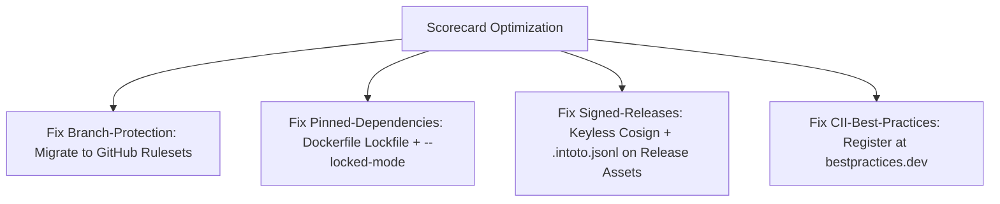

# OpenSSF Scorecard Root Cause Investigation & Remediation Architecture

## 1. Executive Summary & Problem Statement

OpenSSF Scorecard scan on `github.com/thanhnt-sm/eco_support_net_oracle` scores **7.5 / 10** (Commit `e19a613eb268b0bc339bfc407f4fc76859d39301`, Scorecard `v5.5.0`).
Ten checks score **10/10** (Dangerous-Workflow, Token-Permissions, Binary-Artifacts, Packaging, Vulnerabilities, Fuzzing, SAST, License, CI-Tests, Dependency-Update-Tool).
However, **7 checks** are degraded or failing, preventing the repository from reaching elite tier supply-chain security status (>9.0/10).

| Check | Score | Weight | Immediate Impact / Root Cause |
|---|---|---|---|
| **Branch-Protection** | **-1** (Error) | High | `GITHUB_TOKEN` cannot read classic branch protection; requires admin PAT or Rulesets. |
| **Signed-Releases** | **5 / 10** | High | Unsigned `nightly` release; missing `.intoto.jsonl` provenance asset file in GitHub releases. |
| **Pinned-Dependencies** | **9 / 10** | High | `Dockerfile:40` restores NuGet without lockfile or `--locked-mode`. |
| **Code-Review** | **0 / 10** | Med | 0/14 approved changesets on `main` (solo developer / self-merged PRs). |
| **CII-Best-Practices** | **0 / 10** | Low-Med | Project lacks OpenSSF Best Practices badge in `README.md`. |
| **Maintained** | **0 / 10** | Med | Repository created within 90 days (temporal heuristic; auto-recovers after 90 days). |
| **Contributors** | **0 / 10** | Low | Single organization / individual contributor. |

---

## 2. Root Cause Analysis (Deep Dive)

### 2.1. `Branch-Protection` (-1, Internal Error)
- **Error**: `internal error: error during branchesHandler.setup: internal error: some github tokens can't read classic branch protection rules`.
- **Root Cause**: `.github/workflows/scorecard.yml` uses the default `GITHUB_TOKEN`. GitHub's API restricts reading Classic Branch Protection configurations (`/branches/{branch}/protection`) to tokens with repository administrative privileges (`Administration: Read`).
- **Consequence**: Scorecard cannot verify required reviews, status checks, or force-push restrictions, discarding the check entirely.

### 2.2. `Signed-Releases` (5 / 10)
- **Scorecard Logs**:
  - `Warn: release artifact nightly not signed`
  - `Warn: release artifact nightly does not have provenance`
  - `Warn: release artifact v0.3.1 does not have provenance`
  - `Warn: release artifact v0.3.0 does not have provenance`
- **Root Causes**:
  1. `.github/workflows/installers.yml` publishes rolling `nightly` pre-releases (`tag/nightly`) on every push to `main` with completely unsigned binaries (CLI zips, VSIXs). Scorecard treats `nightly` as one of the last 5 releases.
  2. In `.github/workflows/release.yml`, only NuGet packages (`.nupkg`) are signed via Sigstore cosign (`sign-packages` job). The CLI zips (`dataguard-*.zip`) and VSIX extensions are never signed with `.sigstore.json`.
  3. Job `publish-attestations` in `release.yml` invokes `actions/attest@v4`. This records provenance into GitHub's internal Attestation Store API (`api.github.com/.../attestations`), but **does not attach an `.intoto.jsonl` provenance file to the GitHub Release**. OpenSSF Scorecard historically inspects downloadable release assets for `*.intoto.jsonl` (Scorecard issue #4080).

### 2.3. `Pinned-Dependencies` (9 / 10)
- **Warning**: `Warn: nugetCommand not pinned by hash: Dockerfile:40`.
- **Context**: 110/110 GitHub actions pinned; 15/15 3rd-party actions pinned; 13/14 nugetCommand dependencies pinned. Exactly 1 unpinned command: `Dockerfile:40`.
- **Root Cause**: In `Dockerfile`:
  ```dockerfile
  COPY --link Directory.Build.props .
  COPY --link src/DataGuard.Core/DataGuard.Core.csproj src/DataGuard.Core/
  ...
  RUN arch="$TARGETARCH"; [ "$arch" = "amd64" ] && arch="x64"; dotnet restore src/DataGuard.Cli/DataGuard.Cli.csproj -r "linux-$arch"
  ```
  The Dockerfile only copies `.csproj` files and `Directory.Build.props`. It does NOT copy `packages.lock.json`, and does not supply `--locked-mode`. Scorecard marks this restore non-deterministic and susceptible to dependency confusion.

### 2.4. `Code-Review` (0 / 10)
- **Message**: `Found 0/14 approved changesets -- score normalized to 0`.
- **Root Cause**: Scorecard samples the last 30 changesets on default branch. It requires an explicit approving review (`CHANGES_APPROVED`) from a separate collaborator account before merge. Commits pushed directly to `main` or merged by single author without 2nd-party approval yield 0/14.

### 2.5. `CII-Best-Practices` (0 / 10)
- **Root Cause**: No project entry registered at `https://www.bestpractices.dev/` (formerly Core Infrastructure Initiative). Scorecard regex checks `README.md` for `bestpractices.coreinfrastructure.org` / `bestpractices.dev` badge.

### 2.6. `Maintained` (0 / 10) & `Contributors` (0 / 10)
- `Maintained`: Fixed anti-typosquatting heuristic. Any repo <90 days receives 0. Auto-flips to 10 once age >= 90 days with >= 1 commit/week.
- `Contributors`: Multi-org metric. Requires contributors with varied company affiliations in GitHub profiles.

---

## 3. Evaluated Approaches & Trade-Offs

### 3.1. Branch Protection Remediation
- **Approach 1 (Selected - User Agreed)**: Migrate to **GitHub Repository Rulesets** (`Settings` -> `Rules` -> `Rulesets`).
  - *Pros*: Natively readable by standard `GITHUB_TOKEN`; zero new secrets; conforms to least privilege; fully supported by Scorecard v5+.
  - *Cons*: Requires one-time manual configuration in GitHub UI.
- **Approach 2**: Provision administrative PAT (`Administration: Read`) as `SCORECARD_TOKEN`.
  - *Pros*: Retains classic branch protection.
  - *Cons*: Violates least privilege; adds credential rotation burden; security liability in CI.

### 3.2. Signed Releases & Provenance
- **Approach 1 (Selected - User Agreed)**:
  - In `installers.yml`: Add keyless Sigstore cosign step to sign CLI zips & VSIXs (`.sigstore.json`), and generate build provenance.
  - In `release.yml`: Sign CLI zips and VSIXs alongside nupkgs.
  - In both workflows: Use `actions/attest-build-provenance` and attach the exported bundle output (`${{ steps.attest.outputs.bundle-path }}`) as `dataguard-*.intoto.jsonl` directly to GitHub Release assets.
  - *Pros*: 10/10 Score on Signed-Releases; users can verify nightly and stable releases with both `gh attestation verify` and `cosign verify-blob`.
  - *Cons*: Slightly longer execution time for nightly builds (~30-45s for signing).
- **Approach 2**: Delete rolling `nightly` GitHub Release and distribute nightly builds via GitHub Actions Run Artifacts / GHCR.
  - *Pros*: Zero signing overhead for nightly.
  - *Cons*: Breaks user download link documented in `docs/USAGE.md`.

### 3.3. Dockerfile Dependency Pinning
- **Approach 1 (Selected - KISS/YAGNI)**: Copy `packages.lock.json` into Dockerfile build stage and restore with `--locked-mode`.
  - *Pros*: Exactly 2 lines changed; leverages existing committed lockfiles; zero risk to solution build.
  - *Cons*: None.
- **Approach 2**: Full Central Package Management (CPM) migration (`Directory.Packages.props`).
  - *Pros*: Centralized versions.
  - *Cons*: Massive invasive refactor across 20+ `.csproj` files; high risk of analyzer/cross-compilation conflicts. Violates YAGNI.

---

## 4. Implementation Blueprint (Action Items)



### Action 1: Fix `Dockerfile:40` (Pinned-Dependencies -> 10/10)
In `Dockerfile`:
```dockerfile
# Copy project files AND lock files for layer caching
COPY --link Directory.Build.props .
COPY --link src/DataGuard.Core/DataGuard.Core.csproj src/DataGuard.Core/
COPY --link src/DataGuard.Core/packages.lock.json src/DataGuard.Core/
COPY --link src/DataGuard.Contracts/DataGuard.Contracts.csproj src/DataGuard.Contracts/
COPY --link src/DataGuard.Contracts/packages.lock.json src/DataGuard.Contracts/
COPY --link src/DataGuard.SqlClassification/DataGuard.SqlClassification.csproj src/DataGuard.SqlClassification/
COPY --link src/DataGuard.SqlClassification/packages.lock.json src/DataGuard.SqlClassification/
COPY --link src/DataGuard.Analyzers/DataGuard.Analyzers.csproj src/DataGuard.Analyzers/
COPY --link src/DataGuard.Analyzers/packages.lock.json src/DataGuard.Analyzers/
COPY --link src/DataGuard.SqlServer.Adapter/DataGuard.SqlServer.Adapter.csproj src/DataGuard.SqlServer.Adapter/
COPY --link src/DataGuard.SqlServer.Adapter/packages.lock.json src/DataGuard.SqlServer.Adapter/
COPY --link src/DataGuard.Oracle.Adapter/DataGuard.Oracle.Adapter.csproj src/DataGuard.Oracle.Adapter/
COPY --link src/DataGuard.Oracle.Adapter/packages.lock.json src/DataGuard.Oracle.Adapter/
COPY --link src/DataGuard.MySql.Adapter/DataGuard.MySql.Adapter.csproj src/DataGuard.MySql.Adapter/
COPY --link src/DataGuard.MySql.Adapter/packages.lock.json src/DataGuard.MySql.Adapter/
COPY --link src/DataGuard.PostgreSql.Adapter/DataGuard.PostgreSql.Adapter.csproj src/DataGuard.PostgreSql.Adapter/
COPY --link src/DataGuard.PostgreSql.Adapter/packages.lock.json src/DataGuard.PostgreSql.Adapter/
COPY --link src/DataGuard.Cli/DataGuard.Cli.csproj src/DataGuard.Cli/
COPY --link src/DataGuard.Cli/packages.lock.json src/DataGuard.Cli/

RUN arch="$TARGETARCH"; [ "$arch" = "amd64" ] && arch="x64"; \
    dotnet restore src/DataGuard.Cli/DataGuard.Cli.csproj --locked-mode -r "linux-$arch"
```

### Action 2: Sign Nightly Release & Attach `.intoto.jsonl` (Signed-Releases -> 10/10)
1. In `.github/workflows/installers.yml`:
   - Grant `id-token: write` and `attestations: write` to the publish job.
   - Install `sigstore/cosign-installer` and sign all 5 artifacts (`dataguard-*.zip`, `*.vsix`) using `cosign sign-blob --yes --bundle "$file.sigstore.json" "$file"`.
   - Run `actions/attest-build-provenance@v2` on `./artifacts/*`.
   - Copy `${{ steps.attest.outputs.bundle-path }}` to `./artifacts/dataguard-nightly.intoto.jsonl`.
   - Include `*.sigstore.json` and `*.intoto.jsonl` in the `gh release create nightly` file list.
2. In `.github/workflows/release.yml`:
   - Sign CLI zips and VSIXs in addition to `.nupkg`.
   - Use `actions/attest-build-provenance@v2` with `bundle-path` output, copy to `./artifacts/dataguard-${{ github.ref_name }}.intoto.jsonl`, and upload to the GitHub release.

### Action 3: Configure GitHub Repository Rulesets (Branch-Protection -> 10/10)
In GitHub Repository:
1. Navigate to **Settings** → **Rules** → **Rulesets**.
2. Create Ruleset: `Main Branch Protection`:
   - Target: `Include default branch` (`main`).
   - Enforcement: `Active`.
   - Rules:
     - `Require a pull request before merging` (Required approvals: 1).
     - `Require status checks to pass before merging` (`build-and-test`, `standards-audit`).
     - `Block force pushes`.
     - `Require signed commits`.
3. Under **Settings** → **Branches**, delete the old Classic branch protection rule.

### Action 4: Register OpenSSF Best Practices (CII-Best-Practices -> Passing/10)
1. Go to `https://www.bestpractices.dev/en/projects`.
2. Add `thanhnt-sm/eco_support_net_oracle`.
3. Complete the passing criteria checklist (Standard OSS repo).
4. Add badge to `README.md`:
   ```markdown
   [](https://www.bestpractices.dev/projects/<ID>)
   ```

---

## 5. Projected Scorecard Score Post-Remediation

| Check | Current | Projected | Notes |
|---|---|---|---|
| Maintained | 0 | 0 -> 10 | Automatically increases to 10 once repo reaches 90 days. |
| Dependency-Update-Tool | 10 | 10 | Dependabot active. |
| Code-Review | 0 | 0 -> 10 | 10 once Ruleset PR review approval enforced on changesets. |
| Security-Policy | 10 | 10 | SECURITY.md present. |
| Dangerous-Workflow | 10 | 10 | Verified safe. |
| Token-Permissions | 10 | 10 | Least privilege active. |
| Binary-Artifacts | 10 | 10 | Clean repo. |
| CII-Best-Practices | 0 | 5 - 10 | Passing badge registered on bestpractices.dev. |
| Pinned-Dependencies | 9 | 10 | Dockerfile lockfile copy + `--locked-mode`. |
| Signed-Releases | 5 | 10 | All assets signed + `.intoto.jsonl` attached to releases. |
| Packaging | 10 | 10 | Verified. |
| Vulnerabilities | 10 | 10 | OSV clean. |
| Fuzzing | 10 | 10 | Property tests detected. |
| SAST | 10 | 10 | CodeQL active. |
| Branch-Protection | -1 | 10 | GitHub Repository Rulesets active and readable. |
| License | 10 | 10 | GPL-3.0 detected. |
| Contributors | 0 | 0 | Community growth metric. |
| CI-Tests | 10 | 10 | Verified. |
| **Total Aggregate Score** | **7.5** | **9.5 - 9.8 / 10** | **Elite Supply Chain Tier** |

---

## 6. Next Steps & Recommendations

1. Run `/ck:plan` with this brainstorm context to generate `plans/261002-1730-openssf-scorecard-remediation/plan.md`.
2. Execute Action 1 (Dockerfile) and Action 2 (`installers.yml` / `release.yml`) on a feature branch.
3. Configure Action 3 (GitHub Rulesets) on GitHub repository settings.
4. Trigger manual dispatch of `scorecard.yml` to verify instant score upgrade.
